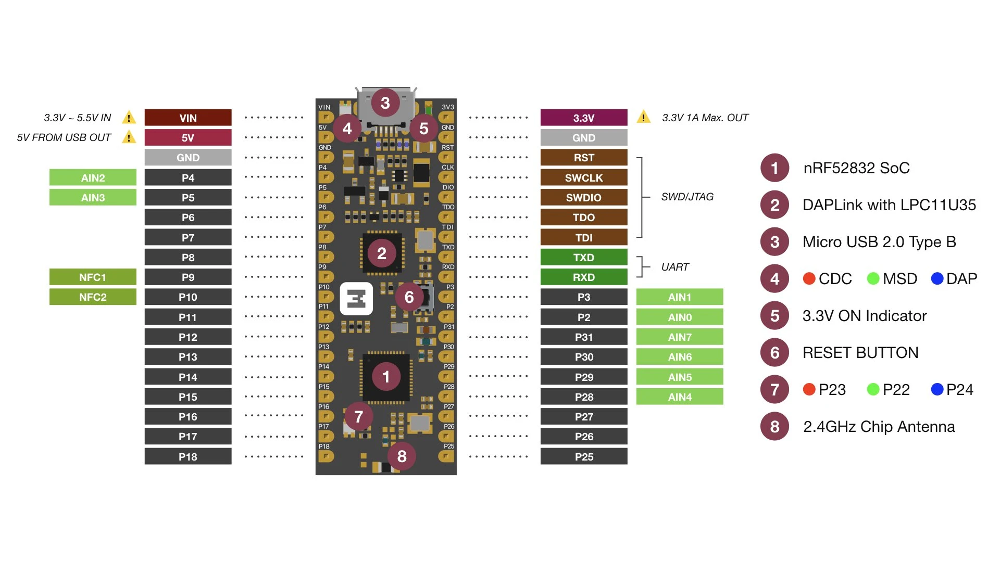

=======================
MakerDiary nRF52832-MDK
=======================

The `nRF52832-MDK <https://wiki.makerdiary.co/nrf52832-mdk>`_ is a development board for
the nRF52832 SoC from Nordic. It features 24 I/Os an on-board RGB led and a chip antenna.
It also includes an embedded DAPlink debugger which allows to flash/debug and monitor UART
from the USB port.

   Pinout diagram

Features
========

  - nRF52832 MCU, 512K FLASH, 64K SRAM
  - 32768 Hz crystal
  - Embedded DAPlink debugger (debug/flash and monitor serial)
  - Reset button
  - Programming mode RGB LED indicator (CDC, MSD or DAP)
  - Power indicator LED
  - User RGB LED
  - Inductor + capacitor for DC/DC mode

Pin Mapping
===========

===== ========== ==========
Pin   Signal     Notes
===== ========== ==========
P0.24 Blue LED   Active LOW
P0.23 Red LED    Active LOW
P0.22 Green LED  Active LOW
P0.20 UART TX
P0.19 UART RX
===== ========== ==========

Configurations
==============

nsh
---

Basic NuttShell configuration (console enabled in UART0, exposed via USB connection, at 115200 bps).

sdc
---

Enables Nordic's SoftDevice controller and uses nimBLE for the host-layer.
The ``nimble`` test application can be used to enable a simple GATT server.

Flash & Debug
=============

Both flashing and debugging are done using the embedded DAPlink debugger. OpenOCD can be invoked
in the following way to flash::

    openocd -f interface/cmsis-dap.cfg -f target/nrf52.cfg -c "program nuttx/nuttx.bin 0x0000000 verify reset; shutdown"

