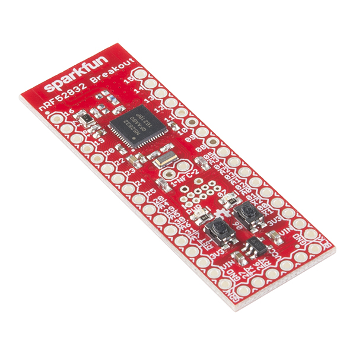

==========================
Sparkfun nRF52832 Breakout
==========================

The `Sparkfun nRF52832 Breakout <https://wiki.makerdiary.co/nrf52832-mdk>`_ is basic board providing
access to all I/O pins, a 32kHz crystal and LED. 

   Sparkfun nRF52832 Breakout

Features
========

 - nRF52832 MCU (QFAAB0), 512K FLASH and 64 SRAM
 - Reset and user button
 - Power LED (blue) and user LED (red)
 - 32768 Hz crystal
 - NFC antenna connection pads
 - Cortex Debug connector
 - UART + SWD header

Pin Mapping
===========

===== =========== ==========
Pin   Signal       Notes
===== =========== ==========
P0.6  User Button Active LOW
P0.7  User LED    Active LOW
P0.26 UART TXO
P0.27 UART RXI
===== =========== ==========

Configurations
==============

nsh
---

Basic NuttShell configuration (console enabled in UART0, at 115200 bps).

Flash & Debug
=============

An external debugger is required, so the procedure to flash/debug depends on the chosen interface. Using an ST-Link V2
you can flash using OpenOCD with::

    openocd -f interface/stlink-v2.cfg -f target/nrf52.cfg -c "program nuttx/nuttx.bin 0x0000000 verify reset; shutdown"

