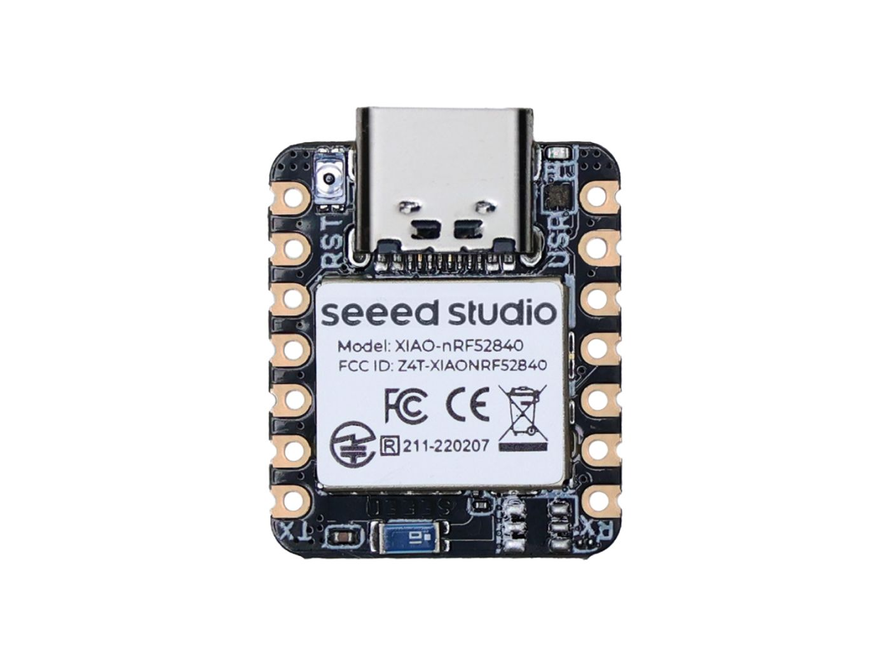

==========================
Seeed Studio XIAO nRF52840
==========================

.. tags:: chip:nrf52, chip:nrf52840

The `Seeed Studio XIAO nRF52840 <https://wiki.seeedstudio.com/XIAO_BLE/>`_ is a general purpose board supplied by
Seeed Studio and it is compatible with the Nordic nRF52840 ecosystem as they share the same MCU.

Features
========

* Nordic nRF52840, ARM® Cortex®-M4 32-bit processor with FPU, 64 MHz
* 256 KB RAM,1MB Flash 2MB onboard Flash
* Bluetooth 5.0/BLE/NFC
* 1xUART, 1xI2C, 1xSPI, 1xNFC, 1xSWD, 11xGPIO(PWM)
* USB Type-C interface
* 1 RGB LED, 1 charge LED
* 1 RESET button

Serial Console
==============

By default, a serial console appears on pins 6 (TX P1.11) and pin 7
(RX P1.12).  This console runs a 115200-8N1.
The board can be configured to use the USB connection as the serial console.

User LED
========

The RGB LED is connected as follows:

===== =====
Color Pin
===== =====
RED   P0.26
GREEN P0.30
BLUE  P0.6
===== =====

Buttons
=======

The Reset button can be used to enter bootloader mode by rapidly clicking
it twice. Then, it will enumerate as a storage device to a computer
connected via USB. Saving a .UF2 file to this device will replace
the Flash ROM contents on the nRF52840.

Pin Mapping
===========
Pads numbered anticlockwise from USB connector.

===== ========== ==========
Pad   Signal     Notes
===== ========== ==========
0     P0.02      D0/A0
1     P0.03      D1/A1
2     P0.28      D2/A2
3     P0.29      D3/A3
4     P0.04      D4/SDA
5     P0.05      D5/SCL
6     P1.11      Default TX for UART0 serial console
7     P1.12      Default RX for UART0 serial console
8     P1.13      D8/SCK
9     P1.14      D9/MISO
10    P1.15      D10/MOSI
11    3V3        Power output to peripherals
12    Ground
13    VIN        +5V Supply to board
===== ========== ==========

Power Supply
============
The working voltage of the MCU is 3.3V. Voltage input connected to
general I/O pins may cause chip damage if it’s higher than 3.3V.

Installation
============

1. Download UF2 Tools:

.. code-block:: console

  $ git clone https://github.com/microsoft/uf2.git

2. Configure and build NuttX:

.. code-block:: console

  $ git clone https://github.com/apache/nuttx.git nuttx
  $ git clone https://github.com/apache/nuttx-apps.git apps
  $ cd nuttx
  $ make distclean
  $ ./tools/configure.sh xiao-nrf52840:nsh
  $ make V=1

3. Convert nuttx.hex to UF2 format using U2F Tools:

.. code-block:: console

  $ python3 uf2/utils/uf2conv.py -c -f 0xADA52840 -i nuttx.hex -o nuttx.uf2

4. Connect the Seeed Studio XIAO nRF52840, and enter bootloader mode by rapidly
clicking it twice. The board will be detected as a USB Mass Storage Device.
Then copy “nuttx.uf2” into the device.

6. To access the console, TX and RX pins must be connected to the
   device such as USB-serial converter.

Configurations
==============

nsh
---
Basic NuttShell configuration (console enabled in UART0, at 115200 bps).

usbnsh
------
Basic NuttShell configuration using CDC/ACM serial (console enabled in USB Port,
at 115200 bps).

jumbo
-----
This configuration enabled NuttShell via USB and enabled leds and gpio examples:

Testing leds:

.. code-block:: console

  $nsh> leds
  leds_main: Starting the led_daemon
  leds_main: led_daemon started

  led_daemon (pid# 3): Running
  led_daemon: Opening /dev/userleds
  led_daemon: Supported LEDs 0x07
  led_daemon: LED set 0x01
  $nsh> led_daemon: LED set 0x02
  led_daemon: LED set 0x03
  led_daemon: LED set 0x04
  led_daemon: LED set 0x05
  led_daemon: LED set 0x06
  led_daemon: LED set 0x07

Testing gpios:

========   ======   ==========
PIN/GPIO    Mode      Device
========   ======   ==========
D0/P0.02   Input    /dev/gpio0
D2/P0.28   Output   /dev/gpio1
D1/P0.03   Input    /dev/gpio2
========   ======   ==========

.. code-block:: console

  $nsh> gpio /dev/gpio0
  Driver: /dev/gpio0
    Input pin:     Value=0
  $nsh> gpio /dev/gpio0
  Driver: /dev/gpio0
    Input pin:     Value=1

  $nsh> gpio -o 0 /dev/gpio1
  Driver: /dev/gpio1
    Output pin:    Value=1
    Writing:       Value=0
    Verify:        Value=0

  $nsh> gpio -w 1 /dev/gpio2
  Driver: /dev/gpio2
    Interrupt pin: Value=0
    Verify:        Value=1

