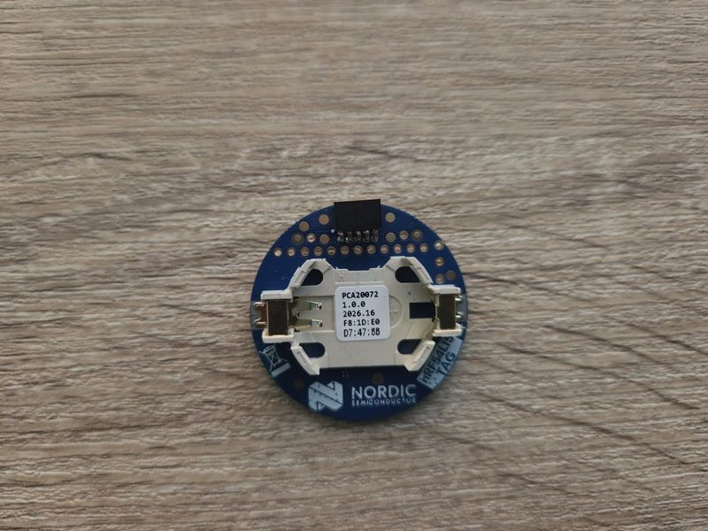

===================
Nordic nRF54L15 Tag
===================

.. tags:: chip:nrf54l, chip:nrf54l15

   nRF54L15-TAG Front

The nRF54L15-TAG is a board based on the nRF54L15 from Nordic.

Serial Console
==============

The console uses RTT channel 0. Connect an external J-Link probe to the
P1 SWD header and use a bidirectional RTT terminal.

LEDs
====

The board has an RGB LED:

===== =====
Color MCU
===== =====
Red   P2.08
Green P2.10
Blue  P2.09
===== =====

A low output illuminates the LED.

Button
======

BTN1 is connected to P0.00 and is active low.

Onboard sensors
===============

The board provides the following sensors:

======== ===================================== =======================
Device   Measurements                          Interface
======== ===================================== =======================
BMI270   Acceleration and angular velocity     SPI2 (SPIM22)
BME688   Temperature, pressure, humidity, gas  I2C1 (TWIM21), 0x76
ADXL367  Acceleration and die temperature      I2C1 (TWIM21), 0x1d
======== ===================================== =======================

SPI2 uses P1.08 (SCK), P1.06 (MOSI), P1.05 (MISO), and P1.07
(BMI270 chip select). I2C1 uses P1.11 (SCL) and P1.12 (SDA).

The SAADC measures the supply voltage through its internal VDD input.
With 12-bit resolution and a 3.6 V full scale, the voltage is
``sample * 3.6 / 4096`` volts.

Configurations
==============

Select a configuration with::

  tools/configure.sh nrf54l15-tag:<subdir>

nsh
---

Basic NuttShell configuration with the console over RTT.

sensors
-------

NSH over RTT with the three onboard sensors, supply-voltage ADC, BTN1,
user LEDs, and TIMER20. The configuration includes ``sensortest``, ``i2c``,
``adc``, ``buttons``, ``leds``, and ``timer``. For example::

  sensortest -n 10 accel0
  sensortest -n 10 gyro0
  sensortest -n 10 accel1
  sensortest -n 5 baro0
  sensortest -n 5 humi0
  adc
  buttons
  timer

``accel0`` and ``gyro0`` are the BMI270; ``accel1`` is the ADXL367.
The BME688 barometer samples also include temperature. The ADC is registered
at ``/dev/adc0``, BTN1 at ``/dev/buttons``, and TIMER20 at ``/dev/timer0``.

sdc
---

NSH over RTT with the native Bluetooth host, SoftDevice Controller, GRTC
tickless scheduling and the ``bt`` utility. Set ``CONFIG_NRF54L_SDC_PUB_ADDR``
to the board's assigned public address. The host advertises its GAP service
at startup. To scan::

  bt bnep0 scan start -d
  bt bnep0 scan get
  bt bnep0 scan stop

Flash & Debug
=============

An external SWD probe is required. Program the generated ``nuttx.hex``
with a tool supporting nRF54L15, for example::

  nrfutil device program --firmware nuttx.hex --serial-number PROBE_SERIAL
  nrfutil device reset --serial-number PROBE_SERIAL
