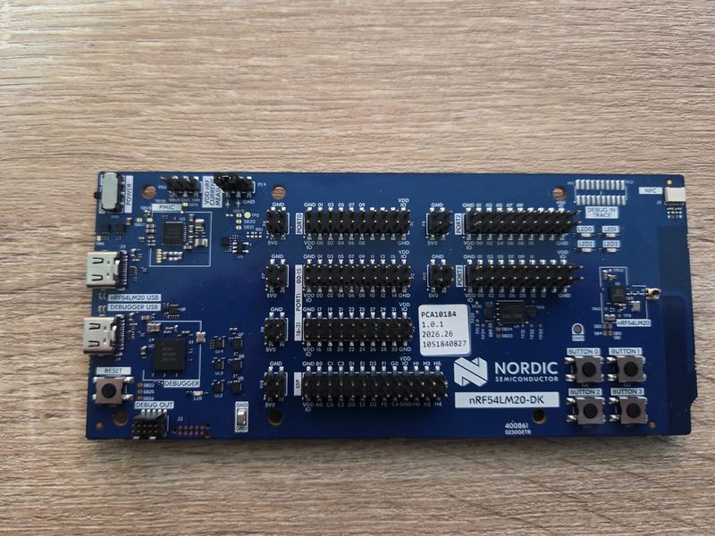

===================
Nordic nRF54LM20 DK
===================

.. tags:: chip:nrf54l, chip:nrf54lm20a, chip:nrf54lm20b

   nRF54LM20-DK Front

The nRF54LM20-DK is a development board based on the nRF54LM20 from Nordic.
The configurations select nRF54LM20B by default. For nRF54LM20A, select
``nRF54LM20A`` under ``System Type -> nRF54L Chip Selection`` in
``make menuconfig`` before building.
The configurations use 511 KiB of SRAM, excluding the reserved upper 1 KiB.

Serial Console
==============

The console uses UARTE20 through the onboard debug interface at 115200 8N1,
without flow control. Use VCOM 1 (the second J-Link serial port, with USB
interface ``if02`` on Linux).

===== ===========
Pin   Signal
===== ===========
P1.16 UARTE20 TX
P1.17 UARTE20 RX
===== ===========

LEDs
====

The board has four user-controllable LEDs:

==== =====
LED  MCU
==== =====
LED1 P1.22
LED2 P1.25
LED3 P1.27
LED4 P1.28
==== =====

A high output illuminates the LED.

Configurations
==============

Select a configuration with::

  tools/configure.sh nrf54lm20-dk:<subdir>

nsh
---

Basic NuttShell configuration with the console on UARTE20.

usbnsh
------

NuttShell over USB CDC ACM using the application's USB connector.
Both high-speed and full-speed USB operation are enabled.

sdc
---

NSH with the native Bluetooth host, SoftDevice Controller and ``bt`` utility.
These configurations use GRTC tickless scheduling and the UARTE20 console.
Set ``CONFIG_NRF54L_SDC_PUB_ADDR`` to the board's assigned public address.

The host advertises its GAP service at startup. To scan::

  bt bnep0 scan start -d
  bt bnep0 scan get
  bt bnep0 scan stop

Stop advertising with ``bt bnep0 advertise stop`` before restarting it with
``bt bnep0 advertise start``.

Flash & Debug
=============

Use a J-Link version supporting the installed chip. For LM20B::

  JLinkExe -USB PROBE_SERIAL -device nRF54LM20B_M33 -if SWD -speed 4000

At the J-Link prompt::

  connect
  loadfile nuttx.hex
  r
  g
  exit

Use ``nRF54LM20A_M33`` for LM20A boards.
