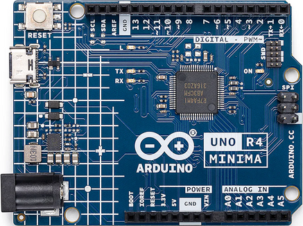

=================
Arduino R4 Minima
=================

This board features the R7FA4M1ABxCFM MCU with 256 KiB of FLASH
and 32 KiB of SRAM running at 64 MHz (internal clock - HOCO).

See the `Arduino website <https://docs.arduino.cc/hardware/uno-r4-minima/>`_ for
information about Arduino R4 Minima.

Buttons and LEDs
================

Buttons
-------

There are no buttons on the Arduino R4 Minima board.

LEDs
----

There are three user-controllable LEDs on board the Arduino R4 Minima:

    ==============   =====
    LED              GPIO
    ==============   =====
    L   Amber LED    P111
    TX  Yellow LED   P012
    RX  Yellow LED   P013
    ==============   =====

LED L is connected to ground and can be illuminated by driving the P111
output high. The TX and RX LEDs are pulled high and can be illuminated by
driving the corresponding GPIO output low.

These LEDs are not used by the board port unless ``CONFIG_ARCH_LEDS`` is
defined. In that case, the usage by the board port is defined in
``include/board.h`` and ``src/ra_autoleds.c``. The LEDs are used to encode OS-related
events as follows:

    ==================  =========================  ======    =====   =====
    SYMBOL              MEANING                       L       TX       RX
    ==================  =========================  ======    =====   =====
    LED_STARTED          NuttX has been started     OFF      OFF      OFF
    LED_HEAPALLOCATE     Heap has been allocated    OFF      OFF      OFF
    LED_IRQSENABLED      Interrupts enabled         OFF      OFF      OFF
    LED_STACKCREATED     Idle stack created         ON       OFF      OFF
    LED_INIRQ            In an interrupt            N/C      GLOW     OFF
    LED_SIGNAL           In a signal handler        N/C      GLOW     OFF
    LED_ASSERTION        An assertion failed        N/C      GLOW     OFF
    LED_PANIC            The system has crashed     N/C      N/C      Blinking
    LED_IDLE             MCU is in sleep mode       NA       NA       NA
    ==================  =========================  ======    =====   =====

Thus, if LED L is statically on, NuttX has successfully booted and is
apparently running normally. If LED RX is glowing, then NuttX is
handling interrupts (and also signals and assertions). If TX is flashing
at approximately 2 Hz, then a fatal error has been detected, and the system
has halted.

Serial Consoles
===============

The R7FA4M1ABxCFM has a UART and 4 SCI (UARTs).

Any of the SCI interfaces may be used as a serial console. By default,
SCI2 is used as the serial console in all configurations. This can be
easily changed by modifying the configuration.

    ==================   ============
    Arduino R4 Minima    R7FA4M1ABxCFM
    Pin (Label)          SCI Mapping
    ==================   ============
    0  (RX0<-0)          RXD2
    1  (TX0->1)          TXD2
    13 (12)              RXD9
    14 (~11)             TXD9
    SWD-7                RXD1
    SWD-8                TXD1
    ==================   ============

Loading Code
============

It is possible to use J-Link on the SWD connector or use USB Boot
available through the USB-C connector.

RA USB Boot:
------------

Reboot the board with BOOT shorted to GND and press the reset button twice (double click). The board will enumerate as "Renesas RA USB Boot."

Then, flash the ``nuttx.hex`` file using ``rfp-cli``:
(https://www.renesas.com/en/software-tool/renesas-flash-programmer-programming-gui)

Example command:

.. code-block:: bash

    rfp-cli -device ra -port /dev/ttyACM0 -p ./build/nuttx.hex

*Note:* Programming using the binary format will fail because, by default, the RA4M1 NuttX port writes to the ``.idcode`` section, which is located beyond the end of the flash area. This causes the RFP to attempt writing to protected regions, leading to failures.
