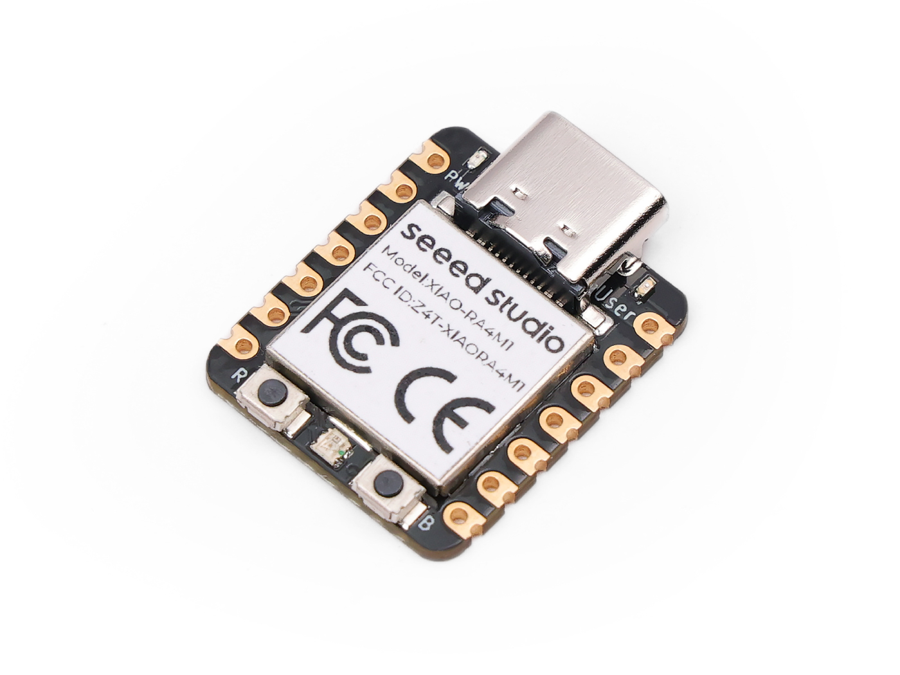

=======================
Seeed Studio XIAO RA4M1
=======================

The `Seeed Studio XIAO RA4M1 <https://wiki.seeedstudio.com/getting_started_xiao_ra4m1/>`_ is a general purpose board supplied by
Seeed Studio and it is compatible with the Renesas RA4M1 ecosystem, sharing the same MCU as Arduino R4 Minima
(R7FA4M1AB3CFM).

Features
========

* Renesas RA4M1, ARM® Dual Cortex-M4 @ 48MHz
* 32kB SRAM, 256KkB Flash, 8KB EEPROM
* Security: AES128/256
* USB Type-C interface
* 19 Pins:14x Analog,19x Digital, 2x IIC, 2x UART, 2x SPI
* 1 user LED, 1 power LED，1 RGB LED (WS2812)
* 1 RESET button, 1 BOOT button

Serial Console
==============

By default, a serial console appears on pins 6 (TX GPIO) and pin 7
(RX GPIO).  This console runs a 115200-8N1.

User LED
========

The USER LED, the yellow LED on the XIAO RA4M1, is connected to P011
according to the schematic diagram.

Buttons
=======

The RESET and BOOT buttons can be used to enter "Renesas RA USB Boot" mode by
reboot the board with BOOT shorted to GND and press the reset button twice (double click).
The board will enumerate as "Renesas RA USB Boot".

Pin Mapping
===========
Pads numbered anticlockwise from USB connector.

===== ========== ==========
Pad   Signal     Notes
===== ========== ==========
0     P014       D0/A0
1     P000       D1/A1
2     P001       D2/A2
3     P002       D3/A3
4     P006       D4/SDA
5     P100       D5/SCL
6     P301       D6/Default TX for UART0 serial console
7     P301       D7/Default RX for UART0 serial console
8     P111       D8/SCK
9     P110       D9/MISO
10    P109       D10/MOSI
11    3V3        Power output to peripherals
12    Ground
13    VIN        +5V Supply to board
===== ========== ==========

Power Supply
============
The working voltage of the MCU is 3.3V. Voltage input connected to
general I/O pins may cause chip damage if it’s higher than 3.3V.

Installation
============

1. Configure and build NuttX:

.. code-block:: console

  $ git clone https://github.com/apache/nuttx.git nuttx
  $ git clone https://github.com/apache/nuttx-apps.git apps
  $ cd nuttx
  $ make distclean
  $ ./tools/configure.sh xiao-ra4m1:nsh
  $ make V=1

2. Connect the Seeed Studio XIAO RA4M1, and enter "Renesas RA USB Boot" mode,
then, flash the ``nuttx.hex`` file using ``rfp-cli``:
(https://www.renesas.com/en/software-tool/renesas-flash-programmer-programming-gui)

Example command:

.. code-block:: bash

    rfp-cli -device ra -port /dev/ttyACM0 -p ./build/nuttx.hex

3. To access the console, TX and RX pins must be connected to the
   device such as USB-serial converter.

Configurations
==============

nsh
---
Basic NuttShell configuration (console enabled in UART0, at 115200 bps).

combo
-----
This configuration enabled NuttShell via Serial and enabled led and gpio
examples:

Testing leds:

.. code-block:: console

  $nsh> leds
  leds_main: Starting the led_daemon
  leds_main: led_daemon started

  led_daemon (pid# 5): Running
  led_daemon: Opening /dev/userleds
  led_daemon: Supported LEDs 0x01
  led_daemon: LED set 0x01
  $nsh> led_daemon: LED set 0x00
  led_daemon: LED set 0x01
  led_daemon: LED set 0x00
  led_daemon: LED set 0x01
  led_daemon: LED set 0x00
  led_daemon: LED set 0x01

Testing gpios:

========   ======   ==========
PIN/GPIO    Mode      Device
========   ======   ==========
D0/P014    Input    /dev/gpio0
D1/P000    Output   /dev/gpio1
========   ======   ==========

.. code-block:: console

  $nsh> gpio /dev/gpio0
  Driver: /dev/gpio0
    Input pin:     Value=0
  $nsh> gpio /dev/gpio0
  Driver: /dev/gpio0
    Input pin:     Value=1

