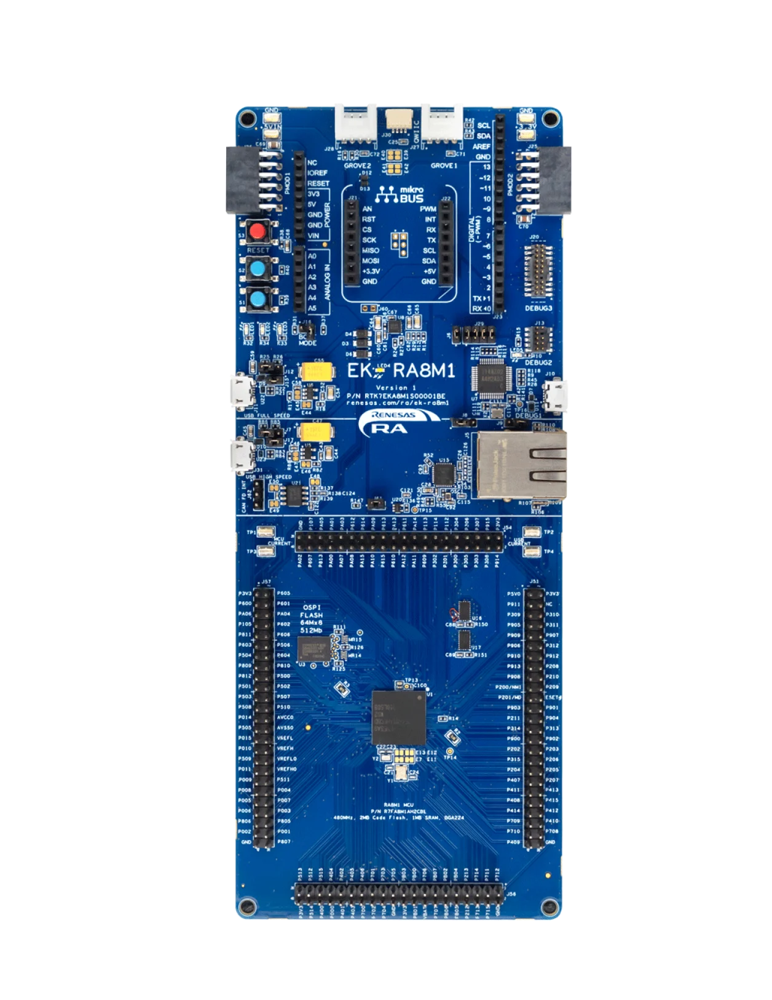

========
EK-RA8M1
========

This is a port of NuttX to the Renesas EK-RA8M1 evaluation kit, featuring
the R7FA8M1AHECBD (BGA224) MCU: an Arm Cortex-M85 running at up to
480 MHz, with 2016 KiB of code flash, 896 KiB of SRAM and 12 KiB of data
flash.

See the `Renesas website
<https://www.renesas.com/en/design-resources/boards-kits/ek-ra8m1>`_ for
information about the EK-RA8M1.

Flat, no-TrustZone image
=========================

This port does not use TrustZone: it is a flat image that always runs in
the secure state, and it uses the secure memory and register aliases
throughout (RA8M1 User's Manual Table 4.1) -- code flash at ``0x0200_0000``,
SRAM at ``0x2200_0000``, data flash at ``0x2700_0000``.  The non-secure
aliases (``0x12xx_xxxx``/``0x32xx_xxxx``/``0x37xx_xxxx``) are not used.

The EK-RA8M1 ships with the TrustZone security partition set to the
Renesas FSP sample project's boundary.  A flat
NuttX image needs the whole flash marked secure instead, which has to be
set once with the flash programmer before the first NuttX image is
written (see `Loading Code`_ below).

Clocking
========

``include/board.h`` configures this clock tree from the EK-RA8M1's 20 MHz
resonator (see ``arch/arm/src/ra8m1/ra_clockconfig.h`` for how every
option is derived and validated):

============  =========================================  ==========
Clock         Source                                      Frequency
============  =========================================  ==========
MOSC          20 MHz resonator on EXTAL/XTAL              20 MHz
PLL1          MOSC / 2, x96                                960 MHz VCO
CPUCLK        PLL1 output P / 1                            480 MHz
ICLK          PLL1 output P / 2                            240 MHz
PCLKA         PLL1 output P / 4                            120 MHz
PCLKB         PLL1 output P / 8                             60 MHz
PCLKC         PLL1 output P / 8                             60 MHz
PCLKD         PLL1 output P / 4                            120 MHz
PCLKE         PLL1 output P / 2                            240 MHz
FCLK          PLL1 output P / 8                             60 MHz
BCLK          PLL1 output P / 4                            120 MHz
SCICLK        PLL1 output Q / 4                            120 MHz
============  =========================================  ==========

SCICLK feeds the baud rate generator of every SCI UART; it is only
configured (and its PLL only started) when at least one ``CONFIG_RA_SCIn_UART``
is enabled.  120 MHz was chosen because it gives 115200 baud with 0.16 %
error (the reset default, the 8 MHz MOCO, gives 3.5 % error).

Buttons and LEDs
================

Buttons
-------

No push-buttons are wired into this port.

LEDs
----

The EK-RA8M1 has three user LEDs:

    ====  ====  ======
    LED   GPIO  Colour
    ====  ====  ======
    LED1  P600  Blue
    LED2  P414  Green
    LED3  P107  Red
    ====  ====  ======

They are driven active-high in this port (``ra8m1_userleds.c``,
``ra8m1_autoleds.c``); this has not been confirmed on hardware, so if a
board turns out to be wired the other way, invert the levels there.

These LEDs are not used by the board port unless ``CONFIG_ARCH_LEDS`` is
defined.  In that case, the usage is defined in ``include/board.h`` and
``src/ra8m1_autoleds.c``:

    ==================  =========================  ======  ======  ======
    SYMBOL              MEANING                     LED1    LED2    LED3
    ==================  =========================  ======  ======  ======
    LED_STARTED         NuttX has been started      OFF     OFF     OFF
    LED_HEAPALLOCATE    Heap has been allocated     OFF     OFF     OFF
    LED_IRQSENABLED     Interrupts enabled          OFF     OFF     OFF
    LED_STACKCREATED    Idle stack created          ON      OFF     OFF
    LED_INIRQ           In an interrupt             N/C     ON      N/C
    LED_SIGNAL          In a signal handler         N/C     ON      N/C
    LED_ASSERTION       An assertion failed         N/C     ON      N/C
    LED_PANIC           The system has crashed      N/C     N/C     ON
    ==================  =========================  ======  ======  ======

Without ``CONFIG_ARCH_LEDS``, the LEDs are available through the
``userled`` upper half at ``/dev/userleds`` (bit 0 = LED1, bit 1 = LED2,
bit 2 = LED3), or individually through the ``ULEDIOC_SETLED`` ioctl.

Serial Console
===============

The EK-RA8M1's on-board debugger (a J-Link) provides a virtual COM port on
SCI9:

    ==================   ============
    Signal               R7FA8M1AHECBD
    ==================   ============
    TXD9                 PA14
    RXD9                 PA15
    ==================   ============

SCI9 is the serial console in the default configurations, at 115200 8N1.

Loading Code
============

This port produces a flat image (no TrustZone), so it is flashed with
``rfp-cli`` (the Renesas Flash Programmer CLI), through the on-board
J-Link, over SWD:

.. code-block:: bash

    rfp-cli -device ra --tool jlink -if swd -p ./build/nuttx.hex

*Note:* the image must be flashed as ELF, HEX or SREC, not as a raw
binary: the option-setting words (OFS0/OFS1/OFS2, see
``ra_option_setting.c``) sit in flash option memory well above the code
flash region, and a raw ``objcopy`` binary would not carry them.

*Note:* a board fresh from the factory, or last flashed with the Renesas
some project, has the TrustZone boundary set to that project's
partition, which might too small for this flat
image and makes ``rfp-cli`` fail to erase/program with an address error.
Set the whole flash and SRAM to secure once, before the first NuttX
flash:

.. code-block:: bash

    rfp-cli -d ra -t jlink -if swd -erase-chip

This is a persistent, one-time device setting; it does not need to be
repeated on later flashes of a NuttX image.

Configurations
==============

nsh
---

Configures the NuttX Shell (nsh) with the serial console on SCI9, plus
the ``ostest`` test suite.

nsh-leds
--------

Same as ``nsh``, but without ``ostest``, and enables the ``userled``
driver on ``/dev/userleds`` (``CONFIG_ARCH_LEDS`` is not set, so NuttX
does not drive the LEDs itself; see `LEDs`_ above).
