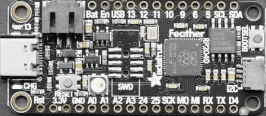

=======================
Adafruit Feather RP2040
=======================

The Feather RP2040 is a general purpose RP2040 board supplied by 
Adafruit.

Features
========

* RP2040 microcontroller chip
* Dual-core ARM Cortex M0+ processor, flexible clock running up to 133 MHz
* 264kB of SRAM, and 8MB of on-board Flash memory
* Castellated module allows soldering direct to carrier boards
* USB Host and Device support via type C connector.
* Low-power sleep and dormant modes
* Drag & drop programming using mass storage over USB
* 26 multi-function GPIO pins
* 2× SPI, 2× I2C, 2× UART, 3× 12-bit ADC, 16× controllable PWM channels
* Accurate clock and timer on-chip
* Temperature sensor
* Accelerated floating point libraries on-chip
* 8 × Programmable IO (PIO) state machines for custom peripheral support
* LiPoly Battery connector

Serial Console
==============

By default a serial console appears on pins 14 (RX GPIO0) and pin 15
(TX GPIO1).  This console runs a 115200-8N1.

The board can be configured to use the USB connection as the serial console.

Buttons and LEDs
================

User LED controlled by GPIO13.

A ws2812 (NeoPixel) smart RGB LED controlled by GPIO16.

An LED (CHG LED) that indicates the charging status of
connected LiPo cell.

There is a BOOT button which if held down when power is first
applied or the RESET button is pressed will cause the RP2040 to
boot into program mode and appear as a storage device to
a USB connecte .  Saving a .UF2 file to this device will 
replace the Flash ROM contents on the RP2040.

A RESET button that allows rebooting the board without disconnecting
the power.

Pin Mapping
===========
Pads numbered anticlockwise from USB connector.

===== ========== ==========
Pad   Signal     Notes
===== ========== ==========
1     Reset      Pull to ground to reset the RP2040 processor.
2     3.3V       Power out to peripherals.
3     3.3V       Power out to peripherals.
4     Ground
5     GPIO26     ADC0
6     GPIO27     ADC1
7     GPIO28     ADC2
8     GPIO29     ADC3
9     GPIO24
10    GPIO25
11    GPIO18
12    GPIO19
13    GPIO20
14    GPIO1      Default RX for UART1 serial console
15    GPIO0      Default TX for UART0 serial console
16    GPIO6
17    GPIO2
18    GPIO3
19    GPIO7
20    GPIO8
21    GPIO9
22    GPIO10
23    GPIO11
24    GPIO12
25    GPIO13
26    VBUS       Connected to USB +5V
27    EN         Pull to ground to turn off 3.3V regulator.
28    VBAT       Connected to LiPo battery 3.3V.
===== ========== ==========

The board has a STEMMA QT connector that is also connected to
pins GPIO2 (I2C1 SDA) and GPIO3 (I2C1 SDA).

The board has a two pin JST PH socket that accepts a single 3.3V
LiPo cell.  The cell connected to this port can be charged by
connecting the board to a USB power supply.

There are solder pads on the board that allow the addition of
a 10-pin serial debug (SWD) connector.

Power Supply 
============

The Raspberry Pi Pico can be powered via the USB connector,
or by supplying +5V to pin 39.  The board had a diode that prevents
power from pin 39 from flowing back to the USB socket, although
the socket can be power via pin 30.

The Raspberry Pi Pico chip run on 3.3 volts.  This is supplied
by an onboard voltage regulator.  This regulator can be disabled
by pulling pin 37 to ground.

The regulator can run in two modes.  By default the regulator runs
in PFM mode which provides the best efficiency, but may be 
switched to PWM mode for improved ripple by outputting a one
on GPIO23. 

Configurations
==============

audiopack
---------

NuttShell configuration (console enabled in UART0, at 115200 bps) with
support for NSPlayer audio player.

composite
---------

NuttShell configuration (console enabled in UART0, at 115200 bps) with support for
CDC/ACM with MSC USB composite driver.

displaypack
-----------

NuttShell configuration (console enabled in USB Port, at 115200 bps) supporting
ST7789 video display.

enc28j60
--------

NuttShell configuration (console enabled in UART0, at 115200 bps) with support for
NC28J60.

lcd1602
-------

NuttShell configuration (console enabled in UART0, at 115200 bps) with support for
LCD1602.

nsh
---

Basic NuttShell configuration (console enabled in UART0, at 115200 bps).

nsh-flash
---------

Basic NuttShell configuration (console enabled in UART0, at 115200 bps
with SMART flash filesystem.

nshsram
-------

NuttShell configuration (console enabled in UART0, at 115200 bps) with interrupt
vectors in RAM.

smp
---

Basic NuttShell configuration (console enabled in UART0, at 115200 bps) with
both ARM cores enabled.

spisd
-----

NuttShell configuration (console enabled in UART0, at 115200 bps) with SPI configured.

ssd1306
-------

NuttShell configuration (console enabled in UART0, at 115200 bps) with support for
ssd1306.

st7735
------

NuttShell configuration (console enabled in UART0, at 115200 bps) with support for
st7735.

usbmsc
------

NuttShell configuration (console enabled in UART0, at 115200 bps) with support for
usbmsc.

usbnsh
------

Basic NuttShell configuration (console enabled in USB Port, at 115200 bps).

waveshare-lcd-1.14
------------------

NuttShell configuration (console enabled in UART0, at 115200 bps) with support for
st7789.

waveshare-lcd-1.3
-----------------

NuttShell configuration (console enabled in UART0, at 115200 bps) with support for
usbmsc.

README.txt
==========

.. include:: README.txt
   :literal:
