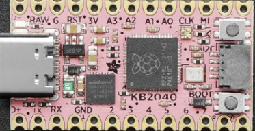

========================
Adafruit KB2040 Key Boar
========================

The KB2040 Key Boar is a general purpose RP2040 board supplied by 
Adafruit.

Features
========

* RP2040 microcontroller chip
* Dual-core ARM Cortex M0+ processor, flexible clock running up to 133 MHz
* 264kB of SRAM, and 8MB of on-board Flash memory
* Castellated module allows soldering direct to carrier boards
* USB Host and Device support via type C connector.
* Low-power sleep and dormant modes
* Drag & drop programming using mass storage over USB
* 18 multi-function GPIO pins
* 2× SPI, 2× I2C, 2× UART, 3× 12-bit ADC, 16× controllable PWM channels
* Accurate clock and timer on-chip
* Temperature sensor
* Accelerated floating point libraries on-chip
* 8 × Programmable IO (PIO) state machines for custom peripheral support
* On-board STEMMA QT connector for quick I2C connection.

Serial Console
==============

By default a serial console appears on pins 1 (TX GPIO0) and pin 2
(RX GPIO1).  This console runs a 115200-8N1.

The board can be configured to use the USB connection as the serial console.

Buttons and LEDs
================

There is a BOOT button which if held down when power is first
applied or the RESET button is pressed will cause the RP2040 to
boot into program mode and appear as a storage device to
a USB connecte .  Saving a .UF2 file to this device will 
replace the Flash ROM contents on the RP2040.

A RESET button that allows rebooting the board without disconnecting
the power.

A ws2812 (NeoPixel) smart RGB LED controlled by GPIO17.

Pin Mapping
===========
Pads numbered anticlockwise from USB connector.

===== ========== ==========
Pad   Signal     Notes
===== ========== ==========
1     D+         Alternate USB data connection.
2     GPIO0      Default TX for UART0 serial console
3     GPIO1      Default RX for UART1 serial console
4     Ground
5     Ground
6     GPIO2
7     GPIO3
8     GPIO4
9     GPIO5
10    GPIO6
11    GPIO7
12    GPIO8
13    GPIO9
14    GPIO10
15    GPIO19
16    GPIO20
17    GPIO18
18    GPIO26     ADC0
19    GPIO27     ADC1
20    GPIO28     ADC2
21    GPIO29     ADC3
22    Ground
23    Raw        Connected to USB +5V line
24    D-         Alternate USB data connection.
===== ========== ==========

The board has a STEMMA QT connector that is also connected to
pins GPI12 (I2C1 SDA) and GPI13 (I2C1 SDA).

Power Supply 
============

The Raspberry Pi Pico can be powered via the USB connector,
or by supplying +5V to pin 23.

The Raspberry Pi Pico chip run on 3.3 volts.  This is supplied
by an onboard voltage regulator. 

Configurations
==============

audiopack
---------

NuttShell configuration (console enabled in UART0, at 115200 bps) with
support for NSPlayer audio player.

composite
---------

NuttShell configuration (console enabled in UART0, at 115200 bps) with support for
CDC/ACM with MSC USB composite driver.

displaypack
-----------

NuttShell configuration (console enabled in USB Port, at 115200 bps) supporting
ST7789 video display.

enc28j60
--------

NuttShell configuration (console enabled in UART0, at 115200 bps) with support for
NC28J60.

lcd1602
-------

NuttShell configuration (console enabled in UART0, at 115200 bps) with support for
LCD1602.

nsh
---

Basic NuttShell configuration (console enabled in UART0, at 115200 bps).

nshsram
-------

NuttShell configuration (console enabled in UART0, at 115200 bps) with interrupt
vectors in RAM.

smp
---

Basic NuttShell configuration (console enabled in UART0, at 115200 bps) with
both ARM cores enabled.

spisd
-----

NuttShell configuration (console enabled in UART0, at 115200 bps) with SPI configured.

ssd1306
-------

NuttShell configuration (console enabled in UART0, at 115200 bps) with support for
ssd1306.

st7735
------

NuttShell configuration (console enabled in UART0, at 115200 bps) with support for
st7735.

usbmsc
------

NuttShell configuration (console enabled in UART0, at 115200 bps) with support for
usbmsc.

usbnsh
------

Basic NuttShell configuration (console enabled in USB Port, at 115200 bps).

waveshare-lcd-1.14
------------------

NuttShell configuration (console enabled in UART0, at 115200 bps) with support for
st7789.

waveshare-lcd-1.3
-----------------

NuttShell configuration (console enabled in UART0, at 115200 bps) with support for
usbmsc.

