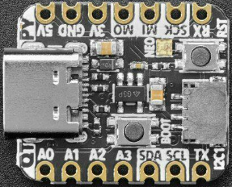

=======================
Adafruit QT Py RP2040
=======================

The QT Py RP2040 is a tiny general purpose RP2040 board supplied by 
Adafruit.

Features
========

* RP2040 microcontroller chip
* Dual-core ARM Cortex M0+ processor, flexible clock running up to 133 MHz
* 264kB of SRAM, and 8MB of on-board Flash memory
* Castellated module allows soldering direct to carrier boards
* USB Host and Device support via type C connector.
* Low-power sleep and dormant modes
* Drag & drop programming using mass storage over USB
* 13 multi-function GPIO pins (11 breakout pads and two QT pads)
* 2× SPI, 2× I2C, 2× UART, 4× 12-bit ADC, 16× controllable PWM channels
* Accurate clock and timer on-chip
* Temperature sensor
* Accelerated floating point libraries on-chip
* 8 × Programmable IO (PIO) state machines for custom peripheral support

Serial Console
==============

By default a serial console appears on GPIO pins 20 (RX GPIO1) and pin 5
(TX GPIO1).  This console runs a 115200-8N1.

The board can be configured to use the USB connection as the serial console.

Buttons and LEDs
================

A ws2812 (NeoPixel) smart RGB LED controlled by GPIO12 (data) and
GPIO11 (power).

There is a BOOT button which if held down when power is first
applied or the RESET button is pressed will cause the RP2040 to
boot into program mode and appear as a storage device to
a USB connecter.  Saving a .UF2 file to this device will 
replace the Flash ROM contents on the RP2040.

A RESET button that allows rebooting the board without disconnecting
the power.

Pin Mapping
===========
Pads numbered anticlockwise from USB connector.

===== ========== ==========
Pad   Signal     Notes
===== ========== ==========
1     GPIO26     ADC0
2     GPIO27     ADC1
3     GPIO28     ADC2
4     GPIO29     ADC3
5     GPIO24
6     GPIO25
7     GPIO20     Default TX for UART1 serial console
8     GPIO5      Default RX for UART1 serial console
9     GPIO6      
10    GPIO4
11    GPIO3
12    3.3V       Power out to peripherals.
13    Ground
14    5V
===== ========== ==========

The board has a STEMMA QT connector that is also connected to
pins GPIO22 (I2C1 SDA) and GPIO23 (I2C1 SCL).

Power Supply 
============

The Raspberry Pi Pico can be powered via the USB connector,
or by supplying +5V to pin 14.  The board had a diode that prevents
power from pin 14 from flowing back to the USB socket, although
this can be disabled by connecting on-board solder pads if there
is need to run as a usb host.

The Raspberry Pi Pico chip run on 3.3 volts which is supplied by
an on board regulator.

Configurations
==============

gpio
--------

NuttShell configuration (console enabled in UART1, at 115200 bps) with GPIO examples.

nsh
---

Basic NuttShell configuration (console enabled in UART1, at 115200 bps).

nsh-flash
---------

Basic NuttShell configuration (console enabled in UART0, at 115200 bps
with SMART flash filesystem.

nshsram
-------

NuttShell configuration (console enabled in UART1, at 115200 bps) with interrupt
vectors in RAM.

smp
---

Basic NuttShell configuration (console enabled in UART1, at 115200 bps) with
both ARM cores enabled.

usbnsh
------

Basic NuttShell configuration (console enabled in USB Port, at 115200 bps).

README.txt
==========

.. include:: README.txt
   :literal:
