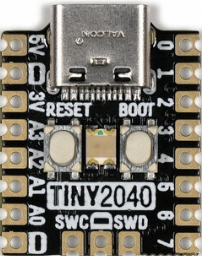

=================
Pimoroni Tiny2040
=================

The Tiny2040 is a general purpose RP2040 board supplied by Pimoroni. 

Features
========

* RP2040 microcontroller chip
* Dual-core ARM Cortex M0+ processor, flexible clock running up to 133 MHz
* 264kB of SRAM, and 2MB or 8MB of on-board Flash memory
* Castellated module allows soldering direct to carrier boards
* USB Host and Device support via type C connector
* Low-power sleep and dormant modes
* Drag & drop programming using mass storage over USB
* 12 multi-function GPIO pins
* 2× SPI, 2× I2C, 2× UART, 3× 12-bit ADC, 16× controllable PWM channels
* Accurate clock and timer on-chip
* Temperature sensor
* Accelerated floating point libraries on-chip
* 8 × Programmable IO (PIO) state machines for custom peripheral support

Serial Console
==============

By default a serial console appears on pins 15 (RX GPIO0) and 
pin 16 (TX GPIO1).  This console runs a 115200-8N1.

The board can be configured to use the USB connection as the serial console.

Buttons and LEDs
================

There is a single onboard RGB LED controlled by pins
GPIO18 (red), GPIO19 (green), and GPIO20 (blue).

The is a User/BOOT button readable as GPIO23. If held down when power
is first applied the RP2040 will boot into program mode and appear to
a computer connected via USB as a storage device.  Saving
a .UF2 file to this device will replace the Flash ROM contents 
on the RP2040.

Pin Mapping
===========
Pads numbered anticlockwise from USB connector.

===== ========== ==========
Pad   Signal     Notes
===== ========== ==========
1     VBUS       Connected to USB +5V
2     Ground
3     3V3        Out to peripherals
4     GPIO29     ADC3
5     GPIO28     ADC2
6     GPIO27     ADC1
7     GPIO26     ADC0
8     Ground
9     GPIO7
10    GPIO6
11    GPIO5
12    GPIO4
13    GPIO3
14    GPIO2
15    GPIO1      Default RX for UART0 serial console
16    GPIO0      Default TX for UART0 serial console
===== ========== ==========

Power Supply 
============

The Raspberry Pi Pico can be powered via the USB connector,
or by supplying +5V to pin 1. 

The Raspberry Pi Pico chip run on 3.3 volts.  This is supplied
by an onboard voltage regulator.

Configurations
==============

composite
---------

NuttShell configuration (console enabled in UART0, at 115200 bps) with support for
CDC/ACM with MSC USB composite driver.

gpio
--------

NuttShell configuration (console enabled in UART0, at 115200 bps) with GPIO examples.

nsh
---

Basic NuttShell configuration (console enabled in UART0, at 115200 bps).

nshsram
-------

NuttShell configuration (console enabled in UART0, at 115200 bps) with interrupt
vectors in RAM.

smp
---

Basic NuttShell configuration (console enabled in UART0, at 115200 bps) with
both ARM cores enabled.

spisd
-----

NuttShell configuration (console enabled in UART0, at 115200 bps) with SPI configured.

usbmsc
------

NuttShell configuration (console enabled in UART0, at 115200 bps) with support for
usbmsc.

usbnsh
------

Basic NuttShell configuration (console enabled in USB Port, at 115200 bps).

