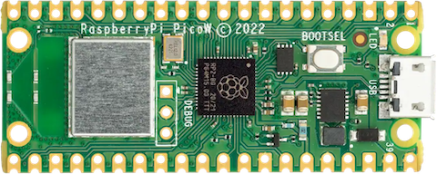

===============================
Raspberry Pi Pico W
===============================

.. tags:: chip:rp2040, wifi

The `Raspberry Pi Pico <https://www.raspberrypi.com/products/raspberry-pi-pico/>`_ is a general purpose board supplied by
the Raspberry Pi Foundation. The W variant adds built in WiFi communications.

Features
========

* RP2040 microcontroller chip
* Dual-core ARM Cortex M0+ processor, flexible clock running up to 133 MHz
* 264kB of SRAM, and 2MB of on-board Flash memory
* Castellated module allows soldering direct to carrier boards
* USB 1.1 Host and Device support
* Low-power sleep and dormant modes
* Drag & drop programming using mass storage over USB
* 26 multi-function GPIO pins
* 2× SPI, 2× I2C, 2× UART, 3× 12-bit ADC, 16× controllable PWM channels
* Accurate clock and timer on-chip
* Temperature sensor
* Accelerated floating point libraries on-chip
* 8 × Programmable IO (PIO) state machines for custom peripheral support
* Built in WiFi radio (Infineon CYW43439)

Buttons and LEDs
================

LED controlled by GPIO0 of the wireless chip (not the RP2040 processor).
Use rp2040_extra_gpio_put(0,value) to control this LED.

A BOOTSEL button, which if held down when power is first
applied to the board, will cause the RP2040 to boot into programming
mode and appear  as a storage device to a computer connected via USB.
Saving a .UF2 file to this device will replace the Flash ROM contents
on the RP2040.

Wireless Communication
======================

The on board Infineon CYW43439 supports 2.4 GHz WiFi 4 communications
(802.11n), WPS3 and SoftAP with up to four clients.

Pin Mapping
===========

===== ========== ==========
Pin   Signal     Notes
===== ========== ==========
1     GPIO0      Default TX for UART0 serial console
2     GPIO1      Default RX for UART0 serial console
3     Ground
4     GPIO2
5     GPIO3
6     GPIO4      Default SDA for I2C0
7     GPIO5      Default SCL for I2C0
8     Ground
9     GPIO6      Default SDA for I2C1
10    GPIO7      Default SCL for I2C1
11    GPIO8      Default RX for SPI1
12    GPIO9      Default CSn for SPI1
13    Ground
14    GPIO10     Default SCK for SPI1
15    GPIO11     Default TX for SPI1
16    GPIO12
17    GPIO13
18    Ground
19    GPIO14
20    GPIO15
21    GPIO16     Default RX for SPI0
22    GPIO17     Default CSn for SPI0
23    Ground
24    GPIO18     Default SCK for SPI0
25    GPIO19     Default TX for SPI0
26    GPIO20     Default TX for UART1 serial console
27    GPIO21     Default RX for UART1 serial console
28    Ground
29    GPIO22
30    Run
31    GPIO26     ADC0
32    GPIO27     ADC1
33    AGND       Analog Ground
34    GPIO28     ADC2
35    ADC_VREF   Analog reference voltage
36    3V3        Power output to peripherals
37    3V3_EN     Pull to ground to turn off.
38    Ground
39    VSYS       +5V Supply to board
40    VBUS       Connected to USB +5V
===== ========== ==========

Other RP2040 Pins
=================

GPIO23 Output - WiFi controller enable.
GPIO24 I/O    - WiFi controller data line.
GPIO25 Output - WiFi controller chip select line.
GPIO29 Output - WiFi controller clock line.
ADC3   Input  - Analog voltage equal to one third of VSys voltage.

Note: ADC3 and GPIO29 share the same pin on the RP2040. If the
GPIO25 line is held high (Wifi controller NOT selected) then a voltage
equal to one third of the VSys voltage with appear on this line and
can be read with ADC3.  When the WiFi chip is selected this voltage
will be removed so the line can be used as a clock for data exchange
with the WiFi controller.

Separate pins for the Serial Debug Port (SDB) are available

WiFi Controller GPIO
====================

* GPIO0 - Output - On board LED.
* GPIO1 - Output - Power supply control.
* GPIO2 - Input  - High if USB port or Pad 40 supplying power.

Power Supply
============

The Raspberry Pi Pico can be powered via the USB connector,
or by supplying +5V to pin 39.  The board had a diode that prevents
power from pin 39 from flowing back to the USB socket, although
the socket can be power via pin 30.

The Raspberry Pi Pico chip run on 3.3 volts.  This is supplied
by an onboard voltage regulator.  This regulator can be disabled
by pulling pin 37 to ground.

The regulator can run in two modes.  By default the regulator runs
in PFM mode which provides the best efficiency, but may be
switched to PWM mode for improved ripple by outputting a one
on the wireless chip's GPIO1 (not the RP2040's GPIO1).

Installation & Build
====================

For instructions on how to to install the build dependencies and create a NuttX
image for this board, consult the main :doc:`RP2040 documentation
<../../index>`.

Configurations
==============

All configurations listed below can be configured using the following command in
the ``nuttx`` directory (again, consult the main :doc:`RP2040 documentation
<../../index>`):

.. code:: console

   $ ./tools/configure.sh raspberrypi-pico-w:<configname>

audiopack
---------

NuttShell configuration (console enabled in UART0, at 115200 bps) with
support for NXPlayer audio player.

Pico Audio Pack support.
See the following page for connection:
https://shop.pimoroni.com/products/pico-audio-pack
SD card interface is also enabled.

composite
---------

NuttShell configuration (console enabled in UART0, at 115200 bps) with support for
CDC/ACM with MSC USB composite driver. ``conn`` command enables the composite
device.

displaypack
-----------

NuttShell configuration (console enabled in USB Port, at 115200 bps) supporting
ST7789 video display.

See the following page for connection:
https://shop.pimoroni.com/products/pico-display-pack

enc28j60
--------

NuttShell configuration (console enabled in UART0, at 115200 bps) with support for
ENC28J60.

ENC28J60 SPI ethernet controller supports:

  - IP address is configured by DHCP.
  - DNS address is 8.8.8.8 (CONFIG_NETINIT_DNSIPADDR)
  - NTP client is enabled.

.. list-table:: ENC28J60 connections
   :widths: auto
   :header-rows: 1

   * - ENC28J60
     - Raspberry Pi Pico W
   * - GND
     - GND (Pin 3 or 38 or ...)
   * - 3.3V
     - 3V3 OUT (Pin 36)
   * - SI
     - GP15 (SPI1 TX) (Pin 20)
   * - SCK
     - GP14 (SPI1 SCK) (Pin 19)
   * - CS
     - GP13 (SPI1 CSn) (Pin 17)
   * - SO
     - GP12 (SPI1 RX) (Pin 16)
   * - INT
     - GP11 (Pin 15)
   * - RESET
     - GP10 (Pin 14)

lcd1602
-------

NuttShell configuration (console enabled in UART0, at 115200 bps) with support for
LCD1602 Segment LCD Display (I2C).

.. list-table:: LCD1602 connections
   :widths: auto
   :header-rows: 1

   * - PCF8574 BackPack 
     - Raspberry Pi Pico W
   * - GND
     - GND (Pin 3 or 38 or ...)
   * - VCC
     - 5V Vbus (Pin 40)
   * - SDA
     - GP4 (I2C0 SDA) (Pin 6)
   * - SCL
     - GP5 (I2C0 SCL) (Pin 7)

nsh
---

Basic NuttShell configuration (console enabled in UART0, at 115200 bps).

nsh-flash
---------

Basic NuttShell configuration (console enabled in UART0, at 115200 bps
with SMART flash filesystem.

nshsram
-------

NuttShell configuration (console enabled in UART0, at 115200 bps) with interrupt
vectors in RAM.

smp
---

Basic NuttShell configuration (console enabled in UART0, at 115200 bps) with
both ARM cores enabled.

spisd
-----

NuttShell configuration (console enabled in UART0, at 115200 bps) with SPI SD
card support enabled.

.. list-table:: spisd connections
   :widths: auto
   :header-rows: 1

   * - SD card slot
     - Raspberry Pi Pico W
   * - DAT2          
     - Not connected
   * - DAT3/CS
     - GP17 (SPI0 CSn) (Pin 22)
   * - CMD /DI
     - GP19 (SPI0 TX)  (Pin 25)
   * - VDD
     - 3V3 OUT (Pin 36)
   * - CLK/SCK
     - GP18 (SPI0 SCK) (Pin 24)
   * - VSS
     - GND (Pin 3 or 38 or ...)
   * - DAT0/DO
     - GP16 (SPI0 RX)  (Pin 21)
   * - DAT1          
     - Not connected

Card hot swapping is not supported.

ssd1306
-------

NuttShell configuration (console enabled in UART0, at 115200 bps) with support
for SSD1306 OLED display (I2C) test configuration.

.. list-table:: SSD1306 connections
   :widths: auto
   :header-rows: 1

   * - SSD1306
     - Raspberry Pi Pico W
   * - GND
     - GND (Pin 3 or 38 or ...)
   * - VCC
     - 3V3 OUT (Pin 36)
   * - SDA
     - GP4 (I2C0 SDA) (Pin 6)
   * - SCL   
     - GP5 (I2C0 SCL) (Pin 7)

st7735
------

NuttShell configuration (console enabled in UART0, at 115200 bps) with support for
ST7735 SPI LCD.

.. list-table:: ST7735 connections
   :widths: auto
   :header-rows: 1

   * - st7735
     - Raspberry Pi Pico W
   * - GND
     - GND (Pin 3 or 38 or ...)
   * - VCC
     - 5V Vbus (Pin 40)
   * - SDA
     - GP15 (SPI1 TX) (Pin 20)
   * - SCK
     - GP14 (SPI1 SCK) (Pin 19)
   * - CS
     - GP13 (SPI1 CSn) (Pin 17)
   * - AO(D/C)
     - GP12 (SPI1 RX) (Pin 16)
   * - BL
     - GP11 (Pin 15)
   * - RESET
     - GP10 (Pin 14)

telnet
------

NuttShell configuration (console enabled in UART0, at 115200 bps) with WiFi client
mode and both telnet server and client enabled.

After loading this configuration use make menuconfig to change the country code in
Device Drivers->Wireless Device Support->IEEE 802.11 Device Support and the 
wireless configuration in Application Configuration->Network Utilities->Network 
initialization->WAPI Configuration to match your wireless network.

usbmsc
------

NuttShell configuration (console enabled in UART0, at 115200 bps) with support for
USB MSC and CDC/ACM.

``msconn`` and ``sercon`` commands enable the MSC and CDC/ACM devices. The MSC
support provides the interface to the SD card with SPI, so the SD card slot
connection like spisd configuration is required.

usbnsh
------

Basic NuttShell configuration using CDC/ACM serial (console enabled in USB Port,
at 115200 bps).

waveshare-lcd-1.14
------------------

NuttShell configuration (console enabled in UART0, at 115200 bps) with support for
st7789.

waveshare-lcd-1.3
-----------------

NuttShell configuration (console enabled in UART0, at 115200 bps) with support for
usbmsc.
