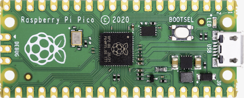

===============================
Raspberry Pi Pico
===============================

The `Raspberry Pi Pico <https://www.raspberrypi.com/products/raspberry-pi-pico/>`_ is a general purpose board supplied by
the Raspberry Pi Foundation.

Features
========

* RP2040 microcontroller chip
* Dual-core ARM Cortex M0+ processor, flexible clock running up to 133 MHz
* 264kB of SRAM, and 2MB of on-board Flash memory
* Castellated module allows soldering direct to carrier boards
* USB 1.1 Host and Device support
* Low-power sleep and dormant modes
* Drag & drop programming using mass storage over USB
* 26 multi-function GPIO pins
* 2× SPI, 2× I2C, 2× UART, 3× 12-bit ADC, 16× controllable PWM channels
* Accurate clock and timer on-chip
* Temperature sensor
* Accelerated floating point libraries on-chip
* 8 × Programmable IO (PIO) state machines for custom peripheral support

Serial Console
==============

By default a serial console appears on pins 1 (TX GPIO0) and pin 2
(RX GPIO1).  This console runs a 115200-8N1.

The board can be configured to use the USB connection as the serial console.

Buttons and LEDs
================

User LED controlled by GPIO25.

A BOOTSEL button, which if held down when power is first
applied to the board, the cause the RP2040 to boot programming mode 
and appear to a computer connected via USB as a storage device.  
Saving a .UF2 file to this device will replace the Flash ROM contents 
on the RP2040.

Pin Mapping
===========
Pads numbered anticlockwise from USB connector.

===== ========== ==========
Pad   Signal     Notes
===== ========== ==========
1     GPIO0      Default TX for UART0 serial console
2     GPIO1      Default RX for UART1 serial console
3     Ground
4     GPIO2
5     GPIO3
6     GPIO4
7     GPIO5
8     Ground
9     GPIO6
10    GPIO7
11    GPIO8
12    GPIO9
13    Ground
14    GPIO10
15    GPIO11
16    GPIO12
17    GPIO13
18    Ground
19    GPIO14
20    GPIO15
21    GPIO16
22    GPIO17
23    Ground
24    GPIO18
25    GPIO19
26    GPIO20
27    GPIO21
28    Ground
29    GPIO22
30    Run
31    GPIO26     ADC0
32    GPIO27     ADC1
33    AGND       Analog Ground 
34    GPIO28     ADC2
35    ADC_VREF
36    3V3        Power output to peripherals
37    3V3_EN     Pull to ground to turn off. 
38    Ground
39    VSYS       +5V Supply to board
40    VBUS       Connected to USB +5V
===== ========== ==========

Separate pins for the Serial Debug Port (SDB) are available

Power Supply 
============

The Raspberry Pi Pico can be powered via the USB connector,
or by supplying +5V to pin 39.  The board had a diode that prevents
power from pin 39 from flowing back to the USB socket, although
the socket can be power via pin 30.

The Raspberry Pi Pico chip run on 3.3 volts.  This is supplied
by an onboard voltage regulator.  This regulator can be disabled
by pulling pin 37 to ground.

The regulator can run in two modes.  By default the regulator runs
in PFM mode which provides the best efficiency, but may be 
switched to PWM mode for improved ripple by outputting a one
on GPIO23. 

Configurations
==============

audiopack
---------

NuttShell configuration (console enabled in UART0, at 115200 bps) with
support for NSPlayer audio player.

composite
---------

NuttShell configuration (console enabled in UART0, at 115200 bps) with support for
CDC/ACM with MSC USB composite driver.

displaypack
-----------

NuttShell configuration (console enabled in USB Port, at 115200 bps) supporting
ST7789 video display.

enc28j60
--------

NuttShell configuration (console enabled in UART0, at 115200 bps) with support for
NC28J60.

lcd1602
-------

NuttShell configuration (console enabled in UART0, at 115200 bps) with support for
LCD1602.

nsh
---

Basic NuttShell configuration (console enabled in UART0, at 115200 bps).

nshsram
-------

NuttShell configuration (console enabled in UART0, at 115200 bps) with interrupt
vectors in RAM.

smp
---

Basic NuttShell configuration (console enabled in UART0, at 115200 bps) with
both ARM cores enabled.

spisd
-----

NuttShell configuration (console enabled in UART0, at 115200 bps) with SPI configured.

ssd1306
-------

NuttShell configuration (console enabled in UART0, at 115200 bps) with support for
ssd1306.

st7735
------

NuttShell configuration (console enabled in UART0, at 115200 bps) with support for
st7735.

usbmsc
------

NuttShell configuration (console enabled in UART0, at 115200 bps) with support for
usbmsc.

usbnsh
------

Basic NuttShell configuration (console enabled in USB Port, at 115200 bps).

waveshare-lcd-1.14
------------------

NuttShell configuration (console enabled in UART0, at 115200 bps) with support for
st7789.

waveshare-lcd-1.3
-----------------

NuttShell configuration (console enabled in UART0, at 115200 bps) with support for
usbmsc.

