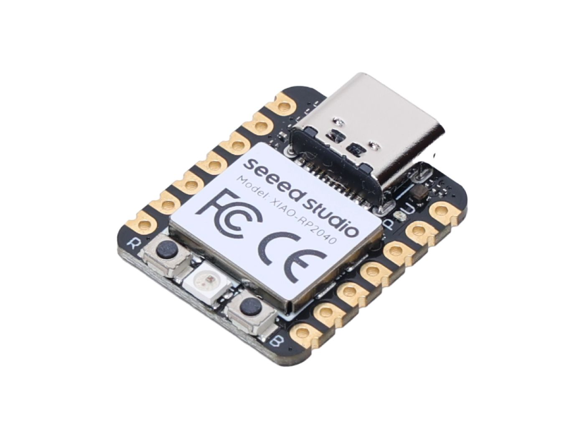

========================
Seeed Studio Xiao RP2040
========================

The `Seeed Studio Xiao RP2040 <https://wiki.seeedstudio.com/XIAO-RP2040/>`_ is a general purpose board supplied by
Seeed Studio and it is compatible with the Raspberry Pi RP2040 ecosystem as they share the same RP2040 chip.

Features
========

* RP2040 microcontroller chip
* Dual-core ARM Cortex M0+ processor, flexible clock running up to 133 MHz
* 264KB of SRAM, and 2MB of onboard Flash memory
* 11 digital pins, 4 analog pins, 11 PWM Pins
* 1 I2C interface, 1 UART interface, 1 SPI interface, 1 SWD Bonding pad interface
* USB Type-C interface
* 1 user LED, 1 power LED, two LEDs for serial port downloading, 1 RGB LED
* 1 RESET button, 1 BOOT button

Serial Console
==============

By default a serial console appears on pins 6 (TX GPIO0) and pin 7
(RX GPIO1).  This console runs a 115200-8N1.
The board can be configured to use the USB connection as the serial console.

LEDs
====

There are 2 LEDs available for user:

- A RGB LED connected to GPIO16 (PIN_LED_G), GPIO17 (PIN_LED_R), GPIO25 (PIN_LED_B).
- A NeoPixel RGB LED connected to GPIO11 (NEOPIXEL_POWER) and GPIO12 (PIN_NEOPIXEL).

Buttons
=======

There are 2 buttons available:

A RESET button and a BOOT button, which if held down when power is first
applied to the board, will cause the RP2040 to boot into programming
mode and appear as a storage device to a computer connected via USB.
Saving a .UF2 file to this device will replace the Flash ROM contents
on the RP2040.

Pin Mapping
===========
Pads numbered anticlockwise from USB connector.

===== ========== ==========
Pad   Signal     Notes
===== ========== ==========
0     GPI26      D0/A0
1     GPI27      D1/A1
2     GPI28      D2/A2
3     GPI29      D3/A3
4     GPIO6      D4/SDA
5     GPIO7      D5/SCL
6     GPIO0      Default TX for UART0 serial console
7     GPIO1      Default RX for UART1 serial console/CSn
8     GPIO2      D8/SCK
9     GPIO3      D10/MOSI
10    GPIO4      D9/MicroSD
11    3V3        Power output to peripherals
12    Ground
13    VIN        +5V Supply to board
===== ========== ==========

Power Supply
============
For general I/O pins:

Working voltage of MCU is 3.3V. Voltage input connected to general I/O pins
may cause chip damage if it' higher than 3.3V.

For power supply pins:

The built-in DC-DC converter circuit able to change 5V voltage into 3.3V allows
to power the device with a 5V supply via VIN-PIN and via the USB connector.

Configurations
==============

nsh
---

Basic NuttShell configuration (console enabled in UART0, at 115200 bps).

userled
---

This is an nsh configuration with added support for user LEDs.

usbnsh
------

Basic NuttShell configuration (console enabled in USB Port, at 115200 bps).

README.txt
==========

.. include:: README.txt
   :literal:
