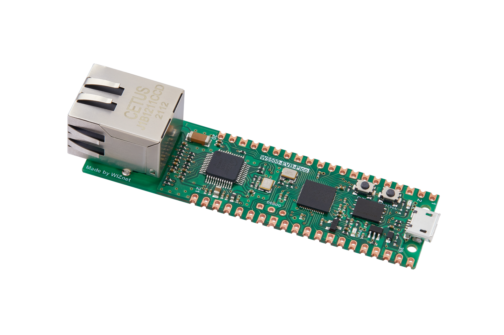

===============================
W5500-EVB-Pico
===============================

The `W5500-EVB-Pico <https://docs.wiznet.io/Product/iEthernet/W5500/w5500-evb-pico/>`_
is a microcontroller evaluation board based on the Raspberry Pi RP2040 and fully
hardwired TCP/IP controller W5500 – and basically works the same as Raspberry Pi
Pico board but with additional Ethernet via W5500.

Features
========

* RP2040 microcontroller chip
* Dual-core ARM Cortex M0+ processor, flexible clock running up to 133 MHz
* 264kB of SRAM, and 2MB of on-board Flash memory
* Castellated module allows soldering direct to carrier boards
* USB 1.1 Host and Device support
* Low-power sleep and dormant modes
* Drag & drop programming using mass storage over USB
* 26 multi-function GPIO pins
* 2× SPI, 2× I2C, 2× UART, 3× 12-bit ADC, 16× controllable PWM channels
* Accurate clock and timer on-chip
* Temperature sensor
* Accelerated floating point libraries on-chip
* 8 × Programmable IO (PIO) state machines for custom peripheral support
* Ethernet port via WIZnet W5500, hardwired to SPI0 and two GPIO pins.

Supported RP2040 capabilities
=============================

* UART  (console port)

  * GPIO 0 (UART0 TX) and GPIO 1 (UART0 RX) are used for the console.

* I2C
* SPI (master only)
* DMAC
* PWM
* ADC
* Watchdog
* USB device

  * MSC, CDC/ACM serial and these composite device are supported.
  * CDC/ACM serial device can be used for the console.

* PIO (RP2040 Programmable I/O)
* Flash ROM Boot
* SRAM Boot

  * If Pico SDK is available, nuttx.uf2 file which can be used in
    BOOTSEL mode will be created.
  * Persistent flash filesystem in unused flash ROM

Currently unsupported RP2040 capabilities
=========================================

* SPI Slave Mode
* SSI
* RTC
* Timers

Serial Console
==============

The board is configured to use the USB connection as the serial console.

Buttons and LEDs
================

User LED controlled by GPIO25.

A BOOTSEL button, which if held down when power is first
applied to the board, will cause the RP2040 to boot into programming
mode and appear as a storage device to a computer connected via USB.
Saving a .UF2 file to this device will replace the Flash ROM contents
on the RP2040.

Pin Mapping
===========
Pads numbered anticlockwise from USB connector.

===== ========== ==========
Pad   Signal     Notes
===== ========== ==========
1     GPIO0      Default TX for UART0 serial console
2     GPIO1      Default RX for UART1 serial console
3     Ground
4     GPIO2
5     GPIO3
6     GPIO4
7     GPIO5
8     Ground
9     GPIO6
10    GPIO7
11    GPIO8
12    GPIO9
13    Ground
14    GPIO10
15    GPIO11
16    GPIO12
17    GPIO13
18    Ground
19    GPIO14
20    GPIO15
21    GPIO16     W5500 MISO
22    GPIO17     W5500 CSn
23    Ground
24    GPIO18     W5500 SCLK
25    GPIO19     W5500 MOSI
26    GPIO20     W5500 RSTn
27    GPIO21     W5500 INTn
28    Ground
29    GPIO22
30    Run
31    GPIO26     ADC0
32    GPIO27     ADC1
33    AGND       Analog Ground
34    GPIO28     ADC2
35    ADC_VREF
36    3V3        Power output to peripherals
37    3V3_EN     Pull to ground to turn off.
38    Ground
39    VSYS       +5V Supply to board
40    VBUS       Connected to USB +5V
===== ========== ==========

Other RP2040 Pins
=================

====== ==========
Signal Notes
====== ==========
GPIO23 Output - Power supply control.
GPIO24 Input  - High if USB port or Pad 40 supplying power.
GPIO25 Output - On board LED.
ADC3   Input  - Analog voltage equal to one third of VSys voltage.
====== ==========

Separate pins for the Serial Debug Port (SDB) are available

Power Supply
============

The W5500-EVB-Pico can be powered via the USB connector,
or by supplying +5V to pin 39.  The board had a diode that prevents
power from pin 39 from flowing back to the USB socket, although
the socket can be power via pin 30.

The W5500-EVB-Pico chip run on 3.3 volts.  This is supplied
by an onboard voltage regulator.  This regulator can be disabled
by pulling pin 37 to ground.

The regulator can run in two modes.  By default the regulator runs
in PFM mode which provides the best efficiency, but may be
switched to PWM mode for improved ripple by outputting a one
on GPIO23.

Installation
============

1. Download Raspberry Pi Pico SDK

::

  $ git clone -b 1.1.2 https://github.com/raspberrypi/pico-sdk.git

2. Set PICO_SDK_PATH environment variable

::

  $ export PICO_SDK_PATH=<absolute_path_to_pico-sdk_directory>

3. Configure and build NuttX

::

  $ git clone https://github.com/apache/nuttx.git nuttx
  $ git clone https://github.com/apache/nuttx-apps.git apps
  $ cd nuttx
  $ make distclean
  $ ./tools/configure.sh w5500-evb-pico:usbnsh
  $ make V=1

4. Connect W5500-EVB-Pico board to USB port while pressing BOOTSEL.
   The board will be detected as USB Mass Storage Device.
   Then copy "nuttx.uf2" into the device.
   (Same manner as the standard Pico SDK applications installation.)

5. `usbnsh` configuration provides the console access by USB CDC/ACM serial
   devcice.  The console is available by using a terminal software on the USB
   host.

Configurations
==============

usbnsh
------

USB CDC/ACM serial console with NuttShell.  TCP/IPv4 & IPv6 networking is
supported via the Ethernet port.

License exceptions
==================

The following files are originated from the files in Pico SDK.
So, the files are licensed under 3-Clause BSD same as Pico SDK.

Created by referring to the Pico SDK clock initialization
---------------------------------------------------------

* arch/arm/src/rp2040/rp2040_clock.c
* arch/arm/src/rp2040/rp2040_pll.c
* arch/arm/src/rp2040/rp2040_xosc.c

Providing an API similar to the Pico SDK's hardware_pio API
-----------------------------------------------------------

* arch/arm/src/rp2040/rp2040_pio.c
* arch/arm/src/rp2040/rp2040_pio.h
* arch/arm/src/rp2040/rp2040_pio_instructions.h

Generated from rp2040.svd originally provided in Pico SDK
---------------------------------------------------------

* arch/arm/src/rp2040/hardware/\*.h
