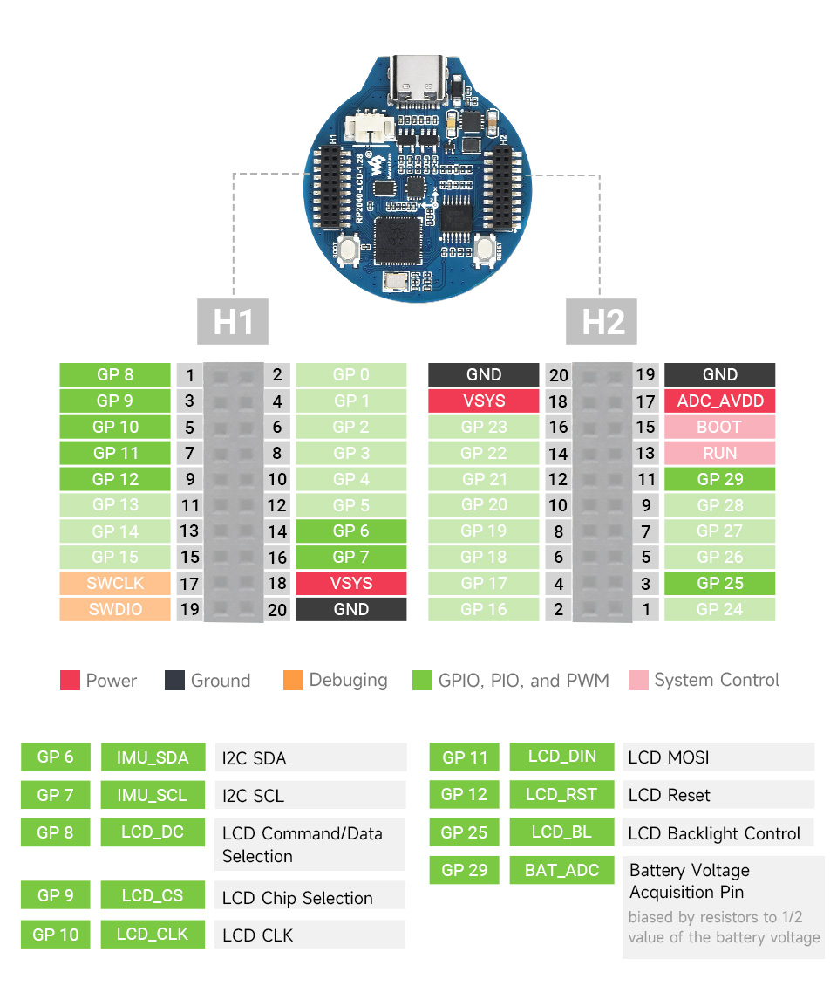

===============================
Waveshare RP2040 LCD 1.28
===============================

The `Waveshare RP2040 LCD 1.28 <https://www.waveshare.com/wiki/RP2040-LCD-1.28>`_
is a low-cost, high-performance MCU board designed by Waveshare based on RP2040
with onboard 1.28 inch LCD.

Features
========

* RP2040 MCU chip designed by Raspberry Pi in the United Kingdom
* Dual-core Arm Cortex M0+ processor, flexible clock running up to 133 MHz
* 264KB of SRAM, and 2MB of onboard Flash memory
* Type-C connector, keeps it up to date, easier to use
* Onboard 1.28-inch 240 x 240 resolution, 65K RGB IPS LCD display for clear color pictures
* Lithium battery recharge/discharge header, suitable for mobile devices
* All GPIOs are adapted through 1.27 pitch female headers
  (There are 30 pins in total, but some pins have been connected to the internal circuit,
  you need to pay attention when multiplexing, please refer to the wiki for details)
* USB 1.1 with device and host support
* Low-power sleep and dormant modes
* Drag-and-drop programming using mass storage over USB
* 2 x SPI, 2 x I2C, 2 x UART, 2 x UART, 4 x 12-bit ADC, 16 x controllable PWM channels
* Accurate clock and timer on-chip
* Temperature sensor
* Accelerated floating-point libraries on-chip
* 8 x Programmable I/O (PIO) state machines for custom peripheral support

Serial Console
==============

By default a serial console appears on pins 1 (TX GPIO0) and pin 2
(RX GPIO1).  This console runs a 115200-8N1.

The board can be configured to use the USB connection as the serial console.

Buttons and LEDs
================

No user LED is provided.

A BOOT button, which if held down when pressing RESET or power is first
applied to the board, will cause the RP2040 to boot into programming
mode and appear as a storage device to a computer connected via USB.
Saving a .UF2 file to this device will replace the Flash ROM contents
on the RP2040.

Pin Mapping
===========

===== ========== ==========
Pad   Signal     Notes
===== ========== ==========
2     GPIO0      Default TX for UART0 serial console
4     GPIO1      Default RX for UART0 serial console
===== ========== ==========

Power Supply
============

The Raspberry Pi Pico can be powered via the USB connector, connecting
a lithium battery through connector, or by supplying +5V to pin 18(VSYS).
The board had a diode that prevents power from pin 18 from flowing back
to the USB socket. Power through USB or VSYS will be charging the battery
if connected. The schematic is available at `RP2040-LCD-1.28-sch.pdf <https://www.waveshare.net/w/upload/6/60/RP2040-LCD-1.28-sch.pdf>`_

Configurations
==============

composite
---------

NuttShell configuration (console enabled in UART0, at 115200 bps) with support for
CDC/ACM with MSC USB composite driver.

nsh
---

Basic NuttShell configuration (console enabled in UART0, at 115200 bps).

nsh-flash
---------

Basic NuttShell configuration (console enabled in UART0, at 115200 bps
with SMART flash filesystem.

nshsram
-------

NuttShell configuration (console enabled in UART0, at 115200 bps) with interrupt
vectors in RAM.

smp
---

Basic NuttShell configuration (console enabled in UART0, at 115200 bps) with
both ARM cores enabled.

spisd
-----

NuttShell configuration (console enabled in UART0, at 115200 bps) with SPI configured.

usbmsc
------

NuttShell configuration (console enabled in UART0, at 115200 bps) with support for
usbmsc.

usbnsh
------

Basic NuttShell configuration (console enabled in USB Port, at 115200 bps).

fb
------------------

NuttShell configuration (console enabled in USB Port, at 115200 bps) with support for
gc9a01 and video framebuffer example.

lvgl
-----------------

NuttShell configuration (console enabled in USB Port, at 115200 bps) with support for
gc9a01 and LVGL demo (using lcd_dev).

