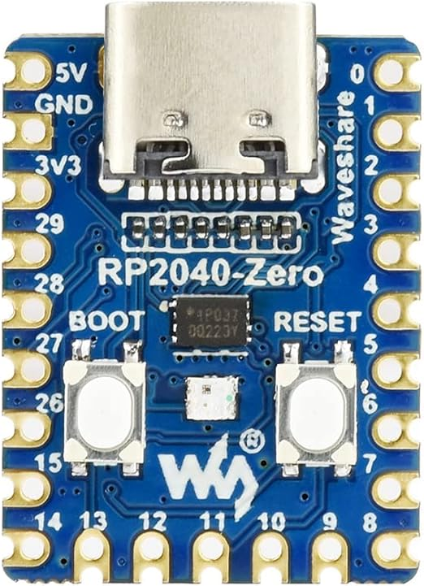

===============================
Waveshare RP2040 Zero
===============================

The `Waveshare RP2040 Zero <https://www.waveshare.com/wiki/RP2040-Zero>`_ is a general purpose board supplied by
Waveshare.

Features
========

* RP2040 microcontroller chip
* Dual-core ARM Cortex M0+ processor, flexible clock running up to 133 MHz
* 264kB of SRAM, and 2MB of on-board Flash memory
* Castellated module allows soldering direct to carrier boards
* USB 1.1 Host and Device support
* Low-power sleep and dormant modes
* Drag & drop programming using mass storage over USB
* 20 multi-function GPIO pins
* 2× SPI, 2× I2C, 2× UART, 3× 12-bit ADC, 16× controllable PWM channels
* Accurate clock and timer on-chip
* Temperature sensor
* Accelerated floating point libraries on-chip
* 8 × Programmable IO (PIO) state machines for custom peripheral support

Serial Console
==============

By default a serial console appears on pins 23 (TX GPIO0) and pin 22
(RX GPIO1).  This console runs a 115200-8N1.

The board can be configured to use the USB connection as the serial console.

Buttons and LEDs
================

A ws2812 (NeoPixel) smart RGB LED controlled by GPIO16 (data).

There is a BOOT button which if held down when power is first
applied or the RESET button is pressed will cause the RP2040 to
boot into program mode and appear as a storage device to
a USB connecter.  Saving a .UF2 file to this device will
replace the Flash ROM contents on the RP2040.

Pin Mapping
===========
Pads numbered anticlockwise from USB connector.

===== ========== ==========
Pad   Signal     Notes
===== ========== ==========
1     5V
2     Ground
3     3.3V
4     GPIO29
5     GPIO28
6     GPIO27
7     GPIO26
8     GPIO15
9     GPIO14
10    GPIO13
11    GPIO12
12    GPIO11     Default TX for SPI1
13    GPIO10     Default SCK for SPI1
14    GPIO9      Default CSn for SPI1
15    GPIO8      Default RX for SPI1
16    GPIO7      Default SCL for I2C1
17    GPIO6      Default SDA for I2C1
18    GPIO5      Default SCL for I2C0
19    GPIO4      Default SDA for I2C0
20    GPIO3
21    GPIO2
22    GPIO1      Default RX for UART0 serial console
23    GPIO0      Default TX for UART0 serial console
===== ========== ==========

Power Supply
============

The Waveshare RP2040 Zero can be powered via the USB connector,
or by supplying +5V to pin 1.

The RP2040 runs on 3.3 volts.  This is supplied
by an onboard voltage regulator.

Supported Capabilities
======================

NuttX supports the following RP2040 capabilities:

* UART  (console port)

  * GPIO 0 (UART0 TX) and GPIO 1 (UART0 RX) are used for the console.

* I2C
* SPI (master only)
* DMAC
* PWM
* ADC
* Watchdog
* USB device

  * MSC, CDC/ACM serial and these composite device are supported.
  * CDC/ACM serial device can be used for the console.

* PIO (RP2040 Programmable I/O)
* Flash ROM Boot
* SRAM Boot

  * If Pico SDK is available, nuttx.uf2 file which can be used in BOOTSEL mode will be created.

* Persistent flash filesystem in unused flash ROM
* WiFi wireless communication

There is currently no direct user mode access to these RP2040 hardware features:

* SPI Slave Mode
* SSI
* RTC
* Timers

NuttX also provide support for these external devices:

* BMP180 sensor at I2C0 (don't forget to define I2C0 GPIOs at "I2C0 GPIO pin assign" in Board Selection menu)
* INA219 sensor / module (don't forget to define I2C0 GPIOs at "I2C0 GPIO pin assign" in Board Selection menu)
* SHT4X sensor at I2C0
* Pico Display Pack (ST7789 LCD)

  * RGB leds and buttons are not supported yet.

* Pico Audio Pack (PCM5100A I2S DAC)

  * I2S interface is realized by PIO.

* WS2812 smart pixel support

Installation
============

1. Download Raspberry Pi Pico SDK

.. code-block:: console

  $ git clone -b 2.0.0 https://github.com/raspberrypi/pico-sdk.git

2. Download and install picotool

  Instructions can be found here: https://github.com/raspberrypi/picotool

  If you are on Arch Linux, you can install the picotool through the AUR:

.. code-block:: console

  $ yay -S picotool

3. Set PICO_SDK_PATH environment variable

.. code-block:: console

  $ export PICO_SDK_PATH=<absolute_path_to_pico-sdk_directory>

4. Configure and build NuttX

.. code-block:: console

  $ git clone https://github.com/apache/nuttx.git nuttx
  $ git clone https://github.com/apache/nuttx-apps.git apps
  $ cd nuttx
  $ make distclean
  $ ./tools/configure.sh waveshare-rp2040-zero:nsh
  $ make V=1

5. Connect Raspberry Pi Pico board to USB port while pressing BOOTSEL.
   The board will be detected as USB Mass Storage Device.
   Then copy "nuttx.uf2" into the device.
   (Same manner as the standard Pico SDK applications installation.)

6. To access the console, GPIO 0 and 1 pins must be connected to the
   device such as USB-serial converter.

   `usbnsh` configuration provides the console access by USB CDC/ACM serial
   device.  The console is available by using a terminal software on the USB
   host.

Configurations
==============

gpio
--------

NuttShell configuration (console enabled in UART0, at 115200 bps) with GPIO examples.

nsh
---

Basic NuttShell configuration (console enabled in UART0, at 115200 bps).

usbnsh
------

Basic NuttShell configuration using CDC/ACM serial (console enabled in USB Port,
at 115200 bps).

ws2812
------

Basic NuttShell configuration with WS2812 driver and example enabled. Console is enabled over USB at 115200 bps.

License exceptions
==================

The following files are originated from the files in Pico SDK.
So, the files are licensed under 3-Clause BSD same as Pico SDK.

* arch/arm/src/rp2040/rp2040_clock.c
* arch/arm/src/rp2040/rp2040_pll.c
* arch/arm/src/rp2040/rp2040_xosc.c

  * These are created by referring the Pico SDK clock initialization.

* arch/arm/src/rp2040/rp2040_pio.c
* arch/arm/src/rp2040/rp2040_pio.h
* arch/arm/src/rp2040/rp2040_pio_instructions.h

  * These provide the similar APIs to Pico SDK's hardware_pio APIs.

* arch/arm/src/rp2040/hardware/\*.h

  * These are generated from rp2040.svd originally provided in Pico SDK.
