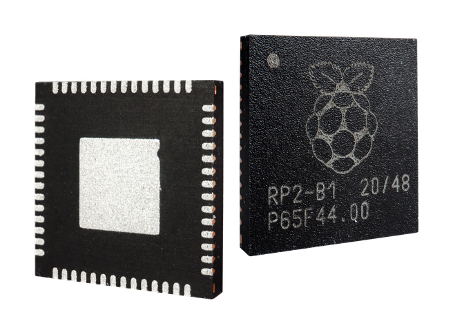

===================
Raspberry Pi rp2040
===================

.. tags:: chip:rp2040

The RP2040 is a dual core chip produced by Raspberry Pi that
is based on ARM Cortex-M0+.

Peripheral Support
==================

The following list indicates RP2040 peripherals currently supported in NuttX:

============== =====
Peripheral     Notes
============== =====
GPIO           See Supported Boards documentation for available pins.
UART           GPIO 0 (UART0 TX) and GPIO 1 (UART0 RX) are often used for the console.
I2C            
SPI         
DMAC        
PWM         
USB         
PIO            RP2040 Programmable I/O
IRQs        
DMA         
Clock Output
ws2812         Smart pixels (e.g. Neopixel)
Flash ROM Boot
SRAM Boot      If Pico SDK is available a nuttx.uf2 file will be created
BMP180         Requires I2C0
INA219         Requires I2C0
============== =====

The Pico Display Pack (ST7789 LCD) and Pico Audio Pack (PCM5100A I2S DAC) are 
also available.

There is currently no direct user mode access to these RP2040 hardware features:

* SPI Slave Mode
* SSI
* RTC
* Timers

Additionally, some supported features are:

* Persistent flash filesystem in unused flash ROM
* WiFi wireless communication (for capable boards such as :doc:`the Pico W
  <boards/raspberrypi-pico-w/index>`)

Installation
============

1. Download the Raspberry Pi Pico SDK:

   .. code:: console
   
      $ git clone -b 2.0.0 https://github.com/raspberrypi/pico-sdk.git

2. Download and install the ``picotool``

   Instructions for installing/building it can be found here:
   https://github.com/raspberrypi/picotool

   If you are on Arch Linux, you can also install the ``picotool`` through the
   AUR:

   .. code-block:: console

      $ yay -S picotool

3. Set ``PICO_SDK_PATH`` environment variable to point to the cloned SDK:

   .. code:: console

      $ export PICO_SDK_PATH=<absolute_path_to_pico-sdk_directory>

   You will have to do this every time you restart the terminal where you are
   building NuttX, so it might be best to include this command in your
   ``bashrc`` so NuttX's build system always knows where to find the SDK.

4. Download NuttX and NuttX applications. These must both be contained in the
   same directory:

   .. code:: console
  
      $ git clone https://github.com/apache/nuttx.git nuttx
      $ git clone https://github.com/apache/nuttx-apps.git apps

Now you have all of the required dependencies for building NuttX for the RP2040.

Building NuttX
==============

1. Change to the NuttX directory:

   .. code:: console

      $ cd nuttx

2. Select a configuration. The available configurations can be listed with the
   command:

   .. code:: console

      $ ./tools/configure.sh -L

   The one you choose will be dependent on the board you want to build for, like
   ``raspberrypi-pico:usbnsh`` to use the ``usbnsh`` configuration for the
   :doc:`Raspberry Pi Pico <boards/raspberrypi-pico/index>`.

3. Load the selected configuration:

   .. code:: console

      $ make distclean
      $ ./tools/configure.sh <selected_configuration>

4. Modify the configuration as needed (optional):

   .. code:: console

      $ make menuconfig

5. Build NuttX:

   .. code:: console
 
      $ make

The output of the build process will be a file called ``nuttx.uf2``, which you
are able to flash to the RP2040.

Programming
============

Programming using BOOTSEL
-------------------------

Connect the board to the USB port of your host computer while pressing down the
BOOTSEL button.

.. note::

   Some boards call it a different name, and some boards use pins that need to
   be jumpered instead of buttons. Consult the documentation for your particular
   board.

.. note::

   If your board comes with a BOOTSEL and a RESET button, you might find it
   easier to hold down the BOOTSEL button and then press RESET, all while the
   board is still plugged in via USB. This will trigger the boot mode without
   having to constantly unplug and plug in the USB cable.

The board should be detected as USB Mass Storage Device, which you can mount in
your file explorer just like a USB drive.

Then copy ``nuttx.uf2`` onto the device. It should reboot itself into NuttX once
the UF2 file is done copying over!

Programming using SDB
---------------------

Most (but not all) RP2040 boards provide a serial (SDB) debug port. The "nuttx"
ELF file can be uploaded with an appropriate SDB programmer module and companion
software.

Running NuttX
=============

The ``usbnsh`` configuration that most supported boards provide allows console
access by USB CDC/ACM serial device. The console is available by using a
terminal software on your host computer with the device plugged in. Some
options are:

* PuTTY
* Minicom
* Picocom

Many configurations may also provide access to the console via UART0. To access
this console from your host computer, GPIO 0 and 1 pins on your board must be
connected to a `USB-serial converter <https://www.adafruit.com/product/954>`_
(and typically the GND pin as well), which is plugged into your computer. You
can then use your terminal software just like with ``usbnsh``.

.. note::

   Most configurations will run the console at 115200 baud.

Supported Boards
================

.. toctree::
   :glob:
   :maxdepth: 1

   boards/*/*

License exceptions
==================

The following files are originated from the files in Pico SDK.
So, the files are licensed under 3-Clause BSD same as Pico SDK.

* ``arch/arm/src/rp2040/rp2040_clock.c``
* ``arch/arm/src/rp2040/rp2040_pll.c``
* ``arch/arm/src/rp2040/rp2040_xosc.c``

  * These are created by referring the Pico SDK clock initialization.

* ``arch/arm/src/rp2040/rp2040_pio.c``
* ``arch/arm/src/rp2040/rp2040_pio.h``
* ``arch/arm/src/rp2040/rp2040_pio_instructions.h``

  * These provide the similar APIs to Pico SDK's hardware_pio APIs.

* ``arch/arm/src/rp2040/hardware/\*.h``

  * These are generated from rp2040.svd originally provided in Pico SDK.
