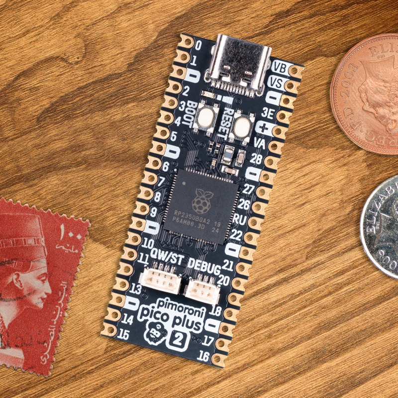

===============================
Pimoroni Pico Plus 2
===============================

.. tags:: chip:rp2350

The `Pimoroni Pico Plus 2 <https://shop.pimoroni.com/products/pimoroni-pico-plus-2>`_
is an RP2350B based board in the Raspberry Pi Pico form factor, with a
USB-C connector, a large 16 MiB of flash and 8 MiB of external QSPI PSRAM.

Features
========

* RP2350B microcontroller chip (QFN-80 variant)
* Dual-core Arm Cortex-M33 processor running up to 150 MHz
* 520 KiB of internal SRAM
* 16 MiB of on-board QSPI flash memory
* 8 MiB of on-board QSPI PSRAM (APS6404) on chip select 1
* USB-C connector, USB 1.1 host and device support
* Qwiic / STEMMA QT (I2C) connector
* SP/CE debug and expansion connectors
* Reset and BOOTSEL buttons
* 48 multi-function GPIO pins broken out on castellated and through-hole pads
* Drag & drop programming using mass storage over USB
* 12 Programmable IO (PIO) state machines for custom peripheral support

Serial Console
==============

By default a serial console appears on GPIO0 (TX) and GPIO1 (RX).  This
console runs at 115200-8N1.

The board can be configured to use the USB connection as the serial console.
See the ``usbnsh`` configuration.

Buttons and LEDs
================

The user LED is controlled by GPIO25 and is configured as autoled by default.

A BOOTSEL button, which if held down when power is first applied to the board,
will cause the RP2350 to boot into programming mode and appear as a storage
device to the computer connected via USB.  Saving a ``.uf2`` file to this
device will replace the flash contents.  A separate RESET button is also
provided.

PSRAM
=====

The distinguishing feature of the Pimoroni Pico Plus 2 is the 8 MiB of
external QSPI PSRAM (an APS6404 part) hanging off the QMI on chip select 1
(GPIO47).  NuttX detects the PSRAM at boot, switches it to quad mode and
maps it read/write at ``0x11000000``.

PSRAM support is enabled by default in the ``nsh`` configuration
(``CONFIG_RP23XX_PSRAM``), which adds the 8 MiB to the main heap.  The
chip select pin is configured with ``CONFIG_RP23XX_PSRAM_CS1_GPIO`` (47 on
this board) and the way the PSRAM is exposed to the memory manager (single
heap, separate heap, or user heap) is selectable.  See the
:doc:`RP23xx PSRAM section <../../index>` for the details of each mode.

.. note::

   The PSRAM is considerably slower than the internal SRAM.  The QMI is
   shared with the flash: writing to the flash goes through the bootrom,
   which reconfigures the QMI for chip select 0 and disturbs the PSRAM
   configuration on chip select 1.  ``rp23xx_psram_restore()`` re-applies it
   and is intended to be called from the flash write path after each erase or
   program.

Supported Capabilities
======================

NuttX supports the following Pico Plus 2 capabilities:

* UART (console port)

  * GPIO 0 (UART0 TX) and GPIO 1 (UART0 RX) are used for the console.

* External QSPI PSRAM (8 MiB)
* I2C
* SPI (master only)
* DMAC
* PWM
* ADC
* Watchdog
* USB device

  * MSC, CDC/ACM serial and composite devices are supported.
  * CDC/ACM serial device can be used for the console.

* PIO (RP2350 Programmable I/O)
* Flash ROM Boot
* SRAM Boot

  * If the Pico SDK is available, a ``nuttx.uf2`` file which can be used in
    BOOTSEL mode will be created.

* Persistent flash filesystem in unused flash ROM

Installation
============

1. Download and install the toolchain and, optionally, the Raspberry Pi
   Pico SDK (needed to generate the ``nuttx.uf2`` image).

.. code-block:: console

  $ git clone -b 2.2.0 --recurse-submodules https://github.com/raspberrypi/pico-sdk.git
  $ export PICO_SDK_PATH=<absolute_path_to_pico-sdk_directory>

2. Configure and build NuttX

.. code-block:: console

  $ git clone https://github.com/apache/nuttx.git nuttx
  $ git clone https://github.com/apache/nuttx-apps.git apps
  $ cd nuttx
  $ make distclean
  $ ./tools/configure.sh pimoroni-pico-2-plus:nsh
  $ make V=1

3. Connect the board to the USB port while pressing BOOTSEL.  The board will
   be detected as a USB Mass Storage Device.  Then copy ``nuttx.uf2`` into
   the device (the same way as standard Pico SDK applications).

4. To access the console, connect GPIO 0 and 1 to a device such as a
   USB-serial converter, or use the ``usbnsh`` configuration for a console
   over USB CDC/ACM.

Configurations
==============

nsh
---

Basic NuttShell configuration (console enabled on UART0, at 115200 bps) with
the external PSRAM added to the main heap.

usbnsh
------

Basic NuttShell configuration (console enabled via USB CDC/ACM).

smp
---

Basic NuttShell configuration (console enabled on UART0, at 115200 bps) with
both Arm cores enabled.

audiopack
---------

Configuration for the Pimoroni Pico Audio Pack.

composite
---------

USB composite device configuration.

usbmsc
------

USB mass storage device configuration.

userled
-------

Configuration demonstrating user-controlled LED access.

xipfs
-----

XIPFS mounted on the on-board flash, with the ``xipfs`` command and the
XIPFS test suite.

xipfs-nxflat
------------

Same as ``xipfs``, plus the NXFLAT execute-in-place demo.  Building this
configuration requires ``ldnxflat``, which is not part of a standard
toolchain installation; see :doc:`/components/nxflat`.
