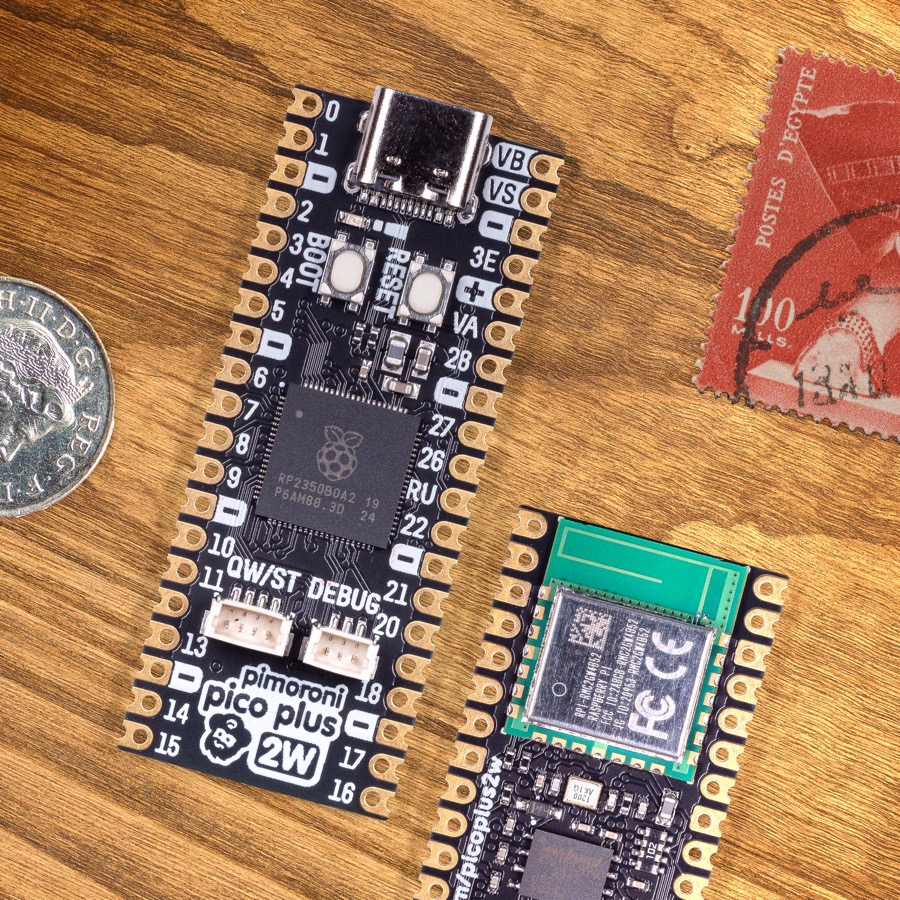

======================
Pimoroni Pico Plus 2 W
======================

.. tags:: chip:rp2350, chip:rp2350b, wifi

The `Pimoroni Pico Plus 2 W <https://shop.pimoroni.com/products/pimoroni-pico-plus-2-w>`_
is a Raspberry Pi Pico form-factor board built around the RP2350B -- the 80-pin
variant of the RP2350 with 48 GPIOs.  It adds 16MB of flash, 8MB of PSRAM, a
USB-C connector, a Qw/ST (Qwiic/STEMMA QT) connector, and an Infineon CYW43439
for 2.4GHz WiFi and Bluetooth.  The radio is carried on a Raspberry Pi RM2
module, which is where the CYW43439 lives.

   Pimoroni Pico Plus 2 W, front and back (photo: Pimoroni)

Features
========

* RP2350B microcontroller chip (QFN-80 package)
* Dual-core ARM Cortex-M33 processor at up to 150MHz, with FPU and DSP
* Also contains two Hazard3 RISC-V cores, selectable instead of the M33 pair
* 520kB of on-chip SRAM
* 16MB of on-board QSPI flash
* 8MB of on-board QSPI PSRAM (chip select on GPIO 47)
* 48 multi-function GPIO pins, 30 of them on the castellated headers
* 4x UART, 2x SPI, 2x I2C, 8x 12-bit ADC, 24x PWM channels
* 12x Programmable IO (PIO) state machines across 3 PIO blocks
* USB-C, supporting device and host
* Infineon CYW43439 for 2.4GHz WiFi 4 (802.11n) and Bluetooth 5.2
* Qw/ST connector on I2C0
* BOOT and RESET buttons; BOOT is also readable at runtime on GPIO 45
* Battery connector with charging, and VSYS monitoring on GPIO 43

Serial Console
==============

By default the serial console is UART0 on GPIO 0 (TX, pin 1) and GPIO 1
(RX, pin 2), at 115200-8N1.

The board can instead be configured to put the console on the USB-C connector
(the ``usbnsh`` configuration).  Note that the RP2350 USB device support is
still marked experimental in NuttX and the CDC/ACM console is known to corrupt
data and stop responding after a handful of commands.  Prefer the UART console
for anything that matters.

Wireless Communication
======================

The on-board Infineon CYW43439 is reached over a half-duplex gSPI bus driven by
a PIO state machine, implemented in ``arch/arm/src/rp23xx/rp23xx_cyw43439.c``.
It presents itself as the ``wlan0`` network device and supports 2.4GHz WiFi 4
(802.11n) in station mode.  Bluetooth is not supported.

The chip's firmware is not downloaded until ``wlan0`` is brought up, so nothing
on the wireless chip -- including the LED, see below -- responds before that.

CYW43439 firmware
-----------------

The driver links the wireless chip's firmware and CLM blob into the NuttX
binary, so a copy has to be available at build time.  ``CONFIG_CYW43439_FIRMWARE_BIN_PATH``
points at it and defaults to::

  ${PICO_SDK_PATH}/lib/cyw43-driver/firmware/43439A0-7.95.49.00.combined

This is the WiFi firmware padded up to a 256-byte boundary with the CLM blob
appended, and ``CONFIG_CYW43439_FIRMWARE_LEN`` is the *unpadded* length of just
the firmware part (224190 bytes for this release).

pico-sdk 2.x no longer ships that file as a binary -- it only carries the same
bytes as a C array in ``lib/cyw43-driver/firmware/w43439A0_7_95_49_00_combined.h``.
If that is all you have, convert the array back to a binary, for example::

  $ python3 -c '
  import re, sys
  text = open(sys.argv[1]).read()
  body = text.split("{", 1)[1].split("};", 1)[0]
  data = bytes(int(b, 16) for b in re.findall(r"0x([0-9a-fA-F]{2})", body))
  open(sys.argv[2], "wb").write(data)
  ' ${PICO_SDK_PATH}/lib/cyw43-driver/firmware/w43439A0_7_95_49_00_combined.h \
    ${PICO_SDK_PATH}/lib/cyw43-driver/firmware/43439A0-7.95.49.00.combined

The header's own ``CYW43_WIFI_FW_LEN`` and ``CYW43_CLM_LEN`` macros tell you the
lengths to expect: 224190 + 984, in a 225240-byte file.

If the file is missing the build still succeeds, but a placeholder is linked in
and the wireless chip will not come up.

User LED
========

**The board's only LED is wired to GPIO 0 of the CYW43439, not to a pin of the
RP2350.** Setting it therefore means an iovar request over the gSPI bus, which
has two consequences:

* The LED does not respond until ``wlan0`` has been brought up, because that is
  when the wireless chip's firmware is downloaded.  Before that, every write
  fails with ``-EIO``.
* Driving the LED blocks, so it cannot be done from interrupt context.  That
  rules out ``CONFIG_ARCH_LEDS``, whose ``board_autoled_on()`` is called from
  interrupt handlers and from assertion handling.  This board therefore
  supports ``CONFIG_USERLED`` only, and a build with ``CONFIG_ARCH_LEDS``
  enabled is rejected with an explicit error.

With ``CONFIG_USERLED`` the LED appears as ``/dev/userleds`` and can be driven
with the ``leds`` example.  Board code can also reach it, and the CYW43439's
other two GPIOs, through ``include/rp23xx_extra_gpio.h``:

===== ========= ==============================================================
GPIO  Direction Function
===== ========= ==============================================================
0     output    On-board LED
1     output    Voltage regulator mode: 1 selects PWM (less ripple) over PFM
2     input     Non-zero if power is coming from USB or the VBUS pin
===== ========= ==============================================================

Buttons
-------

The board has two physical buttons, BOOT and RESET.

BOOT is also wired to GPIO 45, active low, so once NuttX is running it can be
read as an ordinary user button -- this is the pin pico-sdk calls
``PIMORONI_PICO_PLUS2_W_USER_SW_PIN``.  It appears as ``/dev/buttons`` with
``CONFIG_INPUT_BUTTONS``, and is the single button reported by
``board_buttons()``.  RESET is not readable as a GPIO.

The internal pull-up is enabled on GPIO 45, and must be: erratum RP2350-E9
means a floating Bank 0 input on RP2350 A2 leaks around 120uA and settles at
roughly 2.2V, which the internal pull-down is far too weak to overcome.  The
pull-up is unaffected by the erratum.

Held down while power is applied or while RESET is released, BOOT instead makes
the RP2350 come up in bootloader mode, where it appears as a storage device over
USB; copying a .UF2 file to it replaces the flash contents.

Pin Mapping
===========

The castellated headers follow the Raspberry Pi Pico pinout, with the RP2350B's
extra GPIOs brought out on the two rows of pads inside the headers.

===== ========== =============================================================
Pin   Signal     Notes
===== ========== =============================================================
1     GPIO0      Default TX for UART0 serial console
2     GPIO1      Default RX for UART0 serial console
3     Ground
4     GPIO2
5     GPIO3
6     GPIO4      Default SDA for I2C0, also on the Qw/ST connector
7     GPIO5      Default SCL for I2C0, also on the Qw/ST connector
8     Ground
9     GPIO6
10    GPIO7
11    GPIO8
12    GPIO9
13    Ground
14    GPIO10
15    GPIO11
16    GPIO12
17    GPIO13
18    Ground
19    GPIO14
20    GPIO15
21    GPIO16     Default RX for SPI0
22    GPIO17     Default CSn for SPI0
23    Ground
24    GPIO18     Default SCK for SPI0
25    GPIO19     Default TX for SPI0
26    GPIO20
27    GPIO21
28    Ground
29    GPIO22
30    Run
31    GPIO26     ADC0
32    GPIO27     ADC1
33    AGND       Analog ground
34    GPIO28     ADC2
35    ADC_VREF   Analog reference voltage
36    3V3        Power output to peripherals
37    3V3_EN     Pull to ground to turn off
38    Ground
39    VSYS       +5V supply to the board
40    VBUS       Connected to USB +5V
===== ========== =============================================================

Other RP2350B Pins
==================

===== ================================================================
GPIO  Function
===== ================================================================
23    Output - CYW43439 power enable (WL_REG_ON)
24    I/O    - CYW43439 gSPI data line, doubles as its interrupt request
25    Output - CYW43439 chip select
29    Output - CYW43439 gSPI clock
43    Input  - VSYS monitoring, via ADC
45    Input  - BOOT button, active low, readable as a user button
47    Output - PSRAM chip select
===== ================================================================

Note that GPIO 23, 24, 25 and 29 are the same pins the Raspberry Pi Pico W uses
for its CYW43439, so the wireless wiring is identical despite the larger
package.  Do not use them for anything else.

Installation & Build
====================

For instructions on how to install the build dependencies and create a NuttX
image for this board, consult the main :doc:`RP23XX documentation <../../index>`.

Configurations
==============

All configurations listed below can be configured using the following command
in the ``nuttx`` directory (again, consult the main
:doc:`RP23XX documentation <../../index>`):

.. code:: console

   $ ./tools/configure.sh pimoroni-pico-plus-2-w:<configname>

nsh
---

Basic NuttShell configuration, console on UART0 at 115200 bps.  The wireless
chip is not enabled, so this configuration has no network and no LED.

usbnsh
------

Basic NuttShell configuration with the console on USB CDC/ACM at 115200 bps.
See the caveat under `Serial Console`_.

wifi
----

NuttShell configuration with the console on UART0 at 115200 bps and the
CYW43439 enabled: ``wlan0`` in station mode, WAPI, DHCP client, DNS client and
``ping``.  ``/dev/userleds`` and ``/dev/buttons`` are registered too.

After loading this configuration, set the country code to match your region in
:menuselection:`Device Drivers --> Wireless Device Support --> IEEE 802.11 Device Support`,
and set your network's credentials in
:menuselection:`Application Configuration --> Network Utilities --> Network initialization --> WAPI Configuration`.

Alternatively, leave the built-in credentials alone and associate at runtime:

.. code:: console

   nsh> wapi mode wlan0 2
   nsh> wapi psk wlan0 "my-passphrase" 3 2
   nsh> wapi essid wlan0 my-ssid 1
   nsh> renew wlan0
   nsh> ifconfig
   lo    Link encap:Local Loopback at RUNNING mtu 1518
      inet addr:127.0.0.1 DRaddr:127.0.0.1 Mask:255.0.0.0

   wlan0    Link encap:Ethernet HWaddr 28:cd:c1:ff:d3:be at RUNNING mtu 576
      inet addr:192.168.0.118 DRaddr:192.168.0.1 Mask:255.255.255.0

   nsh> ping -c 3 8.8.8.8
   PING 8.8.8.8 56 bytes of data
   56 bytes from 8.8.8.8: icmp_seq=0 time=20.0 ms
   56 bytes from 8.8.8.8: icmp_seq=1 time=10.0 ms
   56 bytes from 8.8.8.8: icmp_seq=2 time=10.0 ms
   3 packets transmitted, 3 received, 0% packet loss, time 3030 ms
   rtt min/avg/max/mdev = 10.000/13.333/20.000/4.714 ms

The ``3`` and ``2`` arguments to ``wapi psk`` select WPA_ALG_CCMP and WPA_VER_2;
run ``wapi help`` for the other values.  ``wapi scan wlan0`` lists the visible
access points.
