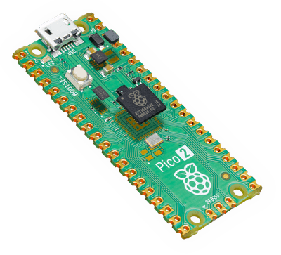

===============================
Raspberry Pi Pico 2
===============================

.. tags:: chip:rp2350

The `Raspberry Pi Pico 2 <https://www.raspberrypi.com/products/raspberry-pi-pico-2/>`_ is a general purpose board supplied by
the Raspberry Pi Foundation.

Features
========

* RP2350 microcontroller chip
* Dual-core ARM Cortex M33 processor, flexible clock running up to 150 MHz
* 520kB of SRAM, and 4MB of on-board Flash memory
* Castellated module allows soldering direct to carrier boards
* USB 1.1 Host and Device support
* Low-power sleep and dormant modes
* Drag & drop programming using mass storage over USB
* 26 multi-function GPIO pins
* 2× SPI, 2× I2C, 2× UART, 3× 12-bit ADC, 16× controllable PWM channels
* Accurate clock and timer on-chip
* Temperature sensor
* Accelerated floating point libraries on-chip
* 12 × Programmable IO (PIO) state machines for custom peripheral support

Serial Console
==============

By default a serial console appears on pins 1 (TX GPIO0) and pin 2
(RX GPIO1). This console runs a 115200-8N1.

The board can be configured to use the USB connection as the serial console.
See the `usbnsh` configuration.

Buttons and LEDs
================

User LED controlled by GPIO25 and is configured as autoled by default.

A BOOTSEL button, which if held down when power is first
applied to the board, will cause the Pico 2 to boot into programming
mode and appear as a storage device to the computer connected via USB.
Saving a .UF2 file to this device will replace the Flash ROM contents
on the Pico 2.

Pin Mapping
===========
Pads numbered anticlockwise from USB connector.

===== ========== ==========
Pad   Signal     Notes
===== ========== ==========
1     GPIO0      Default TX for UART0 serial console
2     GPIO1      Default RX for UART1 serial console
3     Ground
4     GPIO2
5     GPIO3
6     GPIO4      Default SDA for I2C0
7     GPIO5      Default SCL for I2C0
8     Ground
9     GPIO6      Default SDA for I2C1
10    GPIO7      Default SCL for I2C1
11    GPIO8      Default RX for SPI1
12    GPIO9      Default CSn for SPI1
13    Ground
14    GPIO10     Default SCK for SPI1
15    GPIO11     Default TX for SPI1
16    GPIO12
17    GPIO13
18    Ground
19    GPIO14
20    GPIO15
21    GPIO16     Default RX for SPI0
22    GPIO17     Default CSn for SPI0
23    Ground
24    GPIO18     Default SCK for SPI0
25    GPIO19     Default TX for SPI0
26    GPIO20     Default TX for UART1 serial console
27    GPIO21     Default RX for UART1 serial console
28    Ground
29    GPIO22
30    Run
31    GPIO26     ADC0
32    GPIO27     ADC1
33    AGND       Analog Ground
34    GPIO28     ADC2
35    ADC_VREF   Analog reference voltage
36    3V3        Power output to peripherals
37    3V3_EN     Pull to ground to turn off.
38    Ground
39    VSYS       +5V Supply to board
40    VBUS       Connected to USB +5V
===== ========== ==========

Other Pico 2 Pins
=================

GPIO23 Output - Power supply control.
GPIO24 Input  - High if USB port or Pad 40 supplying power.
GPIO25 Output - On board LED.
ADC3   Input  - Analog voltage equal to one third of VSys voltage.

Separate pins for the Serial Debug Port (SDB) are available

Power Supply
============

The Raspberry Pi Pico 2 can be powered via the USB connector,
or by supplying +5V to pin 39. The board had a diode that prevents
power from pin 39 from flowing back to the USB socket, although
the socket can be power via pin 30.

The Raspberry Pi Pico chip run on 3.3 volts. This is supplied
by an onboard voltage regulator.  This regulator can be disabled
by pulling pin 37 to ground.

The regulator can run in two modes. By default the regulator runs
in PFM mode which provides the best efficiency, but may be
switched to PWM mode for improved ripple by outputting a one
on GPIO23.

Supported Capabilities
======================

NuttX supports the following Pico 2 capabilities:

* UART  (console port)

  * GPIO 0 (UART0 TX) and GPIO 1 (UART0 RX) are used for the console.

* I2C
* SPI (master only)
* DMAC
* PWM
* ADC
* Watchdog
* USB device

  * MSC, CDC/ACM serial and these composite device are supported.
  * CDC/ACM serial device can be used for the console.

* PIO (RP2350 Programmable I/O)
* Flash ROM Boot
* SRAM Boot

  * If Pico SDK is available, nuttx.uf2 file which can be used in BOOTSEL mode will be created.

* Persistent flash filesystem in unused flash ROM

There is currently no direct user mode access to these RP2350 hardware features:

* SPI Slave Mode
* SSI
* RTC
* Timers

Installation
============

1. Download Raspberry Pi Pico SDK

.. code-block:: console

  $ git clone -b 2.1.1 https://github.com/raspberrypi/pico-sdk.git

2. Download and install picotool

  Instructions can be found here: https://github.com/raspberrypi/picotool

  If you are on Arch Linux, you can install the picotool through the AUR:

.. code-block:: console

  $ yay -S picotool

3. Set PICO_SDK_PATH environment variable

.. code-block:: console

  $ export PICO_SDK_PATH=<absolute_path_to_pico-sdk_directory>

4. Configure and build NuttX

.. code-block:: console

  $ git clone https://github.com/apache/nuttx.git nuttx
  $ git clone https://github.com/apache/nuttx-apps.git apps
  $ cd nuttx
  $ make distclean
  $ ./tools/configure.sh raspberrypi-pico:nsh
  $ make V=1

5. Connect Raspberry Pi Pico 2 board to USB port while pressing BOOTSEL.
   The board will be detected as USB Mass Storage Device.
   Then copy "nuttx.uf2" into the device.
   (Same manner as the standard Pico SDK applications installation.)

6. To access the console, GPIO 0 and 1 pins must be connected to the
   device such as USB-serial converter.

   `usbnsh` configuration provides the console access by USB CDC/ACM serial
   device.  The console is available by using a terminal software on the USB
   host.

Configurations
==============

nsh
---

Basic NuttShell configuration (console enabled in UART0, at 115200 bps).

smp
---

Basic NuttShell configuration (console enabled in UART0, at 115200 bps) with
both ARM cores enabled.
