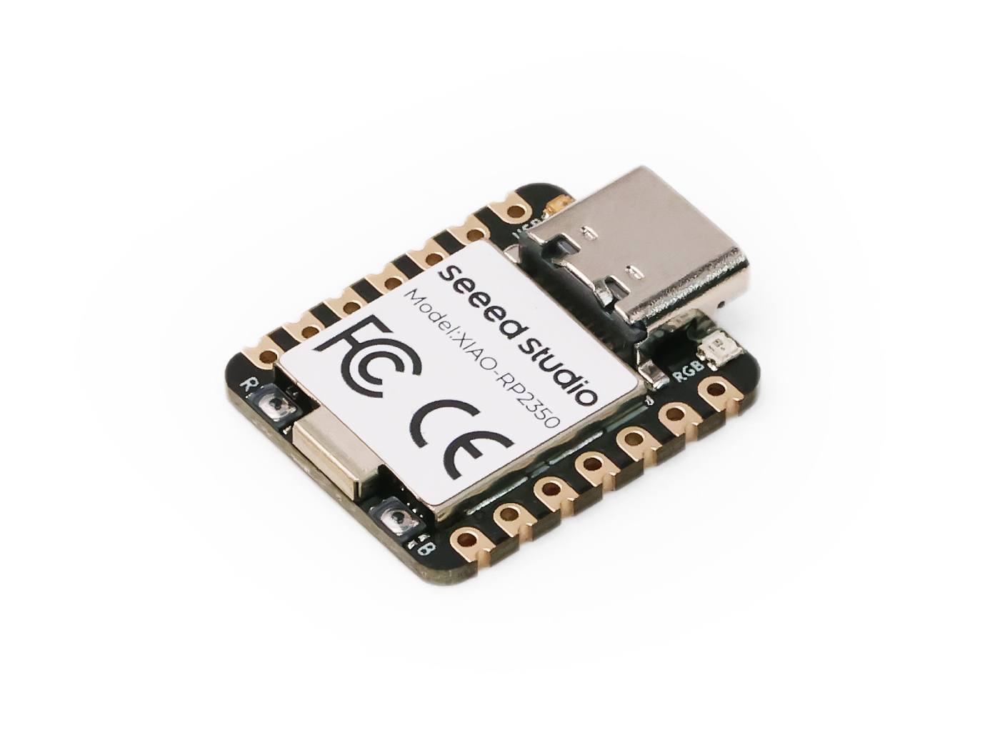

==========================
Seeed Studio XIAO RP2350
==========================

The `Seeed Studio XIAO RP2350 <https://wiki.seeedstudio.com/getting-started-xiao-rp2350/>`_ is a general purpose board supplied by
Seeed Studio and it is compatible with the Rapiberry RP2350 ecosystem, sharing the same MCU as Rapiberry Pi Pico 2.

Features
========

* Raspberry Pi RP2350, ARM® Dual Cortex-M33 @ 150MHz, FPU
* 520kB SRAM, 2MB Flash
* Security: OTP, Secure Boot, Arm TrustZone
* USB Type-C interface
* 19 Pins:3x Analog,19x Digital, 2x I²C, 2x UART, 2x SPI, All PWM
* 1 user LED, 1 power LED，1 RGB LED (WS2812)
* 1 RESET button, 1 BOOT button

Serial Console
==============

By default, a serial console appears on pins 6 (TX GPIO) and pin 7
(RX GPIO).  This console runs a 115200-8N1.
The board can be configured to use the USB connection as the serial console.

User LED
========

The USER LED, the yellow LED on the XIAO RP2350, is connected to GPIO25/D19
according to the schematic diagram. The USER LED will light up when set to
a low level and turn off when set to a high level.

Buttons
=======

The RESET and BOOT buttons can be used to enter bootloader mode by press and 
hold BOOT buttons and then press and release RESET button. Then, the board will
enumerate as a storage device to a computer connected via USB. Saving a .UF2 
file to this device will replace the Flash ROM contents on the RP2350.

Pin Mapping
===========
Pads numbered anticlockwise from USB connector.

===== ========== ==========
Pad   Signal     Notes
===== ========== ==========
0     GPIO26     D0/A0
1     GPIO27     D1/A1
2     GPIO28     D2/A2
3     GPIO5      D3/A3
4     GPIO6      D4/SDA
5     GPIO7      D5/SCL
6     GPIO0      D6/Default TX for UART0 serial console
7     GPIO1      D7/Default RX for UART0 serial console
8     GPIO2      D8/SCK
9     GPIO4      D9/MISO
10    GPIO3      D10/MOSI
11    3V3        Power output to peripherals
12    Ground
13    VIN        +5V Supply to board
===== ========== ==========

Power Supply
============
The working voltage of the MCU is 3.3V. Voltage input connected to
general I/O pins may cause chip damage if it’s higher than 3.3V.

Installation
============

1. Configure and build NuttX:

.. code-block:: console

  $ git clone https://github.com/apache/nuttx.git nuttx
  $ git clone https://github.com/apache/nuttx-apps.git apps
  $ cd nuttx
  $ make distclean
  $ ./tools/configure.sh xiao-rp2350:nsh
  $ make V=1

2. Connect the Seeed Studio XIAO RP2350, and enter bootloader mode, once
the board is detected as a USB Mass Storage Device, copy “nuttx.uf2” into
the device.

3. To access the console, TX and RX pins must be connected to the
   device such as USB-serial converter.

Configurations
==============

nsh
---
Basic NuttShell configuration (console enabled in UART0, at 115200 bps).

usbnsh
------
Basic NuttShell configuration using CDC/ACM serial (console enabled in USB Port,
at 115200 bps).

combo
-----
This configuration enabled NuttShell via Serial and enabled led, gpio and
ws2812 examples:

Testing leds:

.. code-block:: console

  $nsh> leds
  leds_main: Starting the led_daemon
  leds_main: led_daemon started

  led_daemon (pid# 3): Running
  led_daemon: Opening /dev/userleds
  led_daemon: Supported LEDs 0x01
  led_daemon: LED set 0x01
  nsh> led_daemon: LED set 0x00
  led_daemon: LED set 0x01
  led_daemon: LED set 0x00
  led_daemon: LED set 0x01
  led_daemon: LED set 0x00

Testing gpios:

========   ======   ==========
PIN/GPIO    Mode      Device
========   ======   ==========
D0/P0.02   Input    /dev/gpio0
D2/P0.28   Output   /dev/gpio1
D1/P0.03   Input    /dev/gpio2
========   ======   ==========

.. code-block:: console

  nsh> gpio -w 1 /dev/gpio26
  Driver: /dev/gpio26
    Interrupt pin: Value=0
    Verify:        Value=0
  nsh> gpio /dev/gpio27
  Driver: /dev/gpio27
    Input pin:     Value=0
  nsh> gpio /dev/gpio27
  Driver: /dev/gpio27
    Input pin:     Value=1
  nsh> gpio -o 1 /dev/gpio28
  Driver: /dev/gpio28
    Output pin:    Value=0
    Writing:       Value=1
    Verify:        Value=1
  nsh> gpio -o 0 /dev/gpio28
  Driver: /dev/gpio28
    Output pin:    Value=1
    Writing:       Value=0
    Verify:        Value=0

Testing ws2812:

.. code-block:: console

  $nsh> ws2812

