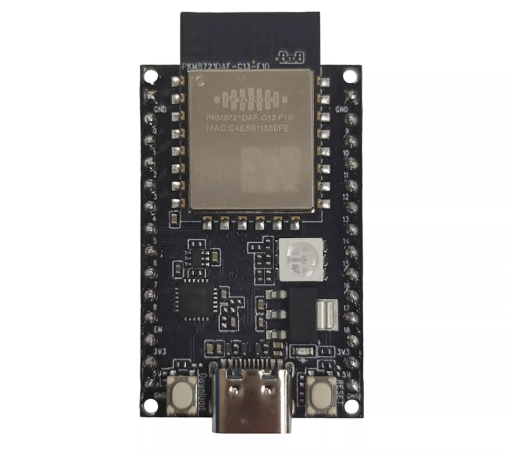

==========
PKE8721DAF
==========

.. tags:: chip:rtl8721dx, arch:arm, vendor:realtek

   The PKE8721DAF development board.

The PKE8721DAF is a Realtek RTL8721Dx development board built around the
RTL8721DAF (QFN48, 4 MB NOR flash). NuttX runs on the KM4 application core —
an Arm Cortex-M55-compatible core running at up to 345 MHz. See the
:doc:`RTL8721Dx chip documentation <../../index>` for the full SoC
specifications and the vendor-SDK dependency.

Features
========

* RTL8721DAF: Arm Cortex-M55-compatible KM4 core up to 345 MHz, 512 KB SRAM,
  4 MB NOR flash
* Wi-Fi 4 dual-band (2.4 / 5 GHz) station and SoftAP
* SPI NOR flash (XIP)
* LOG-UART console

Supported in this NuttX port:

* NSH shell over the LOG-UART console
* littlefs persistent storage mounted at ``/data`` (a dedicated SPI NOR flash
  partition), backing the Wi-Fi key-value store
* Wi-Fi station and SoftAP through the ``wapi`` tool
* DHCP client (STA) and DHCP server (SoftAP)
* GPIO pins exposed as ``/dev/gpioN`` character devices (input, output and
  interrupt), driven directly on the SDK fwlib register layer
* General-purpose UARTs exposed as ``/dev/ttySN`` serial devices, driven
  directly on the SDK fwlib register layer
* I2C master buses exposed as ``/dev/i2cN`` character devices, driven directly
  on the SDK fwlib register layer
* SPI master buses exposed as ``/dev/spiN`` character devices, driven directly
  on the SDK fwlib register layer
* PWM output exposed as a ``/dev/pwm0`` character device, driven directly on
  the SDK fwlib timer register layer
* ADC channels exposed as an ``/dev/adc0`` character device, driven directly
  on the SDK fwlib register layer
* On-chip RTC exposed as a ``/dev/rtc0`` date/time character device with
  alarm support, driven directly on the SDK fwlib register layer

Buttons and LEDs
================

This NuttX port does not wire any user buttons or LEDs.

Configurations
==============

Build and flash any of these per the :doc:`RTL8721Dx build instructions
<../../index>`; for the CMake build, source ``. tools/ameba/env.sh
pke8721daf`` first (the make build needs no sourcing).

.. code:: console

   $ ./tools/configure.sh pke8721daf:<config-name>

nsh
---

Networking-enabled NSH with littlefs at ``/data`` and the ``wapi`` Wi-Fi tool.
The console is the LOG-UART at 1500000 8N1 (the rate is configured by the
bootloader and inherited by NuttX). The Wi-Fi examples below are available from
this configuration.

gpio
----

Minimal NSH with the GPIO driver and the ``gpio`` example enabled (no Wi-Fi).
The board registers three pins from its pin table (see
``boards/arm/rtl8721dx/pke8721daf/src/rtl8721dx_gpio.c``): an output at
``/dev/gpio0``, an input at ``/dev/gpio1`` and an interrupt pin at
``/dev/gpio2``. Edit that table to match a board's wiring. Exercise them with
the example::

    nsh> gpio -o 1 /dev/gpio0     # drive the output high
    nsh> gpio /dev/gpio1          # read the input
    nsh> gpio -w 1 /dev/gpio2     # wait for a falling-edge interrupt

Pins are encoded with the ``AMEBA_PA()`` / ``AMEBA_PB()`` helpers from
``arch/arm/src/common/ameba/ameba_gpio.h`` (port A/B, pin 0-31), matching the
Ameba SDK ``PinName`` layout.

uart
----

Minimal NSH with the general-purpose UART driver and the ``serialrx`` /
``serialblaster`` examples enabled (no Wi-Fi). The LOG-UART owns the console
and ``/dev/ttyS0``, so the board registers UART0 from its table (see
``boards/arm/rtl8721dx/pke8721daf/src/rtl8721dx_uart.c``) as ``/dev/ttyS1`` at
115200 8N1. Edit that table -- controller, TX/RX pads and baud -- to match a
board's wiring. The TX/RX pads use the same ``AMEBA_PA()`` / ``AMEBA_PB()``
encoding as the GPIO table; the driver muxes them to the UART function and
pulls RX high through the SDK ROM. Exercise the port with the examples (loop TX
back to RX, or wire it to a host serial adapter)::

    nsh> serialblaster    # stream a test pattern out /dev/ttyS1
    nsh> serialrx         # receive and dump bytes from /dev/ttyS1

The line format can be changed at runtime through ``tcsetattr()`` (the config
enables ``CONFIG_SERIAL_TERMIOS``). UART2 is shared with Bluetooth and is not
exposed by the driver.

i2c
---

Minimal NSH with the I2C master driver and the ``i2ctool`` (``system/i2c``)
enabled (no Wi-Fi). The board registers its I2C controllers from a table (see
``boards/arm/rtl8721dx/pke8721daf/src/rtl8721dx_i2c.c``): I2C0 at ``/dev/i2c0``
on PB20/PB21 and I2C1 at ``/dev/i2c1`` on PB18/PB19. Edit that table --
controller and SCL/SDA pads -- to match a board's wiring; the pads use the
same ``AMEBA_PA()`` / ``AMEBA_PB()`` encoding as the GPIO table and are muxed
to the I2C function through the SDK ROM. The I2C bus is open-drain, so fit
external pull-ups on SCL/SDA. Probe a bus with the tool::

    nsh> i2c dev -b 0 0x03 0x77     # scan /dev/i2c0 for devices

spi
---

Minimal NSH with the SPI master driver and the ``spi`` tool
(``system/spi``) enabled (no Wi-Fi). The board registers two buses from its
table (see ``boards/arm/rtl8721dx/pke8721daf/src/rtl8721dx_spi.c``): SPI0 at
``/dev/spi0`` with CLK/MOSI/MISO/CS on PA14/PA15/PA16/PA17 and SPI1 at
``/dev/spi1`` with CLK/MOSI/MISO on PB18/PB19/PB20 and a software chip-select
on PB21. Edit that table -- controller, CLK/MOSI/MISO pads and CS pad -- to
match a board's wiring; the pads use the same ``AMEBA_PA()`` / ``AMEBA_PB()``
encoding as the GPIO table and are muxed to the SPI function through the SDK
ROM, while the chip-select is driven as a plain GPIO. Exercise a bus with the
tool::

    nsh> spi exch -b 1 -x 4 deadbeef     # full-duplex transfer on /dev/spi1

pwm
---

Minimal NSH with the PWM driver and the ``pwm`` example
(``examples/pwm``) enabled (no Wi-Fi). The board registers one timer at
``/dev/pwm0`` (see ``boards/arm/rtl8721dx/pke8721daf/src/rtl8721dx_pwm.c``):
TIM8 drives up to eight compare channels off one shared time base, so every
channel shares one frequency and each carries its own duty cycle. The example
table routes channel 1 to PB18 and channel 2 to PB19; edit it -- one pad per
channel, ``AMEBA_PWM_PIN_NC`` for the unused ones -- to match a board's
wiring. The pads use the same ``AMEBA_PA()`` / ``AMEBA_PB()`` encoding as the
GPIO table and are muxed to the PWM function through the crossbar. Set
``CONFIG_PWM_NCHANNELS`` to the number of channels used. Exercise it with the
example::

    nsh> pwm -d 25 -f 1000     # 1 kHz, 25% duty on /dev/pwm0

adc
---

Minimal NSH with the ADC driver and the ``adc`` example enabled (no Wi-Fi).
The board registers its channels from a table (see
``boards/arm/rtl8721dx/pke8721daf/src/rtl8721dx_adc.c``): ``/dev/adc0`` samples
CH0 on PB19 and CH1 on PB18. Edit that table -- channel numbers and the analog
pad each is wired to -- to match a board's wiring; the external channels
CH0..CH6 map to pads PB19..PB13 and are muxed to the ADC function through the
SDK ROM, while internal channels carry ``AMEBA_ADC_PIN_NC``. Every listed
channel is sampled, in order, on each trigger. Read the channels with the
example::

    nsh> adc -n 1                        # one sweep of /dev/adc0

rtc
---

Minimal NSH with the on-chip RTC driver and the ``alarm`` example enabled
(no Wi-Fi). The RTC is registered at ``/dev/rtc0`` from the board bring-up
(``boards/arm/rtl8721dx/pke8721daf/src/rtl8721dx_rtc.c``); it has no board
wiring (it is an internal clock). The hardware stores year + day-of-year, so
the shared driver bridges to a full calendar. Read and set the clock with the
NSH ``date`` command, and arm a one-shot wakeup with the example::

    nsh> date                            # read /dev/rtc0
    nsh> date -s "Jun 16 12:00:00 2026"  # set the RTC
    nsh> alarm 10                        # fire an alarm in 10 seconds

Wi-Fi
=====

Station (connect to an AP)::

    nsh> wapi psk    wlan0 <password> 3
    nsh> wapi essid  wlan0 <ssid> 1
    nsh> renew wlan0

SoftAP (become an access point, with a DHCP server for clients)::

    nsh> wapi mode   wlan0 3
    nsh> wapi psk    wlan0 <password> 3
    nsh> wapi essid  wlan0 <ssid> 1
    nsh> ifconfig    wlan0 192.168.4.1 netmask 255.255.255.0
    nsh> dhcpd_start wlan0

Stop the SoftAP with ``wapi essid wlan0 <ssid> 0``.

License Exceptions
==================

This board depends on Realtek vendor code that is not part of NuttX and is
subject to its own license:

* The prebuilt Wi-Fi / Bluetooth firmware image and the Realtek ``ameba-rtos``
  SDK libraries/headers linked into the image. See the SDK's own license; the
  SDK is auto-fetched and is not redistributed in the NuttX tree.
