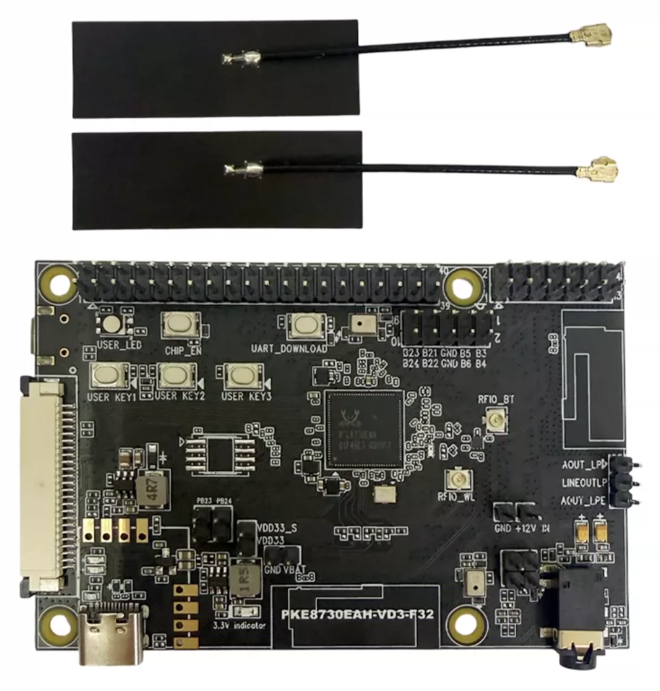

============
RTL8730E_EVB
============

.. tags:: chip:rtl8730e, arch:arm, vendor:realtek

   The RTL8730E EVB development board.

The RTL8730E_EVB is a Realtek RTL8730E evaluation board built around the
RTL8730EH (DDR2 64 MB, 16 MB NOR flash).  NuttX runs on the dual-core Arm
Cortex-A32 application processor at up to 1.2 GHz as BL33 in the ATF boot
chain.  See the :doc:`RTL8730E chip documentation <../../index>` for the full
SoC specifications and vendor-SDK dependency.

Features
========

* RTL8730EH: dual-core Arm Cortex-A32 up to 1.2 GHz, 64 MB DDR2, 16 MB NOR
  flash
* Symmetric Multi-Processing (SMP) on both Cortex-A32 cores
* Wi-Fi 6 (802.11ax) dual-band (2.4 / 5 GHz) station and SoftAP
* Bluetooth 5 dual-mode (BR/EDR + LE)
* SPI NOR flash with littlefs at ``/data``
* LOG-UART console at 1500000 8N1

Supported in this NuttX port:

* NSH shell over the LOG-UART console
* SMP on both Cortex-A32 cores; tasks are dispatched across CPU0 and CPU1
  by the NuttX SMP scheduler
* GPIO pins exposed as ``/dev/gpioN`` character devices (input, output and
  interrupt), driven through the SDK fwlib ROM layer
* General-purpose UARTs exposed as ``/dev/ttySN`` serial devices, driven
  through the SDK fwlib ROM layer (the LOG-UART owns the console and
  ``/dev/ttyS0``)
* littlefs persistent storage mounted at ``/data`` (a dedicated SPI NOR flash
  partition), backing the Wi-Fi key-value store
* Wi-Fi station and SoftAP through the ``wapi`` tool
* DHCP client (STA) and DHCP server (SoftAP)
* ``/etc`` read-only ROMFS populated from the board's ``src/etc/`` tree

Configurations
==============

Build and flash any of these per the :doc:`RTL8730E build instructions
<../../index>`.

.. code:: console

   $ ./tools/configure.sh rtl8730e_evb:<config-name>

nsh
---

Networking-enabled NSH with SMP, littlefs at ``/data``, and the ``wapi``
Wi-Fi tool.  The console is the LOG-UART at 1500000 8N1.

gpio
----

Minimal NSH with the GPIO driver and the ``gpio`` example enabled (no Wi-Fi).
The board registers three pins from its pin table (see
``boards/arm/rtl8730e/rtl8730e_evb/src/rtl8730e_gpio.c``): an output at
``/dev/gpio0``, an input at ``/dev/gpio1`` and an interrupt pin at
``/dev/gpio2``.  Edit that table to match a board's wiring.  Exercise them
with the example::

    nsh> gpio -o 1 /dev/gpio0     # drive the output high
    nsh> gpio /dev/gpio1          # read the input
    nsh> gpio -w 1 /dev/gpio2     # wait for a falling-edge interrupt

Pins are encoded with the ``AMEBA_PA()`` / ``AMEBA_PB()`` helpers from
``arch/arm/src/common/ameba/ameba_gpio.h`` (port A/B, pin 0-31), matching the
Ameba SDK ``PinName`` layout.

uart
----

Minimal NSH with the general-purpose UART driver and the ``serialrx`` /
``serialblaster`` examples enabled (no Wi-Fi). The LOG-UART owns the console
and ``/dev/ttyS0``, so the board registers UART0-2 from its table (see
``boards/arm/rtl8730e/rtl8730e_evb/src/rtl8730e_uart.c``) as ``/dev/ttyS1-3``
at 115200 8N1. Edit that table -- controller, TX/RX pads and baud -- to match a
board's wiring. The TX/RX pads use the same ``AMEBA_PA()`` / ``AMEBA_PB()``
encoding as the GPIO table; the driver muxes them to the UART function and
pulls RX high through the SDK ROM. Exercise a port with the examples (loop TX
back to RX, or wire it to a host serial adapter)::

    nsh> serialblaster /dev/ttyS1 26   # stream a test pattern out /dev/ttyS1
    nsh> serialrx      /dev/ttyS1 26   # receive and dump bytes from /dev/ttyS1

The line format can be changed at runtime through ``tcsetattr()`` (the config
enables ``CONFIG_SERIAL_TERMIOS``). UART3 is reserved for Bluetooth and is not
exposed by the driver.

Wi-Fi
=====

Station (connect to an AP)::

    nsh> wapi mode  wlan0 2
    nsh> wapi psk   wlan0 <password> 3
    nsh> wapi essid wlan0 <ssid> 1
    nsh> renew wlan0

SoftAP (become an access point, with a DHCP server for clients)::

    nsh> wapi mode   wlan0 3
    nsh> wapi psk    wlan0 <password> 3
    nsh> wapi essid  wlan0 <ssid> 1
    nsh> dhcpd_start wlan0

Stop the SoftAP with ``wapi essid wlan0 <ssid> 0``.

License Exceptions
==================

This board depends on Realtek vendor code that is not part of NuttX and is
subject to its own license:

* The prebuilt Wi-Fi / Bluetooth firmware image and the Realtek ``ameba-rtos``
  SDK libraries/headers linked into the image.  See the SDK's own license; the
  SDK is auto-fetched and is not redistributed in the NuttX tree.
* The prebuilt ATF BL2 and BL32 binaries under ``prebuilt/`` are provided by
  Realtek and are subject to the Realtek binary license included in the SDK.
