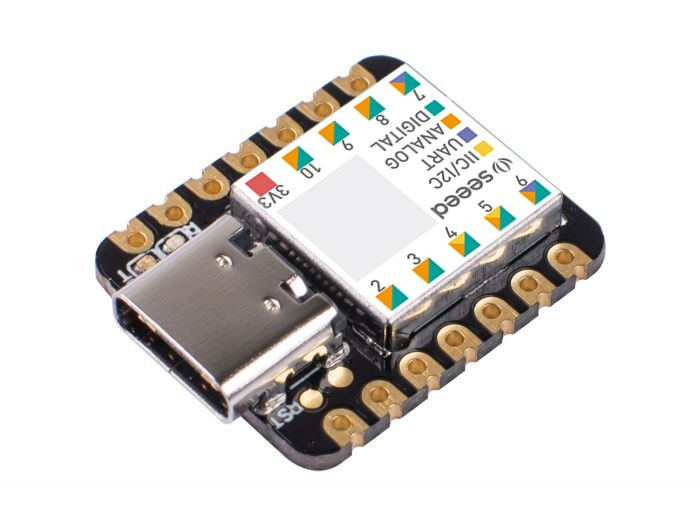

========================
Seeed Studio Xiao SAMD21
========================

The `Seeed Studio Xiao SAM21 <https://wiki.seeedstudio.com/Seeeduino-XIAO/>`_ is the first of the XIAO family, and is a
general purpose, low-power and tiny board. It can be referred to as the "Seeed Studio Xiao SAMD21" or the "Xiao
Seeeduino".

Features
========

* ATSAMD21G18A-MU microcontroller chip @48MHz
* 256KB flash
* 32KB SRAM
* 14 pins (11 analog, 11 digital)
* 10 PWM interfaces
* 1 DAC output pin
* Serial wire debug interface
* 1 I2C interface
* 1 SPI interface
* 1 UART interface
* USBC interface
* Serial communication indicator LEDs for TX and RX (blue)
* Power indicator LED (green)
* Blinkable LED (yellow)

Serial Console
==============

By default, the serial console appears on the board's UART interface. Pin 9 is
TX and pin 7 is RX.

Pin Mapping
===========

Pins are numbered anticlockwise from the USB connector.

===== ======== ========================================
Pin   Signal   Notes
===== ======== ========================================
0     PA2      A0/D0/DAC
1     PA4      A1/D1
2     PA10     A2/D2
3     PA11     A3/D3
4     PA8      A4/D4/SDA (I2C)
5     PA9      A5/D5/SCL (I2C)
6     PB08     A6/D6/TX (UART)
7     PB09     A7/D7/RX (UART)
8     PA7      A8/D8/SCK (SPI)
9     PA5      A9/D9/MISO (SPI)
10    PA6      A10/D10/MOSI (SPI)
11    3V3
12    GND
13    5V       You can supply 5V power on this pin too.
===== ======== ========================================

There are also four pads on the back side of the board. SWCLK, SWDIO for serial
wire debugging, and RST and GND for resetting the board. These same two pins are
also exposed on the top of the board.

Power Supply
============

The board can be powered through a USB-C connection. It can also be supplied 5V
power through it's 5V power pin.

There is an additional two pads for powering the board (VIN and GND) on the back
side. The board accepts anywhere between 3.3V and 5V.

Installation
============

To build NuttX for the Xiao Seeduino, you can use the following configuration
commands within the cloned ``nuttx`` repository:

.. code-block:: console

   $ ./tools/configure.sh xiao-seeeduino:nsh
   $ make

This will generate a ``nuttx.hex`` file. To put the program on your board, you
can choose from one of the following:

1. Convert the hex file to a uf2 file using the `Microsoft uf2 tool <https://github.com/microsoft/uf2/>`_:

   .. code-block:: console

      $ git clone https://github.com/microsoft/uf2.git
      $ cd uf2/utils
      $ python uf2conv.py -f 0x68ed2b88 -b 0x2000 nuttx.hex -o nuttx.uf2

   Then, plug your board into the host computer using the USB-C interface. Short
   the RST (reset) pad with ground twice in a row quickly. The board will be
   detected as mass storage under the name "Arduino", and its orange LED will be
   pulsing slowly. You can then copy the UF2 file to the drive/storage device
   which appears. Once the file is done copying, the board will auto-eject and
   you will have an NSH console on the UART pins!

   .. todo::
      Maybe this process should be part of the post-build scripts, since the
      Microsoft UF2 tools is MIT licensed.

2. Flash the hex file using the ``bossac`` tool. You can find the source for it
   `here <https://github.com/shumatech/BOSSA/>`_, or you can install it on Arch
   Linux via the AUR with this command:

   .. code-block:: console
      
      $ yay -S bossa

   Then, plug your Seeduino in via USB-C to the host computer and short the RST
   (reset) and ground pins twice in a row quickly. The board will be detected as
   mass storage under the name "Arduino", and its orange LED should be pulsing.
   You can then run the following command:

   .. code-block:: console

      $ sudo stty -F <path/to/xiao-USB-port> 1200
      $ sudo bossac -i -d --port=<path/to/xiao-USB-port> -i -w -v nuttx.hex -R

   .. todo::
      The ``bossac`` utility doesn't actually work for programming in my testing
      yet. It is what the Arduino IDE uses but I haven't managed to get the
      commmand line working. Using the commands listed above does actually
      detect the board but the programming itself fails with "Flash command
      failed". This needs more debugging.

Configurations
==============

nsh
---

Basic NuttShell configuration with the console enabled on the UART interface at
115200 bps. Comes with "Hello world" demo.
