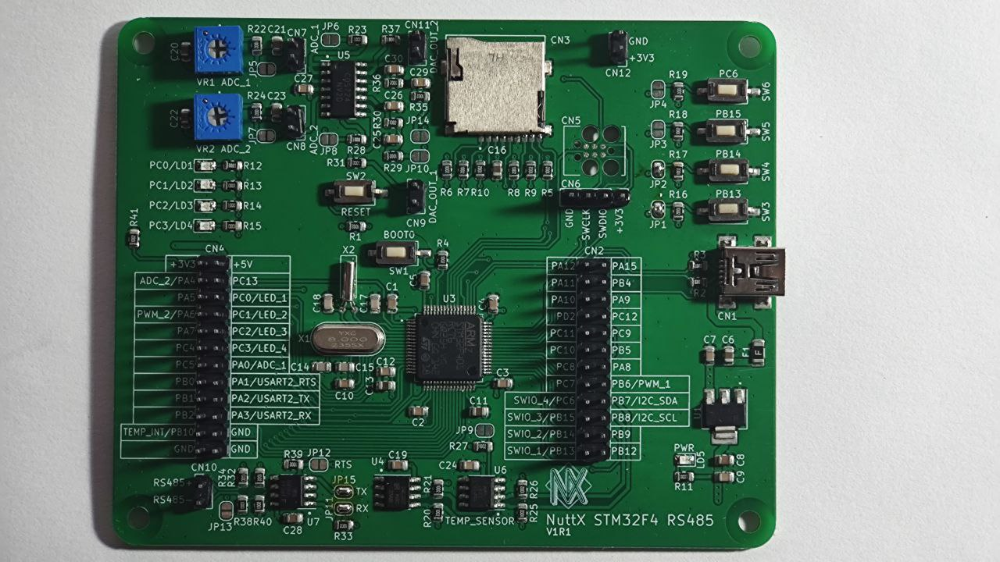

=================
stm32f401rc-rs485
=================

This page discusses issues unique to NuttX configurations for the
NuttX STM32F4-RS485 development board.

Board information
=================

This board was release on NuttX International Workshop 2023 and developed based on
STM32F401RCT6 microcontroller.

STM32F401RCT6 microcontroller features:
 - Arm 32-bit Cortex®-M4 CPU with FPU
 - 256 Kbytes of Flash memory
 - 64 Kbytes of SRAM
 - Serial wire debug (SWD) & JTAG interfaces
 - Up to 81 I/O ports with interrupt capability
 - Up to 11 communication interfaces
 - Up to 3 I2C interfaces
 - Up to 3 USARTs
 - Up to 4 SPIs
 - SDIO interface
 - USB 2.0 full-speed device/host/OTG controller with on-chip PHY

The board features:

- Digital I2C Temperature Sensor (TMP75)
- 2K bits (256x8) I2C EEPROM
- On-board RS485 Transceiver
- Two Analog Input Stages with Amplifier Buffer
- Two Analog Output Stages with Amplifier Buffer
- MicroSD Connector supporting 1 or 4-bit bus
- Four User LEDs
- Four User Buttons
- USB for DFU (Device Firmware Update) and USB device functionality, as well as powering the board
- Onboard voltage regulator from 5V to 3.3V
- SWD Pins for use as STLink (Pin header) and TC2030-IDC 6-Pin Tag-Connect Plug-of-Nails™ Connector
- Crystal for HS 8MHz
- Crystal for RTC 32.768KHz

Board documentation:
https://github.com/lucaszampar/NuttX_STM32F4_RS485_DevBoard

As F4 series have a USB DFuSe-capable BootROM [AN2606], the board can be flashed
via `dfu-util` over USB, or via `stm32flash` over UART without any debuggers.

LEDs
====

The STM32F4-RS485 has 4 software controllable LEDs.

=====  =====
LED    PINS
=====  =====
LED_1  PC0
LED_2  PC1
LED_4  PC2
LED_5  PC3
=====  =====

User Buttons
============

The STM32F4-RS485 has 4 user switches.

======= ===== ======
SWITCH  PINS  LABEL
======= ===== ======
SWIO_1  PB13  SW3
SWIO_2  PB14  SW4
SWIO_3  PB15  SW5
SWIO_4  PC6   SW6[1]
======= ===== ======

[1] The switch SWIO_4 (SW6) is disabled due a conflict with PIN
PC6 when using USART6. 

UARTs
=====

The STM32F4-RS485 has 1 USART available for user.

USART6
------

========== =======
UART/USART PINS
========== =======
TX         PC6 [1]
RX         PC7
CK         PA8
========== =======

[1] Warning you make need to reverse RX/TX on some RS-232 converters

SDCard support
==============

The STM32F4-RS485 has 1 SDCard slot connected as below:

========== =====
SDIO       PINS
========== =====
SDIO_D0    PC8
SDIO_D1    PC9
SDIO_D2    PC10
SDIO_D3    PC11
SDIO_DK    PC12
========== =====

EEPROM
======

The STM32F4-RS485 development board has serial EEPROM HX24LC02B, with 2k bits (256x8) and internally
organized with 32 pages of 8 bytes each. It is connected through I2C as below:

====== =====
I2C    PINS
====== =====
SDA    PB7
SCL    PB8
====== =====

Users can enable EERPOM support on STM32F4-RS485 by following below configuration:

- Configure basic nsh::

       ./tools/configure.sh -l stm32f401rc-rs485:nsh

- Enable the following configs::

       CONFIG_DEV_ZERO=y
       CONFIG_EEPROM=y
       CONFIG_FS_PROCFS=y
       CONFIG_I2C=y
       CONFIG_I2C_EE_24XX=y
       CONFIG_STM32_I2C1=y

- Build and flash the STM32F4-RS485.
- Use dd command to write and read data from EEPROM as below::

       nsh> dd if=/dev/zero of=/dev/eeprom
       nsh: dd: write failed: 1
       nsh> dd if=/dev/console of=/dev/eeprom bs=1 count=4
       (type "Hello")
       nsh> dd if=/dev/eeprom of=/dev/console bs=4 count=1
       Hellonsh>

Temperature Sensor
==================

The STM32F4-RS485 development board has a temperature sensor TMP75 (compatible with LM75) connected through I2C as below:

====== =====
I2C    PINS
====== =====
SDA    PB7
SCL    PB8
====== =====

RS485 Transceiver
=================

The STM32F4-RS485 development board has a half-duplex RS-485 transceiver, the BL3085B it is connected
through USART2 as below:

==========   =====
USART2       PINS
==========   =====
USART2_RX    RO
USART2_RTS   DE, /RE
USART2_RX    DI
==========   =====

A/D Converter
=============

The STM32F4-RS485 development board has two Analog to Digital converters with Amplifier Buffer (1COS724SR)
and connected as below:

======= =====
PWM     PINS
======= =====
PWM_1   PB6
PWM_2   PA6
======= =====

D/C Converter
=============

The STM32F4-RS485 development board has two Digital to Analog converters with Amplifier Buffer (1COS724SR)
and connected as below:

======= =====
ADC     PINS
======= =====
ADC_1   PA0
ADC_2   PA4
======= =====

Configurations
==============

Each stm32f401rc-rs485 configuration is maintained in a sub-directory and
can be selected as follow::

    tools/configure.sh stm32f401rc-rs485:<subdir>

Where <subdir> is one of the following:

Configuration Directories
-------------------------

nsh
---

Configures the NuttShell (nsh) located at apps/examples/nsh. This
configuration enables a serial console on USART6.

usbnsh
------

Configures the NuttShell (nsh) located at apps/examples/nsh. This
configuration enables a serial console over USB.

After flasing and reboot your board you should see in your dmesg logs::

       [ 2638.948089] usb 1-1.4: new full-speed USB device number 16 using xhci_hcd
       [ 2639.054432] usb 1-1.4: New USB device found, idVendor=0525, idProduct=a4a7, bcdDevice= 1.01
       [ 2639.054437] usb 1-1.4: New USB device strings: Mfr=1, Product=2, SerialNumber=3
       [ 2639.054438] usb 1-1.4: Product: CDC/ACM Serial
       [ 2639.054440] usb 1-1.4: Manufacturer: NuttX
       [ 2639.054441] usb 1-1.4: SerialNumber: 0
       [ 2639.074861] cdc_acm 1-1.4:1.0: ttyACM0: USB ACM device
       [ 2639.074886] usbcore: registered new interface driver cdc_acm
       [ 2639.074887] cdc_acm: USB Abstract Control Model driver for USB modems and ISDN adapters

You may need to press **ENTER** 3 times before the NSH show up.

sdcard
------

Configures the NuttShell (nsh) and enables SD card support.
The stm32f401rc-rs485 has an onboard microSD slot that should
be automatically registered as the block device /dev/mmcsd0 when
an SD card is present.  The SD card can then be mounted by the
NSH commands::

       nsh> mount -t procfs /proc
       nsh> mount -t vfat /dev/mmcsd0 /mnt

modbus_slave
------------

Configures the NuttShell (nsh) and enables modbus in slave mode. This
configuration enables a serial console on USART6. The RS-485 is connected
to USART2. Follow below precedure to use modbus test aplication, you will
need a USB to RS-485 converter to connect the board to a PC via RS-485.

NuttShell configuration:

Run modbus application at NSH::

       nsh> modbus -help
       USAGE: modbus [-d|e|s|q|h]

       Where:
         -d : Disable protocol stack
         -e : Enable the protocol stack
         -s : Show current status
         -q : Quit application
         -h : Show this information

       nsh> modbus -e

PC Configuration:

Download and install mbpoll aplication::

       sudo apt install mbpoll

Check which TTY USB port is being used by you USB to RS-485 converter::

       sudo dmesg
       [99846.668209] usb 1-1.3: Product: USB Serial
       [99846.676313] ch341 1-1.3:1.0: ch341-uart converter detected
       [99846.677454] usb 1-1.3: ch341-uart converter now attached to ttyUSB1

Run the mbpoll as below::

       mbpoll -a 10 -b 38400 -t 3 -r 1000 -c 4 /dev/ttyUSB1 -R

At PC terminal you will see the mbpoll application receiving the random values
generated by STM32F401RC-RS485 and transmitted over RS-485::

       mbpoll 1.0-0 - FieldTalk(tm) Modbus(R) Master Simulator
       Copyright © 2015-2019 Pascal JEAN, https://github.com/epsilonrt/mbpoll
       This program comes with ABSOLUTELY NO WARRANTY.
       This is free software, and you are welcome to redistribute it
       under certain conditions; type 'mbpoll -w' for details.

       Protocol configuration: Modbus RTU
       Slave configuration...: address = [10]
                               start reference = 1000, count = 4
       Communication.........: /dev/ttyUSB1,      38400-8E1
                               t/o 1.00 s, poll rate 1000 ms
       Data type.............: 16-bit register, input register table
       -- Polling slave 10... Ctrl-C to stop)
       [1000]: 	58080 (-7456)
       [1001]: 	0
       [1002]: 	0
       [1003]: 	0
       -- Polling slave 10... Ctrl-C to stop)
       [1000]: 	6100
       [1001]: 	0
       [1002]: 	0
       [1003]: 	0
       -- Polling slave 10... Ctrl-C to stop)
       [1000]: 	51010 (-14526)
       [1001]: 	0
       [1002]: 	0
       [1003]: 	0
       -- Polling slave 10... Ctrl-C to stop)
       [1000]: 	12528
       [1001]: 	0
       [1002]: 	0
       [1003]: 	0

modbus_master
-------------

Configures the NuttShell (nsh) and enables modbus in master mode. This
configuration enables a serial console on USART6. The RS-485 is connected
to USART2. Follow below precedure to use modbusmaster test aplication, you will
need a USB to RS-485 converter to connect the board to a PC via RS-485.

PC Configuration:

Download and install diagslave aplication from https://www.modbusdriver.com/diagslave.html.

Check which TTY USB port is being used by you USB to RS-485 converter::

       sudo dmesg
       [99846.668209] usb 1-1.3: Product: USB Serial
       [99846.676313] ch341 1-1.3:1.0: ch341-uart converter detected
       [99846.677454] usb 1-1.3: ch341-uart converter now attached to ttyUSB1

Run the diagslave as below::

       sudo diagslave -a 10 -b 38400 /dev/ttyUSB1

At PC terminal you will see the diagslave application listening to address 10,
notice that this address is configurable via MODBUSMASTER_SLAVEADDR::

       diagslave 3.4 - FieldTalk(tm) Modbus(R) Diagnostic Slave Simulator
       Copyright (c) 2002-2021 proconX Pty Ltd
       Visit https://www.modbusdriver.com for Modbus libraries and tools.

       Protocol configuration: Modbus RTU, frame tolerance = 0ms
       Slave configuration: address = 10, master activity t/o = 3.00s
       Serial port configuration: /dev/ttyUSB1, 38400, 8, 1, even

       Server started up successfully.
       Listening to network (Ctrl-C to stop)
       Slave  10: readHoldingRegisters from 2, 1 references
       .......

NuttShell configuration:

Run modbusmaster application at NSH::

       NuttShell (NSH) NuttX-12.4.0
       nsh> modbusmaster
       Initializing modbus master...
       Creating poll thread.
       Sending 100 requests to slave 10
       mbmaster_main: Exiting poll thread.
       Modbus master statistics:
       Requests count:  100
       Responses count: 100
       Errors count:    0
       Deinitializing modbus master...

The application modbusmaster will send 100 requests, you can check on diagslave::

       Server started up successfully.
       Listening to network (Ctrl-C to stop)
       Slave  10: readHoldingRegisters from 2, 1 references
       Slave  10: readHoldingRegisters from 2, 1 references
       Slave  10: readHoldingRegisters from 2, 1 references
       Slave  10: readHoldingRegisters from 2, 1 references
       Slave  10: readHoldingRegisters from 2, 1 references
       Slave  10: readHoldingRegisters from 2, 1 references
       Slave  10: readHoldingRegisters from 2, 1 references

lm75
----

Configures the NuttShell (nsh) over USB Serial (check usbserial configuration) and enables temperature sensor LM75.
NSH commands::

       nsh> lm75 -help
       Usage: temp [OPTIONS]
         [-n count] selects the samples to collect.  Default: 1 Current: 100
         [-h] shows this message and exits
       nsh> lm75 -n 3
       30.13 degrees Celsius
       30.13 degrees Celsius
       30.13 degrees Celsius

adc
---

Configures the NuttShell (nsh) over USB Serial (check usbserial configuration) and enables ADC 1 on channels 0 and 4.
NSH commands::

       nsh> adc -h
       Usage: adc [OPTIONS]

       Arguments are "sticky".  For example, once the ADC device is
       specified, that device will be re-used until it is changed.

       "sticky" OPTIONS include:
         [-p devpath] selects the ADC device.  Default: /dev/adc0 Current: /dev/adc0
         [-n count] selects the samples to collect.  Default: 1 Current: 0
         [-h] shows this message and exits
       nsh> adc -n 2
       adc_main: g_adcstate.count: 2
       adc_main: Hardware initialized. Opening the ADC device: /dev/adc0
       Sample:
       1: channel: 0 value: 2684
       Sample:
       1: channel: 4 value: 2682

Currently there is a bug that causes the application to always read the same value for channel 0 and 4. If you want to read the value from channel 2, you will need to enable the config "ADC1 Scan Mode".

dac
---

Configures the NuttShell (nsh) over USB Serial (check usbserial configuration) and enables PWM 3 on channel 1.
Use pwm command on NSH to change dutty cycle, frequency and duration, use dac_out_2 to measure the output voltage. 
NSH commands::

       nsh> pwm -h
       Usage: pwm [OPTIONS]

       Arguments are "sticky".  For example, once the PWM frequency is
       specified, that frequency will be re-used until it is changed.

       "sticky" OPTIONS include:
         [-p devpath] selects the PWM device.  Default: /dev/pwm0 Current: NONE
         [-f frequency] selects the pulse frequency.  Default: 100 Hz Current: 100 Hz
         [-d duty] selects the pulse duty as a percentage.  Default: 50 % Current: 50 %
         [-t duration] is the duration of the pulse train in seconds.  Default: 5 Current: 5
         [-h] shows this message and exits
       nsh> pwm -d 50 -t 3
       pwm_main: starting output with frequency: 50 duty: 00007fff
       pwm_main: stopping output

qencoder
--------

Configures the NuttShell (nsh) over USB Serial (check usbserial configuration) and enables Timer 3 on channels 1 and
2 to handle Quadrature Encoder.
NSH commands::

       nsh> qe -help

       Usage: qe [OPTIONS]

       OPTIONS include:
         [-p devpath] QE device path
         [-n samples] Number of samples
         [-t msec]    Delay between samples (msec)
         [-r]         Reset the position to zero
         [-h]         Shows this message and exits
         nsh> qe -p /dev/qe0 -n 5 -t 100 -r
         nsh: qe: too many arguments
         qe_main: Hardware initialized. Opening the encoder device: /dev/qe0
         qe_main: Resetting the count...
         qe_main: Number of samples: 5
         qe_main:   1. 0
         qe_main:   2. 0
         qe_main:   3. 4
         qe_main:   4. 2
         qe_main:   5. 2
         Terminating!

rndis
-----

Configures the NuttShell (nsh), enables a serial console on USART6 and enables RNDIS over USB.
NSH commands::

       nsh> mount -t procfs /proc
       nsh> ping -h

       Usage: ping [-c <count>] [-i <interval>] [-W <timeout>] [-s <size>] <hostname>
       ping -h

       Where:
       <hostname> is either an IPv4 address or the name of the remote host
       that is requested the ICMPv4 ECHO reply.
       -c <count> determines the number of pings.  Default 10.
       -i <interval> is the default delay between pings (milliseconds).
       Default 1000.
       -W <timeout> is the timeout for wait response (milliseconds).
       Default 1000.
       -s <size> specifies the number of data bytes to be sent.  Default 56.
       -h shows this text and exits.
       
       nsh> ping 10.42.0.1
       PING 10.42.0.1 56 bytes of data
       56 bytes from 10.42.0.1: icmp_seq=0 time=0.0 ms
       56 bytes from 10.42.0.1: icmp_seq=1 time=0.0 ms
       ...
       10 packets transmitted, 10 received, 0% packet loss, time 10100 ms
       rtt min/avg/max/mdev = 0.000/0.000/0.000/0.000 ms

usbmsc
------

Configures the NuttShell (nsh), enables a serial console on USART6 and enables USB Mass Storage.
NSH commands::

       nsh> msconn
       mcsonn_main: Creating block drivers
       mcsonn_main: Configuring with NLUNS=1
       mcsonn_main: handle=0x20004c10
       mcsonn_main: Bind LUN=0 to /dev/mmcsd0
       mcsonn_main: Connected

       nsh> msdis

hcs04
-----

Configures the NuttShell (nsh) over USB Serial (check usbserial configuration) and enables ultrasonic sensor HC-SR04::

       nsh> cat /dev/dist0
       6241 --> value 
       6227
       6241
       6255

You can convert the value using following::

       Convert to cm: value/58
       Convert to inches: value/148

ssd1309
-------

This config is used to enable support to the transparent OLED display powered by SSD1309.
The resolution of this display is 128x64 (although the effective view is 128x56).

You can wire the display to your board this way:

======= =====
OLED    PINS
======= =====
CS      PB7
DC      PB8
RESET   PB6
SDA     PA7
SCK     PA5
======= =====

The board profile configures the NSH over USB and you can use the fb command to test::

        NuttShell (NSH) NuttX-12.5.1
        nsh> fb
        VideoInfo:
              fmt: 0
             xres: 128
             yres: 64
          nplanes: 1
        PlaneInfo (plane 0):
            fbmem: 0x200034f8
            fblen: 1024
           stride: 16
          display: 0
              bpp: 1
        Mapped FB: 0x200034f8
         0: (  0,  0) (128, 64)
         1: ( 11,  5) (106, 54)
         2: ( 22, 10) ( 84, 44)
         3: ( 33, 15) ( 62, 34)
         4: ( 44, 20) ( 40, 24)
         5: ( 55, 25) ( 18, 14)
        Test finished
        nsh>

telnetd
-------

Configures the NuttShell (nsh), enables a serial console on USART6, enables RNDIS over USB and
enables Device Configuration over Telnet.  
NSH commands::

       nsh> mount -t procfs /proc
       nsh> ifcong

Get the ip address assigned to eth0 and convert to hexadecimal, for example 192.168.1.2
becomes 0xC0A80102, than configure CONFIG_NETINIT_IPADDR and CONFIG_EXAMPLES_TELNETD_IPADDR,
also configure the router address, in this example it woukd be 0xC0A80101. After theses changes
rebuild and load the new firmware on your board::

       nsh> mount -t procfs /proc
       nsh> telnetd

At your host PC, telnet to IP address for the board::

       $ telnet 192.168.01.02

Now you will be able to access the Device Configuration over Telnet::

       Device Configuration over Telnet
       You can add functions to setup your device
       Type '?' and press <enter> for help
       cfg> ?
       Available commands:
       help, ?   - show help
       reset     - reset the board
       exit      - exit shell

max7219
-------

Configures the NuttShell (nsh) over USB Serial (check usbserial configuration) and enables LCD driver with
MAX7219 for 8x8 LED matrix::

       NuttShell (NSH) NuttX-12.5.1                                      
       nsh> 
       nsh> nxhello
       nxhello_main: NX handle=0x20005420
       nxhello_main: Set background color=0
       nxhello_listener: Connected
       nxhello_main: Screen resolution (32,8)
       nxhello_hello: Position (3,0)
       nxhello_main: Disconnect from the server
       nsh>

======= ====
MAX7219 PINS
======= ====
CS      PC4
DIN     PA7
Clk     PA5
======= ====

As this LED matrix can be combined either horizontally or vetically,
you can configure this using menuconfig::

       Number of 8x8 LEDs matrices in the horizontal (width)
       Number of 8x8 LEDs matrices in the vertical (height)
