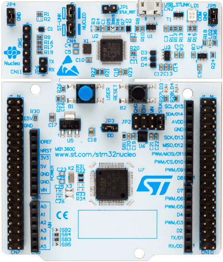

================
ST Nucleo G0B1RE
================

Board Information
=================

The Nucleo G0B1RE is a member of the Nucleo-64 board family, based on the
MB1360 reference board, featuring the STM32G0B1RET6U MCU. The STM32G0B1RE is
a 64 MHz Cortex-M0+ architecture with 512 KByte Flash memory (Dual bank) and
144 KByte SRAM.

The board features:

- On-board ST-LINK/V2-1 debugger/programmer
- 1 user LED
- User and reset push-buttons
- 32.768 kHz crystal oscillator
- Board connectors:
  - ARDUINO Uno V3 expansion connector
  - ST morpho extension

Refer to http://www.st.com and UM2324 for further information about this
board.

Serial Console
==============

The default console is the virtual serial console through ST-LINK:

1. Nucleo Virtual Console

   The virtual console uses serial port 2 (UART2) with TX on PA2 and RX on
   PA3.

      ================ ===
      VCOM Signal      Pin
      ================ ===
      SERIAL_RX        PA3
      SERIAL_TX        PA2
      ================ ===
    
   These signals are internally connected to the on board ST-Link.

   The Nucleo virtual console is the default serial console on all
   configurations unless stated otherwise in configuration description.

Configurations
==============

nsh:
----

This configuration provides a basic NuttShell configuration (NSH) on the
Nucleo virtual console (VCOM on UART2).
