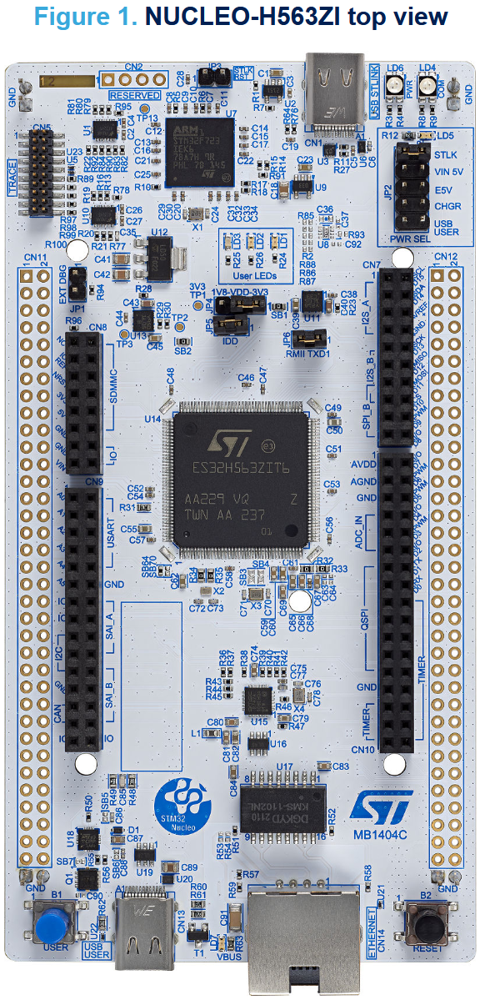

================
ST Nucleo-H563ZI
================

Board Information
=================

This page discusses issues unique to NuttX configurations for the
STMicro NUCLEO-H563ZI development board featuring the STM32H563ZI
MCU. The STM32H563ZI is a 250MHz Cortex-M33 operation with 2MBytes Flash
memory and 640KByte SRAM. The board features:

- On-board ST-LINK-V3EC for programming and debugging
- 3 user LEDs
- Two pushbuttons (user and reset)
- 32.768 kHz crystal oscillator
- USB Type-C connectors
- Ethernet connector compliant with IEEE-802.3-2002
- Board connectors:
  - 2x USB-C
  - Ethernet RJ45
  - ST Zio connector including Arduino Uno V3
  - ST morpho

Refer to the http://www.st.com website for further information about this
board (search keyword: NUCLEO-H563ZI)

Serial Console
==============

Many options are available for a serial console via the Morpho connector.
Here two common serial console options are suggested:

1. Nucleo Virtual Console.

   The virtual console uses Serial Port 3 (USART3) with TX on PD8 and RX on
   PD9.

      ================= ===
      VCOM Signal       Pin
      ================= ===
      SERIAL_RX         PD9
      SERIAL_TX         PD8
      ================= ===

   These signals are internally connected to the on board ST-Link.

   The Nucleo virtual console is the default serial console in all
   configurations unless otherwise stated in the description of the
   configuration.

2. Arduino Serial Shield.

   If you are using a standard Arduino RS-232 shield with the serial
   interface with RX on pin D0 and TX on pin D1 from LPUART1:

      ======== ========== =====
      ARDUINO  FUNCTION   GPIO
      ======== ========== =====
      DO RX    LPUART1_RX PB7
      D1 TX    LPUART1_TX PB6
      ======== ========== =====

Configurations
==============

Information Common to All Configurations
----------------------------------------

Each Nucleo-H563ZI configuration is maintained in a sub-directory and
can be selected as follows::

    tools/configure.sh [options] nucleo-h563zi:<subdir>

Where options should specify the host build platform (-l for Linux, -c for
Cygwin under Windows, etc.).  Try 'tools/configure.sh -h' for the complete
list of options.

Before starting the build, make sure that (1) your PATH environment variable
includes the correct path to your toolchain, and (2) you have the correct
toolchain selected in the configuration.

And then build NuttX by simply typing the following.  At the conclusion of
the make, the nuttx binary will reside in an ELF file called, simply, nuttx.::

    make

The <subdir> that is provided above as an argument to the tools/configure.sh
must be is one of the following.

NOTES:

1. These configurations use the mconf-based configuration tool.  To
   change any of these configurations using that tool, you should:

   a. Build and install the kconfig-mconf tool.  See nuttx/README.txt
      see additional README.txt files in the NuttX tools repository.

   b. Execute 'make menuconfig' in nuttx/ in order to start the
      reconfiguration process.

2. Unless stated otherwise, all configurations generate console
   output on the ST-Link VCOM, USART3.

3. Unless otherwise stated, the configurations are setup for Linux by
   default:

   Build Setup::

     CONFIG_HOST_LINUX=y                     : Linux host operating system

4. All of these configurations use the general arm-none-eabi toolchain for
   Linux  That toolchain selection can easily be reconfigured using 'make
   menuconfig'.

5. These configurations all assume that you are loading code using
   something like the ST-Link v3 JTAG.  None of these configurations are
   setup to use the DFU bootloader but should be easily reconfigured to
   use that bootloader if so desired.

Configuration Sub-directories
=============================

nsh:
----

This configuration provides a basic NuttShell configuration (NSH)
for the Nucleo-H563ZI.  The default console is the VCOM on USART3.

adc:
--------

This configuration configures ADC1_IN3 and ADC1_IN10, which can be
accessed at the CN9 A0 and A1 pins respectively. Modify
nucleo-h563zi/src/stm32_adc.c to enable more channels.

usbnsh:
--------

This configuration provides a basic NuttShell through the USB User interface.

References
===========

[UM3115] - STM32H5 Nucleo-144 board (MB1404)
