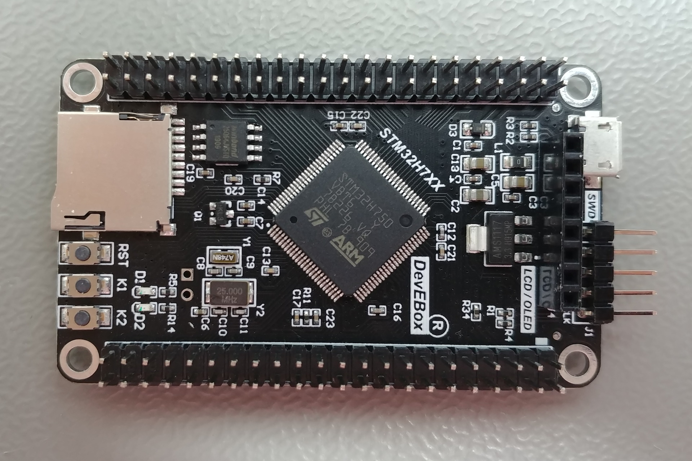
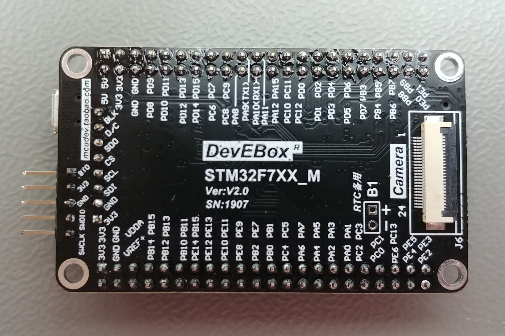

==================
devebox-stm32h743
==================

.. tags:: chip:stm32, chip:stm32h7, chip:stm32h743

NuttX port for the DevEbox STM32H743 board.

|

|

Board information
=================

The DevEbox STM32H743 board is developed based on the STM32H743VI microcontroller.

Board information: https://stm32-base.org/boards/STM32H743VIT6-STM32H7XX-M

The board features:

  - USB-C power supply
  - SWD connector
  - Crystal for HS 25MHz
  - Crystal for RTC 32.768KHz
  - 1 user LED (PA1)
  - 2 user buttons (PE3, PC5)
  - 1 MicroSD connector supporting 1 or 4-bit bus (SDMMC1)
  - 1 USB 2.0 OTG FS
  - 1 QSPI Flash W25Q64 (8MB)

Serial Console
==============

The board uses USART1 for the serial debug console.

======== =====
USART1   PINS
======== =====
TX       PA9
RX       PA10
======== =====

**Note:** PA10 is also used as OTGFS_ID. When USB is enabled,
``CONFIG_OTG_ID_GPIO_DISABLE=y`` must be set to avoid a pin conflict.

LED
===

The board has one software-controllable LED on PA1 (active low).

Board buttons
=============

The board has two buttons with active-low logic:

==== =====
ID   GPIO
==== =====
K1   PE3
K2   PC5
==== =====

SDMMC
=====

The board has one microSD slot connected via SDMMC1.

=========== =====
SDMMC1      PINS
=========== =====
SDMMC_D0    PC8
SDMMC_D1    PC9
SDMMC_D2    PC10
SDMMC_D3    PC11
SDMMC_CK    PC12
SDMMC_CMD   PD2
=========== =====

=============== =====
GPIO            PINS
=============== =====
SDCARD_DETECT   PD4
=============== =====

QSPI Flash
==========

The board has a W25Q64 (8MB) QSPI NOR Flash.

========= =====
QSPI      PINS
========= =====
BK1_CS    PB6
BK1_IO0   PD11
BK1_IO1   PD12
BK1_IO2   PE2
BK1_IO3   PD13
CLK       PB2
========= =====

USB OTG FS
==========

========= =====
OTG_FS    PINS
========= =====
DM        PA11
DP        PA12
ID        PA10
========= =====

Flashing
========

The board can be flashed via the SWD connector using a compatible programmer
such as J-Link, ST-Link, or other SWD probe.

SWD
---

Connect the SWD programmer as follows:

================ ===============
SWD Programmer   DevEbox
================ ===============
SWDIO            DIO
GND              GND
SWCLK            CLK
3.3V             3V3
================ ===============

J-Link example::

  JLinkExe -autoconnect 1 -device STM32H743VI -if SWD -speed 4000 \
    -CommanderScript flash.jlink

With flash.jlink::

  reset
  halt
  loadfile nuttx.bin 0x08000000
  reset
  go
  exit

Configurations
==============

Each devebox-stm32h743 configuration is maintained in a sub-directory and
can be selected as follows::

  ./tools/configure.sh devebox-stm32h743:<subdir>

Where ``<subdir>`` is one of the following:

nsh
---

Configures the NuttShell (nsh) with a serial console on USART1 (PA9/PA10).
Minimal configuration suitable for basic testing.

nsh+debug
---------

nsh configuration with debug features enabled (assertions, LEDs, stack
checking, RAMLOG). Syslog output goes to ``/dev/ttyRAM`` via RAMLOG.

full
----

All-in-one configuration enabling all board features:

  - SD card (``/dev/mmcsd0``)
  - USB CDC ACM (``/dev/ttyACM0``)
  - W25Q64 QSPI Flash NXFFS (``/w25``)
  - Buttons (``/dev/buttons``)
  - RAMLOG (``/dev/ttyRAM``)
  - GPIO helper (``/dev/gpio*``)
