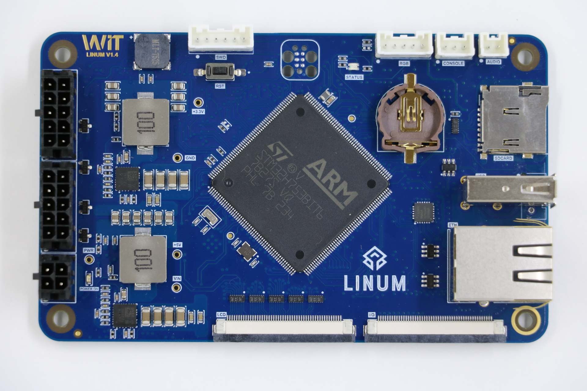
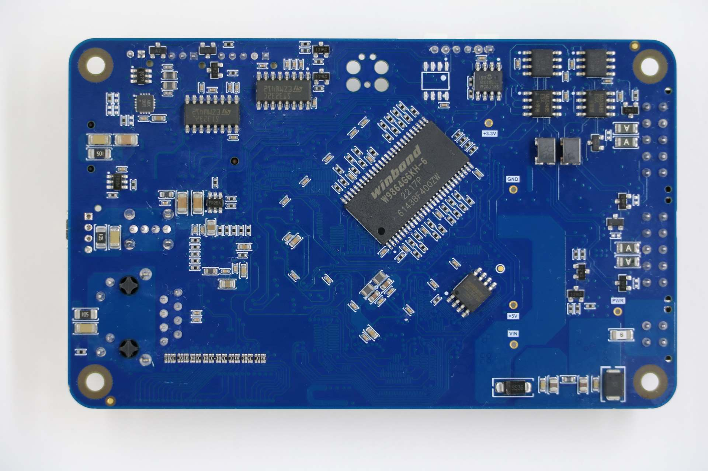

=================
linum-stm32h753bi
=================

This page discusses issues unique to NuttX configurations for the
LINUM-STM32H753BI board.

Board information
=================

This board was release by Witte Tenology in 2023 and developed based on
STM32H753BI microcontroller. The board has 2 expansion connectors used by the LCD display with 
touchscreen and another for access to other peripherals of microcontroller.

The board features:
  - 8 to 52V power supply
  - SWD Pins for use as STLink (Pin header) and TC2030-IDC 6-Pin Tag-Connect Plug-of-Nails™ Connector
  - Crystal for HS 25MHz
  - Crystal for RTC 32.768KHz
  - 1 UART serial for debug
  - 1 Led RGB
  - 1 Buzzer without internal oscillator
  - 1 Mono audio up to 3W
  - 1 Ethernet 10/100
  - 1 MicroSD connector supporting 1 or 4-bit bus
  - 1 USB 2.0 Host/Device
  - 1 EEPROM memory with 512K bits
  - 1 External SRAM memory with 8MB
  - 1 NOR memory with 16MB
  - 2 On-board RS232 Transceiver with RTS/CTS
  - 2 On-board RS485 Transceiver
  - 2 On-board CAN-FD Transceiver

Expansion connector 1 features:
  - 1 Display RBG 888 
  - 1 Capacitive Touchscreen sensor

Expansion connector 2 features.
  - 1 SPI
  - 1 I2C
  - 1 One Wire
  - 2 DACs
  - 6 PWM Channels
  - 10 ADCs

Board documentation: https://wittetech.com/

BOARD-LEDs
==========

The LINUM-STM32H753BI has 3 software controllable LEDs.

  ======= =====
  LED RGB PINS
  ======= =====
  LED_R   PG2
  LED_G   PG3
  LED_B   PB2  
  ======= =====

UART/USART
==========

The LINUM-STM32H753BI used the USART1 for serial debug messages.

USART1
------

  ====== =====
  USART1 PINS
  ====== =====
  TX     PB14
  RX     PB15 
  ====== =====

The LINUM-STM32H753BI board has two on-board RS-232 transceiver connected to USART2 and USART3.

  ====== =====
  USART2 PINS
  ====== =====
  TXD    PD5
  RXD    PD6
  CTS    PD3
  RTS    PD4
  ====== =====

  ====== =====
  USART3 PINS
  ====== =====
  TXD    PB10
  RXD    PB11
  CTS    PD11
  RTS    PD12
  ====== =====

The LINUM-STM32H753BI board has two on-board RS-485 transceiver connected to USART4 and USART6.

  ====== =====
  UART4  PINS
  ====== =====
  TXD    PB9
  RXD    PB8
  DE     PA15
  ====== =====

  ====== =====
  USART6 PINS
  ====== =====
  TXD    PC6
  RXD    PC7
  DE     PG12  
  ====== =====
  
SDMMC
======

The LINUM-STM32H753BI has one SDCard slot connected as below:

  ========== =====
  SDMMC1     PINS
  ========== =====
  SDMMC_D0   PC8
  SDMMC_D1   PC9
  SDMMC_D2   PC10
  SDMMC_D3   PC11
  SDMMC_DK   PC12
  ========== =====

  =============== =====
  GPIO            PINS
  =============== =====
  SDCARD_DETECTED PG7
  SDCARD_PWR_EN   PD7
  =============== =====      

ETHERNET
========

The LINUM-STM32H753BI has a ethernet connection using the transceiver KSZ8081RNACA.

  ============ =====
  ETH          PINS
  ============ =====
  ETH_REF_CLK  PA1
  ETH_MDIO     PA2
  ETH_CRS_DV   PA7
  ETH_MDC      PC1
  ETH_RXD0     PC4
  ETH_RXD1     PC5
  ETH_TX_EN    PG11
  ETH_TXD0     PG13
  ETH_TXD1     PG14
  ETH_CLK      PA8
  ETH_RESET    PI4
  ============ =====

CAN-FD
========

The LINUM-STM32H753BI board has two on-board CAN-FD transceiver connected to FDCAN1 and FDCAN2.

  ====== =====
  FDCAN1 PINS
  ====== =====
  TXD    PH13
  RXD    PH14
  STD    PI2  
  ====== =====

  ====== =====
  FDCAN2 PINS
  ====== =====
  TXD    PB13
  RXD    PB12
  STD    PE3  
  ====== =====

USB
============

The LINUM-STM32H753BI has one usb port.

  ========= =====
  USB       PINS
  ========= =====
  USB_VBUS  PA9
  USB_N     PA11
  USB_P     PA12
  USB_EN    PI12
  USB_FLT   PI13
  ========= =====

QUADSPI
==============

The LINUM-STM32H753BI board has one NOR memory connected to QUADSPI.
The NOR memory used is the W25Q128JV with 16MB

  ======= =====
  QUADSPI PINS
  ======= =====
  IO0     PF8
  IO1     PF9
  IO2     PF7
  IO3     PF6
  CLK     PF10
  NCS     PG6
  ======= =====
  
I2C3
============
The LINUM-STM32H753BI connects the EEPROM memory and the touchscreen sensor to I2C3.

  ====== =====
  I2C3   PINS
  ====== =====
  SCL    PH7
  SDA    PH8
  ====== =====

EEPROM MEMORY
--------------

EEPROM memory used is the 24LC256 with 256Kb with the control bytes value 0x54.

TOUCHSCREEN SENSOR
------------------

The touchscreen sensor used is the GT928.

  ======== =====
  GPIO     PINS
  ======== =====
  TS_RESET PI7
  TS_ISR   PH9
  ======== =====

I2C4
=======
The I2C4 is available for general use on the expansion connector.
  
  ====== =====
  I2C4   PINS
  ====== =====
  SCL    PH11
  SDA    PH12
  ====== =====

External SDRAM
==============
The LINUM-STM32H753BI has a external SDRAM with 16Mbits connected to FMC peripheral.

  =========== =====
  FMC         PINS
  =========== =====
  FMC_A0      PJ12
  FMC_A1      PF1
  FMC_A2      PF2
  FMC_A3      PF3
  FMC_A4      PF4
  FMC_A5      PF5
  FMC_A6      PF12
  FMC_A7      PF13
  FMC_A8      PF14
  FMC_A9      PF15
  FMC_A10     PG0
  FMC_A11     PG1
  FMC_BA0     PG4
  FMC_BA1     PG5
  FMC_D0      PD14
  FMC_D1      PD15
  FMC_D2      PD0
  FMC_D3      PD1
  FMC_D4      PE7
  FMC_D5      PE8
  FMC_D6      PE9
  FMC_D7      PE10
  FMC_D8      PE11
  FMC_D9      PE12
  FMC_D10     PE13
  FMC_D11     PE14
  FMC_D12     PE15
  FMC_D13     PD8
  FMC_D14     PD9
  FMC_D15     PD10
  FMC_NBL0    PE0
  FMC_NBL1    PE1
  FMC_SDCKE0  PC3
  FMC_SDCLK   PG8
  FMC_SDNCAS  PG15
  FMC_SDNEO   PC2
  FMC_SDNRAS  PF11
  FMC_SDNWE   PC0
  =========== =====

LCD
=======
The LINUM-STM32H753BI use the LTDC to support one LCD with RGB connection.

  ============= =====
  LTDC          PINS
  ============= =====
  LTDC_B0       PF0
  LTDC_B1       PJ13
  LTDC_B2       PJ14
  LTDC_B3       PJ15
  LTDC_B4       PK3
  LTDC_B5       PK4
  LTDC_B6       PK5
  LTDC_B7       PK6
  LTDC_CLK      PI14
  LTDC_DE       PK7
  LTDC_G0       PJ7
  LTDC_G1       PJ8
  LTDC_G2       PJ9
  LTDC_G3       PJ10
  LTDC_G4       PJ11
  LTDC_G5       PK0
  LTDC_G6       PK1
  LTDC_G7       PK2
  LTDC_HSYNC    PI10
  LTDC_R0       PI15
  LTDC_R1       PJ0
  LTDC_R2       PJ1
  LTDC_R3       PJ2
  LTDC_R4       PJ3
  LTDC_R5       PJ4
  LTDC_R6       PJ5
  LTDC_R7       PJ6
  LTDC_VSYNC    PI9
  PWM_BACKLIGHT PH6
  ============= =====

I2S
=======
The LINUM-STM32H753BI has one I2S output.

  ======== =====
  I2S2     PINS
  ======== =====
  I2S2_WS  PI0
  I2S2_CK  PI1
  I2S2_SDO PI3
  ======== =====

PWM
=======
The LINUM-STM32H753BI has a buzzer without internal oscillator connected to PB7

  ========= =====
  GPIO      PINS
  ========= =====
  BUZZER    PB7  
  ========= =====

==============

Each linum-stm32h753bi configuration is maintained in a sub-directory and
can be selected as follow::

    tools/configure.sh linum-stm32h753bi:<subdir>

  Where <subdir> is one of the following:

Configuration Directories
-------------------------

nsh
---

Configures the NuttShell (nsh) located at apps/examples/nsh. This
configuration enables a serial console on UART1.

usbnsh
------

Configures the NuttShell (nsh) located at apps/examples/nsh. This configuration enables a serial console over USB.

After flasing and reboot your board you should see in your dmesg logs::

    $ sudo dmesg | tail
    [ 9180.937813] usb 3-1.1.2: SerialNumber: 0
    [ 9180.946974] cdc_acm 3-1.1.2:1.0: ttyACM0: USB ACM device
    [ 9715.123387] usb 3-1.1.2: USB disconnect, device number 20
    [ 9717.393142] usb 3-1.1.2: new full-speed USB device number 21 using xhci_hcd
    [ 9717.494824] usb 3-1.1.2: New USB device found, idVendor=0525, idProduct=a4a7, bcdDevice= 1.01
    [ 9717.494834] usb 3-1.1.2: New USB device strings: Mfr=1, Product=2, SerialNumber=3
    [ 9717.494837] usb 3-1.1.2: Product: CDC/ACM Serial
    [ 9717.494840] usb 3-1.1.2: Manufacturer: NuttX
    [ 9717.494842] usb 3-1.1.2: SerialNumber: 0
    [ 9717.504192] cdc_acm 3-1.1.2:1.0: ttyACM0: USB ACM device

You may need to press ENTER 3 times before the NSH show up.

modbus_slave
------------

Configures the ModBus RTU Slave located at apps/examples/modbus. This
configuration enables a RS485 on USART6.

After configuring the desired pins on menuconfig and wiring the RS485 converter, you
can enable the ModBus to respond to queries::

    nsh> modbus -e

In your pc you will be able to read the ModBus registers using an application like ``mbpoll``::

    $ mbpoll -a 10 -b 38400 -t 3 -r 1000 -c 4 /dev/ttyUSB1 -R

modbus_master
-------------

Configures the ModBus RTU Master located at apps/examples/modbusmaster. This
configuration enables a RS485 on USART6.

After configuring the desired pins on menuconfig and wiring the RS485 converter, you
can enable the ModBus Master to create queries for device with address 10::

    nsh> mbmaster

In your pc you will be able to create a ModBus Slave with address 10 using an application like ``diagslave``::

    $ sudo diagslave -a 10 -b 38400 /dev/ttyUSB0

sdcard
------

Configures the NuttShell (nsh) and enables SD card support. The board has an onboard microSD slot that should be
automatically registered as the block device /dev/mmcsd0 when an SD card is present.

The SD card can then be mounted by the NSH commands::

    nsh> mount -t vfat /dev/mmcsd0 /mnt
    nsh> mount
    nsh> echo "Hello World!!" > /mnt/test_file.txt
    nhs> ls /mnt/
    test_file.txt
    nsh> cat /mnt/test_file.txt
    Hello World!!

eeprom
------

Use **dd** command to write and read data from EEPROM as below:::

    nsh> dd if=/dev/console of=/dev/eeprom bs=1 count=35
    Witte-Tech Linum-STM32H753BI board
    nsh> dd if=/dev/eeprom of=/dev/console bs=4 count=35
    Witte-Tech Linum-STM32H753BI board
    nsh>

buzzer
------

This example use the timer 4 with channel 2 to generate a PWM output signal on buzzer pin::

    nsh> ls /dev
    /dev:
    console
    null
    pwm0
    rtc0
    ttyS0
    nsh> pwm -d 75 -t 3
    pwm_main: starting output with frequency: 100 duty: 0000bfff
    pwm_main: stopping output
    nsh> pwm -f 300 -t 3
    pwm_main: starting output with frequency: 300 duty: 0000bfff
    pwm_main: stopping output

leds
------

Example to blink the RBG led of board, using this example the board led status support stop to work::

    # turn on led red
    printf \x00000001 > /dev/userleds

    # turn on led green
    printf \x00000002 > /dev/userleds

    # turn on led blue
    printf \x00000004 > /dev/userleds

    # Run blink leds sample
    nsh> leds
    leds_main: Starting the led_daemon
    leds_main: led_daemon started

    led_daemon (pid# 3): Running
    led_daemon: Opening /dev/userleds
    led_daemon: Supported LEDs 0x07
    led_daemon: LED set 0x01
    nsh> led_daemon: LED set 0x02
    led_daemon: LED set 0x03
    led_daemon: LED set 0x04
    led_daemon: LED set 0x05
    led_daemon: LED set 0x06
    led_daemon: LED set 0x07
    led_daemon: LED set 0x06
    led_daemon: LED set 0x05
    led_daemon: LED set 0x04
    led_daemon: LED set 0x03
    led_daemon: LED set 0x02
    led_daemon: LED set 0x01

zmodem
------

This example use the nsh via usb and the SDCard to storage the files exchanged.
By default the zmodem lib use the path /tmp to storage the files.

Sending files to target::

    # Mount the SDCard at /tmp
    nsh> mount -t vfat /dev/mmcsd0 /tmp

    # Waiting for a new file.
    nsh> rz

    # Transmitting a file to target.
    my_pc$ sz --zmodem nuttx_logo.txt > /dev/ttyACM0 < /dev/ttyACM0

    # Check if the file was received
    nsh> ls -l /tmp
    /tmp:
    -rw-rw-rw-        1942 nuttx_logo.txt

Transmiting a file to PC::

    # Sending the file nuttx_logo.txt to PC
    nsh> sz -x 1 /tmp/nuttx_logo.txt
    **B00000000000000

    # Using zmodem to receive a file from target
    my_pc/temp$ rz > /dev/ttyACM0 < /dev/ttyACM0
    Receiving: nuttx_logo.txt                         
    Bytes received:    1942/   1942   BPS:124544

    Transfer complete
    my_pc/temp$ ls -l
    -rw-------  1 nuttx nuttx    1942 abr  6 16:07 nuttx_logo.txt

If you don't have a SDCard on your board, you can mount the TMPFS at /tmp and transfer files to it, 
but you cannot transfer big files because TMPFS could use the free RAM of your board::

    nsh> mount -t tmpfs /tmp

nxffs
-----
This example use the flash memory W25Q128JV via qspi with the nxffs file system::

    NuttShell (NSH) NuttX-12.5.1-RC0
    nsh> ls
    /:
    dev/
    w25/
    nsh> cd /w25
    nsh> echo "hello world!" > message.txt
    nsh> ls
    /w25:
    message.txt
    nsh> cat message.txt
    hello world!

littlefs
--------
This example use the flash memory W25Q128JV via qspi with the littlefs file system::

    NuttShell (NSH) NuttX-12.5.1-RC0
    nsh> ls
    /:
    dev/
    w25/
    nsh> cd /w25
    nsh> mkdir folder1
    nsh> cd folder1
    nsh> echo "hello world!!!!" > message.txt
    nsh> cat message.txt
    hello world!!!!
    nsh> ls
    /w25/folder1:
    .
    ..
    message.txt

rndis
-----
This example use ethernet over usb and show how configure ip and download file with wget command from server.

After flash the board check if the linux found and recognized the new network driver:: 

    $ sudo dmesg | tail
    [30260.873245] rndis_host 3-1.3:1.0 enxa0e0deadbeef: unregister 'rndis_host' usb-0000:00:14.0-1.3, RNDIS device
    [30265.461419] usb 3-1.3: new full-speed USB device number 34 using xhci_hcd
    [30265.563354] usb 3-1.3: New USB device found, idVendor=584e, idProduct=5342, bcdDevice= 0.01
    [30265.563359] usb 3-1.3: New USB device strings: Mfr=1, Product=2, SerialNumber=3
    [30265.563361] usb 3-1.3: Product: RNDIS gadget
    [30265.563362] usb 3-1.3: Manufacturer: NuttX
    [30265.563363] usb 3-1.3: SerialNumber: 1234
    [30265.572179] rndis_host 3-1.3:1.0: dev can't take 1558 byte packets (max 660), adjusting MTU to 602
    [30265.573517] rndis_host 3-1.3:1.0 eth0: register 'rndis_host' at usb-0000:00:14.0-1.3, RNDIS device, a0:e0:de:ad:be:ef
    [30265.584924] rndis_host 3-1.3:1.0 enxa0e0deadbeef: renamed from eth0

    $ ifconfig
    enxa0e0deadbeef: flags=4163<UP,BROADCAST,RUNNING,MULTICAST>  mtu 602
    inet 10.42.0.1  netmask 255.255.255.0  broadcast 10.42.0.255
    ether a0:e0:de:ad:be:ef  txqueuelen 1000  (Ethernet)
    RX packets 87  bytes 10569 (10.5 KB)
    RX errors 0  dropped 0  overruns 0  frame 0
    TX packets 99  bytes 22896 (22.8 KB)
    TX errors 0  dropped 0 overruns 0  carrier 0  collisions 0

**OBS:** In network settings of PC enable "Shared to other computers"

Configure the IP of target::

    nsh> ifconfig eth0 10.42.0.2
    nsh> ifconfig
    lo	Link encap:Local Loopback at RUNNING mtu 1518
    inet addr:127.0.0.1 DRaddr:127.0.0.1 Mask:255.0.0.0

    eth0	Link encap:Ethernet HWaddr 00:e0:de:ad:be:ef at UP mtu 576
    inet addr:10.42.0.2 DRaddr:10.42.0.1 Mask:255.255.255.0

                IPv4   TCP   UDP  ICMP
    Received     012a  0000  0126  0000
    Dropped      0004  0000  0000  0000
      IPv4        VHL: 0000   Frg: 0001
      Checksum   0000  0000  0000  ----
      TCP         ACK: 0000   SYN: 0000
                  RST: 0000  0000
      Type       0000  ----  ----  0000
    Sent         0000  0000  0000  0000
      Rexmit     ----  0000  ----  ----
    nsh> 

Testing communication with PC using ping command::

    nsh> ping 10.42.0.1
    PING 10.42.0.1 56 bytes of data
    56 bytes from 10.42.0.1: icmp_seq=0 time=0.0 ms
    56 bytes from 10.42.0.1: icmp_seq=1 time=0.0 ms
    56 bytes from 10.42.0.1: icmp_seq=2 time=0.0 ms
    56 bytes from 10.42.0.1: icmp_seq=3 time=0.0 ms
    56 bytes from 10.42.0.1: icmp_seq=4 time=0.0 ms
    56 bytes from 10.42.0.1: icmp_seq=5 time=0.0 ms
    56 bytes from 10.42.0.1: icmp_seq=6 time=0.0 ms
    56 bytes from 10.42.0.1: icmp_seq=7 time=0.0 ms
    56 bytes from 10.42.0.1: icmp_seq=8 time=0.0 ms
    56 bytes from 10.42.0.1: icmp_seq=9 time=0.0 ms
    10 packets transmitted, 10 received, 0% packet loss, time 10100 ms
    rtt min/avg/max/mdev = 0.000/0.000/0.000/0.000 ms

In your pc you will be able connect to target using telnet and access their shell nsh::

    $ telnet 10.42.0.2
    Trying 10.42.0.2...
    Connected to 10.42.0.2.
    Escape character is '^]'.

    NuttShell (NSH) NuttX-12.5.1
    nsh> uname -a
    NuttX  12.5.1 c148e8f2af-dirty Apr 28 2024 10:27:50 arm linum-stm32h753bi
    nsh> exit
    Connection closed by foreign host.
    $
    
Testing wget to download file from server::

    # PC: Creating a http server and sharing local folder.
    $ sudo python3 -m http.server 80 -d ./

    # log of server
    Serving HTTP on 0.0.0.0 port 80 (http://0.0.0.0:80/) ...
    10.42.0.2 - - [28/Apr/2024 16:14:39] "GET /nuttx_logo.txt HTTP/1.0" 200 -

    # Using wget on target    
    nsh> mount -t tmpfs /tmp
    nsh> cd /tmp
    nsh> pwd
    /tmp
    nsh> wget http://10.42.0.1/nuttx_logo.txt
    nsh> ls
    /tmp:
    nuttx_logo.txt

usbmsc-sdcard
-------------
This example uses the USB Mass Storage with SD Card.

Enable the USB Mass Storage with the command **msconn**::

    nsh> msconn
    mcsonn_main: Creating block drivers
    mcsonn_main: handle=0x38003020
    mcsonn_main: Bind LUN=0 to /dev/mmcsd0
    mcsonn_main: Connected

After that check if your PC recognized the usb driver::

    $ sudo dmesg | tail
    [sudo] password for jaga: 
    [27219.361934] usbcore: registered new interface driver uas
    [27220.378231] scsi 0:0:0:0: Direct-Access     NuttX    Mass Storage     0101 PQ: 0 ANSI: 2
    [27220.378646] sd 0:0:0:0: Attached scsi generic sg0 type 0
    [27220.379203] sd 0:0:0:0: [sda] 1930240 512-byte logical blocks: (988 MB/943 MiB)
    [27220.597414] sd 0:0:0:0: [sda] Write Protect is off
    [27220.597419] sd 0:0:0:0: [sda] Mode Sense: 0f 00 00 00
    [27220.817620] sd 0:0:0:0: [sda] Write cache: enabled, read cache: enabled, doesn't support DPO or FUA
    [27221.265245]  sda: sda1
    [27221.266103] sd 0:0:0:0: [sda] Attached SCSI removable disk
    [27228.147377] FAT-fs (sda1): Volume was not properly unmounted. Some data may be corrupt. Please run fsck.

**OBS:** This example disable the macro CONFIG_STM32H7_SDMMC_IDMA, for more information read the file: arch/arm/stm32h7/stm32_sdmmc.c

netnsh
------

This configuration is focused on network testing using the ethernet periferal::

    $ nsh> ifconfig
      eth0	Link encap:Ethernet HWaddr 00:e0:de:ad:be:ef at UP mtu 1486
        inet addr:192.168.1.6 DRaddr:192.168.1.1 Mask:255.255.255.0

                  IPv4   TCP   UDP  ICMP
      Received     01b9  0025  0194  0000
      Dropped      0000  0000  0000  0000
        IPv4        VHL: 0000   Frg: 0000
        Checksum   0000  0000  0000  ----
        TCP         ACK: 0000   SYN: 0000
                    RST: 0000  0000
        Type       0000  ----  ----  0000
      Sent         0028  0025  0003  0000
        Rexmit     ----  0000  ----  ----

      nsh> ping google.com
      PING 142.251.129.110 56 bytes of data
      56 bytes from 142.251.129.110: icmp_seq=0 time=10.0 ms
      56 bytes from 142.251.129.110: icmp_seq=1 time=0.0 ms
      56 bytes from 142.251.129.110: icmp_seq=2 time=0.0 ms
      56 bytes from 142.251.129.110: icmp_seq=3 time=0.0 ms
      56 bytes from 142.251.129.110: icmp_seq=4 time=0.0 ms
      56 bytes from 142.251.129.110: icmp_seq=5 time=0.0 ms
      56 bytes from 142.251.129.110: icmp_seq=6 time=0.0 ms
      56 bytes from 142.251.129.110: icmp_seq=7 time=0.0 ms
      56 bytes from 142.251.129.110: icmp_seq=8 time=0.0 ms
      56 bytes from 142.251.129.110: icmp_seq=9 time=0.0 ms
      10 packets transmitted, 10 received, 0% packet loss, time 10100 ms
      rtt min/avg/max/mdev = 0.000/1.000/10.000/3.000 ms

qencoder
--------

Configures and enables TIM5 on CH1(PA0) and CH2(PH11) to handle Quadrature Encoder::

    nsh> qe
    qe_main: Hardware initialized. Opening the encoder device: /dev/qe0
    qe_main: Number of samples: 0
    qe_main:   1. 1
    qe_main:   2. 2
    qe_main:   3. 3
    qe_main:   4. 2
    qe_main:   5. 1

sdram
--------

This configuration uses the FMC peripheral to connect to external SDRAM with 8 MB and add it to the nuttx heap.

To test the sdram use the command **ramtest**::

    nsh> free
                    total       used       free    maxused    maxfree  nused  nfree
          Umem:    9397168       5488    9391680       5880    8388592     28      5
    nsh> ramtest -w -a 0xc0000000 -s 8388608
    RAMTest: Marching ones: c0000000 8388608
    RAMTest: Marching zeroes: c0000000 8388608
    RAMTest: Pattern test: c0000000 8388608 55555555 aaaaaaaa
    RAMTest: Pattern test: c0000000 8388608 66666666 99999999
    RAMTest: Pattern test: c0000000 8388608 33333333 cccccccc
    RAMTest: Address-in-address test: c0000000 8388608
