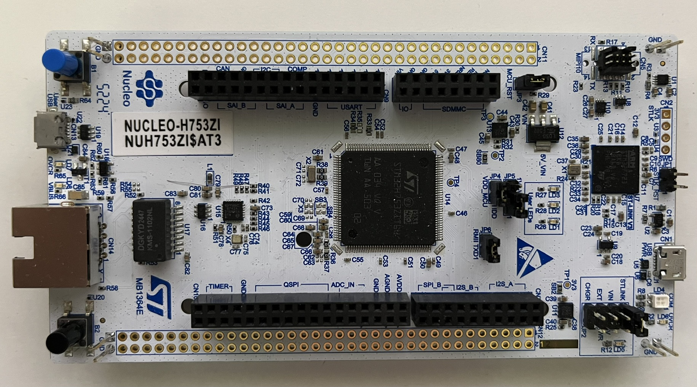

=================
ST Nucleo H753ZI
=================

.. tags:: chip:stm32, chip:stm32h7, chip:stm32h753



This page discusses issues unique to NuttX configurations for the
STMicro NUCLEO-H753ZI development board featuring the STM32H753ZI
MCU. The STM32H753ZI is a 400MHz Cortex-M7 operation with 2MBytes Flash
memory and 1MByte SRAM. The board features:

- On-board ST-LINK/V2 for programming and debugging,
- 3 user LEDs
- Two pushbuttons (user[B1] and reset)
- 32.768 kHz crystal oscillator
- USB OTG FS with Micro-AB connectors
- Ethernet connector compliant with IEEE-802.3-2002
- Board connectors:
  - USB with Micro-AB
  - SWD
  - Ethernet RJ45
  - ST Zio connector including Arduino Uno V3
  - ST morpho

Refer to the http://www.st.com website for further information about this
board (search keyword: NUCLEO-H753ZI)

Serial Console
==============

Many options are available for a serial console via the Morpho connector.
Here two common serial console options are suggested:

1. Arduino Serial Shield.

   If you are using a standard Arduino RS-232 shield with the serial
   interface with RX on pin D0 and TX on pin D1 from USART6:

      ======== ========= =====
      ARDUINO  FUNCTION  GPIO
      ======== ========= =====
      DO RX    USART6_RX PG9
      D1 TX    USART6_TX PG14
      ======== ========= =====

2. Nucleo Virtual Console.

   The virtual console uses Serial Port 3 (USART3) with TX on PD8 and RX on
   PD9.

      ================= ===
      VCOM Signal       Pin
      ================= ===
      SERIAL_RX         PD9
      SERIAL_TX         PD8
      ================= ===

   These signals are internally connected to the on board ST-Link.

   The Nucleo virtual console is the default serial console in all
   configurations unless otherwise stated in the description of the
   configuration.

Configurations
==============

nsh:
----

This configuration provides a basic NuttShell configuration (NSH)
for the Nucleo-H753ZI.  The default console is the VCOM on USART3.

jumbo:
------

This configuration enables many Apache NuttX features.  This is
mostly to help provide additional code coverage in CI, but also
allows for a users to see a wide range of features that are
supported by the OS.

Some highlights:
  NSH:
    - Readline with tab completion
    - Readline command history

  Performance and Monitoring:
    - RAM backed syslog
    - Syslog with process name, priority, and timestamp
    - Process Snapshot with stack usage, cpu usage, and signal information
    - Interrupt Statistics
    - procfs filesystem (required for ifconfig, ifup/ifdown)

  Networking:
    - IPv4 Networking
    - Ethernet
    - DHCP Client
    - iperf
    - telnet daemon

  File Systems:
    - FAT filesystem
    - LittleFS
    - RAM MTD device

  Testing:
    - OS Test with FPU support
    - Filesystem testing

  USB Host:
    - USB Hub support
    - Mass Storage Device
    - Trace Monitoring


..
   ADE
   telnetd [7:100]

   NuttShell (NSH) NuttX-12.13.0
   nsh> uname -a
   NuttX  12.13.0 81dc339415-dirty May 19 2026 13:07:19 arm nucleo-h753zi
   nsh> help
   help usage:  help [-v] [<cmd>]

       .           cp          expr        mkrd        route       truncate    
       [           cmp         false       mount       set         uname       
       ?           dirname     fdinfo      mv          kill        umount      
       addroute    date        free        nslookup    pkill       unset       
       alias       delroute    help        pidof       sleep       uptime      
       unalias     df          hexdump     printf      usleep      watch       
       arp         dmesg       ifconfig    ps          source      wget        
       basename    echo        irqinfo     pwd         test        xd          
       break       env         ls          reboot      top         wait        
       cat         exec        mkdir       rm          time        
       cd          exit        mkfatfs     rmdir       true        

   Builtin Apps:
       buttons     getprime    netcat      ping        tc          
       dd          hidkbd      nsh         renew       telnetd     
       fstest      iperf       ostest      sh          
   nsh> ls
   /:
    dev/
    mnt/
    proc/
   nsh> free
         total       used       free    maxused    maxfree  nused  nfree name
        953572     158596     794976     158992     461520     64      5 Umem
   nsh> irqinfo
   IRQ HANDLER  ARGUMENT    COUNT    RATE    TIME
    11 080012e5 00000000       1031   50.738    0
    15 0800b00d 00000000       2032  100.000    1
    55 080007d5 24000000       1455   71.604    5
    77 0800cccd 00000000          8    0.393    1
   117 0800bf85 00000000        205   10.168 21558
   nsh> ifconfig
   eth0	Link encap:Ethernet HWaddr ea:63:b9:20:1d:46 at RUNNING mtu 1486
   	inet addr:10.0.0.2 DRaddr:10.0.0.1 Mask:255.255.255.0

   lo	Link encap:Local Loopback at RUNNING mtu 1518
   	inet addr:127.0.0.1 DRaddr:127.0.0.1 Mask:255.0.0.0

                IPv4   TCP   UDP  ICMP
   Received     0004  0000  0004  0000
   Dropped      0000  0000  0000  0000
     IPv4        VHL: 0000   Frg: 0000
     Checksum   0000  0000  0000  ----
     TCP         ACK: 0000   SYN: 0000
                 RST: 0000  0000
     Type       0000  ----  ----  0000
   Sent         0000  0000  0000  0000
     Rexmit     ----  0000  ----  ----
   nsh> renew eth0
   nsh> ifconfig eth0
   eth0	Link encap:Ethernet HWaddr ea:63:b9:20:1d:46 at RUNNING mtu 1486
   	inet addr:192.168.3.106 DRaddr:192.168.3.1 Mask:255.255.255.0

   nsh> ifconfig eth0
   eth0	Link encap:Ethernet HWaddr ea:63:b9:20:1d:46 at RUNNING mtu 1486
   	inet addr:192.168.3.106 DRaddr:192.168.3.1 Mask:255.255.255.0

   nsh> ifconfig eth0
   eth0	Link encap:Ethernet HWaddr ea:63:b9:20:1d:46 at RUNNING mtu 1486
   	inet addr:192.168.3.106 DRaddr:192.168.3.1 Mask:255.255.255.0

   nsh> ifconfig
   eth0	Link encap:Ethernet HWaddr ea:63:b9:20:1d:46 at RUNNING mtu 1486
   	inet addr:192.168.3.106 DRaddr:192.168.3.1 Mask:255.255.255.0

   lo	Link encap:Local Loopback at RUNNING mtu 1518
   	inet addr:127.0.0.1 DRaddr:127.0.0.1 Mask:255.0.0.0

                IPv4   TCP   UDP  ICMP
   Received     004e  0033  001a  0001
   Dropped      0000  0000  0000  0000
     IPv4        VHL: 0000   Frg: 0000
     Checksum   0000  0000  0000  ----
     TCP         ACK: 0000   SYN: 0000
                 RST: 0000  0000
     Type       0000  ----  ----  0000
   Sent         0035  0032  0002  0001
     Rexmit     ----  0000  ----  ----
   nsh> ping www.google.com
   PING 142.251.155.119 56 bytes of data
   56 bytes from 142.251.155.119: icmp_seq=0 time=10.0 ms
   56 bytes from 142.251.155.119: icmp_seq=1 time=10.0 ms
   56 bytes from 142.251.155.119: icmp_seq=2 time=10.0 ms
   56 bytes from 142.251.155.119: icmp_seq=3 time=20.0 ms
   56 bytes from 142.251.155.119: icmp_seq=4 time=10.0 ms
   56 bytes from 142.251.155.119: icmp_seq=5 time=10.0 ms
   56 bytes from 142.251.155.119: icmp_seq=6 time=10.0 ms
   56 bytes from 142.251.155.119: icmp_seq=7 time=20.0 ms
   56 bytes from 142.251.155.119: icmp_seq=8 time=10.0 ms
   56 bytes from 142.251.155.119: icmp_seq=9 time=10.0 ms
   10 packets transmitted, 10 received, 0% packet loss, time 10100 ms
   rtt min/avg/max/mdev = 10.000/12.000/20.000/4.000 ms
   nsh> ls /dev
   /dev:
    buttons
    console
    kmsg
    null
    rammtd
    sda
    telnet
    ttyS0
    zero
   nsh> ls /mnt
   /mnt:
    lfs/
   nsh> echo "This will go away on reboot." > /mnt/lfs/afile
   nsh> cat /mnet/lfs/afile
   nsh: cat: open failed: 2
   nsh> mount -t vfat /dev/sda /mnt/sda
   nsh> echo "This will stay on the USB drive" > /mnt/sda/afile
   nsh> ls /mnt/sda
   /mnt/sda:
    GARMIN/
    afile
   nsh> rebootADE
   telnetd [7:100]

   NuttShell (NSH) NuttX-12.13.0
   nsh> ls /mnt/lfs
   /mnt/lfs:
    .
    ..
   nsh> mount -t vfat /dev/sda /mnt/sda
   nsh> ls /mnt/sda
   /mnt/sda:
    GARMIN/
    afile
   nsh> cat /mnt/sda/afail
   nsh: cat: open failed: 2
   nsh> cat /mnt/sda/afile
   This will stay on the USB drive
   nsh> buttons
   buttons_main: Starting the button_daemon
   buttons_main: button_daemon started
   button_daemon: Running
   button_daemon: Opening /dev/buttons
   button_daemon: Supported BUTTONs 0x01
   nsh> B1 was pressed
   B1 was released
   B1 was pressed
   B1 was released

   nsh> ps
     TID   PID  PPID PRI POLICY   TYPE    NPX STATE    EVENT     SIGMASK            STACK    USED FILLED    CPU COMMAND
       0     0     0   0 FIFO     Kthread   - Ready              0000000000000000 0001000 0000552  55.2%  100.0% Idle_Task
       1     0     0 224 RR       Kthread   - Waiting  Semaphore 0000000000000000 0001976 0000632  31.9%   0.0% hpwork 0x24000130 0x24000180
       2     0     0 100 RR       Kthread   - Waiting  Semaphore 0000000000000000 0001976 0000632  31.9%   0.0% lpwork 0x240000c0 0x24000110
       4     0     0 100 RR       Kthread   - Waiting  Semaphore 0000000000000000 0002008 0000896  44.6%   0.0% usbhost
       5     0     0  50 RR       Kthread   - Waiting  Signal    0000000000000000 0004048 0000616  15.2%   0.0% USB_Monitor
       6     6     0 100 RR       Task      - Running            0000000000000000 0004048 0001800  44.4%   0.0% nsh_main
       7     7     0 100 RR       Task      - Waiting  Semaphore 0000000000000000 0002008 0000912  45.4%   0.0% telnetd
       9     9     0 100 RR       Task      - Waiting  Signal    0000000000000000 0004048 0000720  17.7%   0.0% button_daemon
   nsh> 
   ```

   ```
   peter@legion:~$ telnet 192.168.3.106
   Trying 192.168.3.106...
   Connected to 192.168.3.106.
   Escape character is '^]'.
   
   NuttShell (NSH) NuttX-12.13.0
   nsh> ps
     TID   PID  PPID PRI POLICY   TYPE    NPX STATE    EVENT     SIGMASK            STACK    USED FILLED    CPU COMMAND
       0     0     0   0 FIFO     Kthread   - Ready              0000000000000000 0001000 0000552  55.2%  100.0% Idle_Task
       1     0     0 224 RR       Kthread   - Waiting  Semaphore 0000000000000000 0001976 0000632  31.9%   0.0% hpwork 0x24000130 0x24000180
       2     0     0 100 RR       Kthread   - Waiting  Semaphore 0000000000000000 0001976 0000632  31.9%   0.0% lpwork 0x240000c0 0x24000110
       4     0     0 100 RR       Kthread   - Waiting  Semaphore 0000000000000000 0002008 0000896  44.6%   0.0% usbhost
       5     0     0  50 RR       Kthread   - Waiting  Signal    0000000000000000 0004048 0000632  15.6%   0.0% USB_Monitor
       6     6     0 100 RR       Task      - Waiting  Semaphore 0000000000000000 0004048 0001416  34.9%   0.0% nsh_main
       7     7     0 100 RR       Task      - Waiting  Semaphore 0000000000000000 0002008 0000912  45.4%   0.0% telnetd
       9     9     0 100 RR       Task      - Running            0000000000000000 0002000 0001896  94.8%!  0.0% Telnet_session
   nsh> ^]
   telnet> quit
   Connection closed.
   peter@legion:~$ 
   ```
