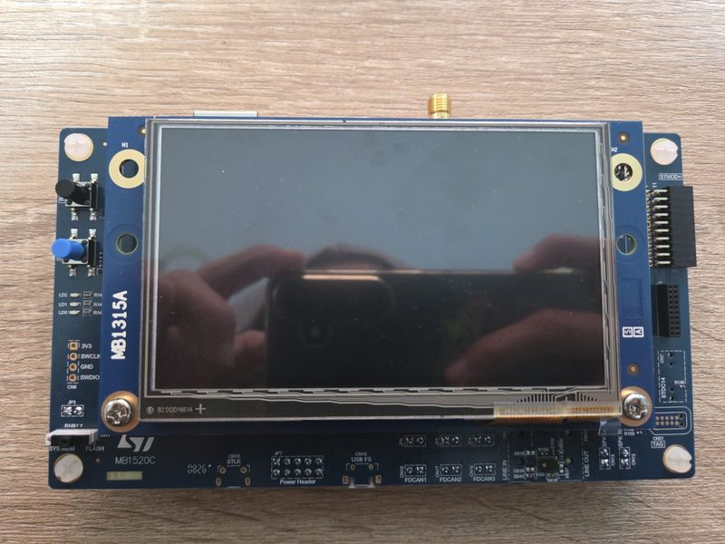
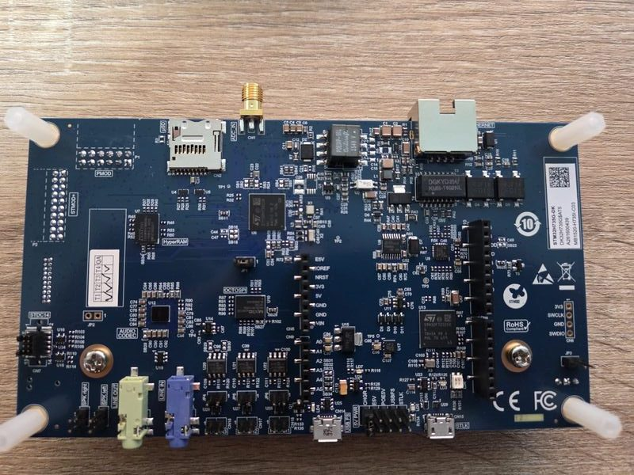

================
ST STM32H735G-DK
================

.. tags:: chip:stm32, chip:stm32h7, chip:stm32h735

   STM32H735G-DK Front

   STM32H735G-DK Back

The STM32H735G-DK Discovery board features an STM32H735IGK6 Cortex-M7
with 1 MiB flash, 564 KiB RAM and a 480 x 272 touchscreen.

Configurations
==============

nsh
---

Basic NuttShell configuration with procfs.

jumbo
-----

OS tests and LED/button drivers. Run ``ostest`` from NSH.

lvgl
----

LVGL widgets demo with the on-board LCD and GT911 touchscreen.
Run ``lvgldemo widgets &`` from NSH.
