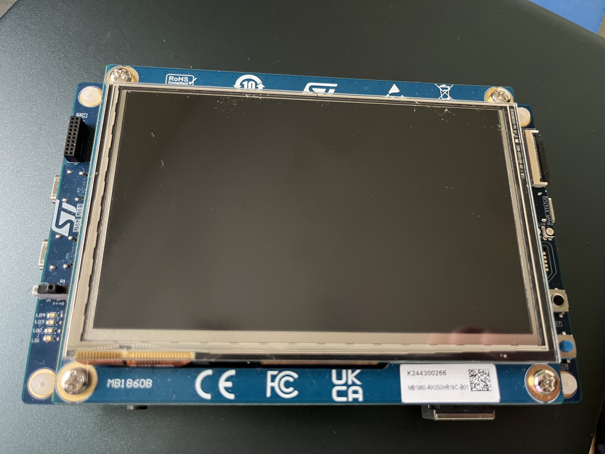
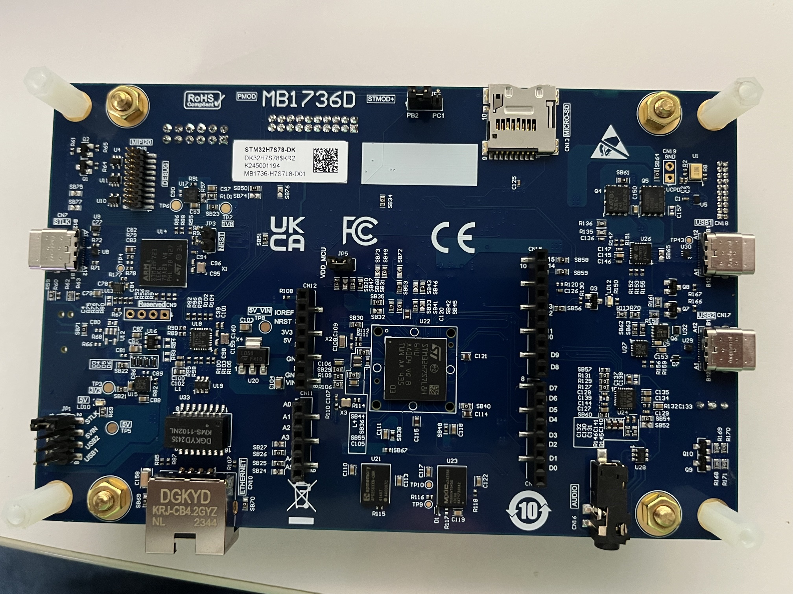

===============
ST STM32H7S8-DK
===============

.. tags:: chip:stm32, chip:stm32h7, chip:stm32h7s3

   STM32H8S8-DK Front

          
   STM32H8S8-DK Back

This page describes the NuttX port for the `STMicro SMT32H7S8-DK <https://www.st.com/en/evaluation-tools/stm32h7s78-dk.html>`_
Discovery kit. The board is based on the 600 MHz STM32H7S3L8
Cortex-M7 microcontroller.

Flashing NSH image
==================

.. note::
   nsh image is restricted in size to fit in and execute from
   internal 64 KB flash.

Build the internal nsh image::

  cmake -B build/nsh -DBOARD_CONFIG=stm32h7s8-dk:nsh -GNinja
  cmake --build build/nsh

Install STM32CubeProgrammer and set ``CUBE_PROGRAMMER`` to the path of its
command-line executable.::

  CUBE_PROGRAMMER=/path/to/STM32_Programmer_CLI

Program and verify the internal image, then reset the board::

  "$CUBE_PROGRAMMER" --connect port=SWD reset=HWrst \
    --download build/nsh/nuttx.bin 0x08000000 --verify --rst

The internal nsh image presents a shell on the ST-link console on startup.

Configurations
==============

Each configuration is maintained in a subdirectory of ``configs`` and can be
selected as follows::

  tools/configure.sh stm32h7s8-dk:<subdir>

Where ``<subdir>`` is one of the following:

nsh
---

Provides a basic NuttShell configuration in internal flash and
includes support for on-board LEDs and user button.  The default
console is the ST-LINK virtual COM port on USART4.

