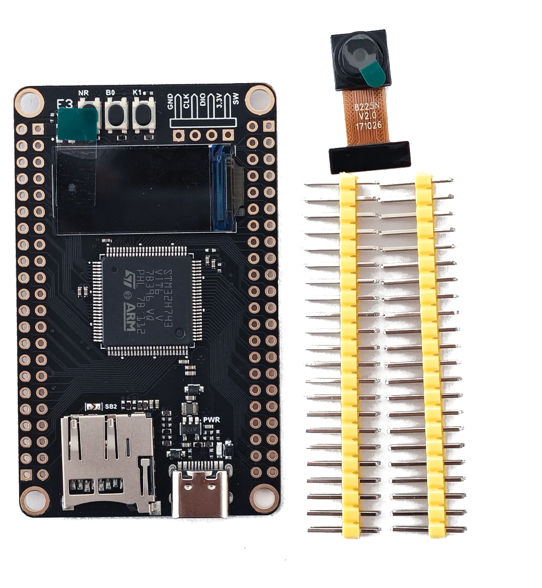

===============
weact-stm32h743
===============

This page discusses issues unique to NuttX configurations for the
WeAct STM32H743 board.

Board information
=================

This board was release by WeAct Studio in 2020 and developed based on
STM32H743VI microcontroller.

The board features:
  - USB-C power supply
  - SWD connector
  - Crystal for HS 25MHz
  - Crystal for RTC 32.768KHz
  - 1 user LED
  - 1 MicroSD connector supporting 1 or 4-bit bus
  - 1 USB 2.0 Host/Device
  - 2 SPI Flash
  - 1 OLED display
  - 1 Camera

Board documentation: https://github.com/WeActStudio/MiniSTM32H7xx

BOARD-LED
=========

The WeAct STM32H743 has 1 software controllable LED.

  ==== =====
  LED  PINS
  ==== =====
  E3   PE3
  ==== =====

UART/USART
==========

The WeAct STM32H743 used the USART1 for serial debug messages.

USART1
------

  ====== =====
  USART1 PINS
  ====== =====
  TX     PB14
  RX     PB15 
  ====== =====

==============

Each weact-stm32h743 configuration is maintained in a sub-directory and
can be selected as follow::

    tools/configure.sh weact-stm32h743:<subdir>

  Where <subdir> is one of the following:

Configuration Directories
-------------------------

nsh
---

Configures the NuttShell (nsh) located at apps/examples/nsh. This
configuration enables a serial console on UART1.

