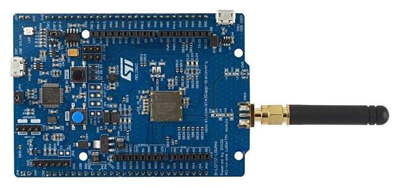

.. _b-l072z-lrwan1:

=================
ST B-L072Z-LRWAN1
=================

.. tags:: chip:stm32, chip:stm32l0, chip:stm32l072

The B-L072Z-LRWAN1 is a LoRa and Sigfox discovery board built around the
Murata CMWX1ZZABZ-091 module, which packs an STM32L072CZ microcontroller and
a Semtech SX1276 sub-GHz transceiver into a single package. The board
carries an SMA connector with a whip antenna, an on-board ST-LINK/V2-1 and
Arduino Uno R3 compatible headers.

Board information
=================

The board features:

  - Murata CMWX1ZZABZ-091 module: STM32L072CZ (Cortex-M0+ up to 32 MHz,
    192 KiB flash, 20 KiB RAM) plus an SX1276 transceiver
  - Programmable RF power, up to +14 dBm on the RFO path and +20 dBm on
    PA_BOOST
  - SMA and U.FL antenna connectors
  - 32 MHz TCXO for the radio, powered from a GPIO
  - On-board ST-LINK/V2-1 with mass storage programming and a virtual COM
    port
  - Arduino Uno R3 headers plus the ST morpho extension headers
  - Four LEDs and one user button
  - USB 2.0 full speed device connector
  - Powered from USB, from an external supply or from a battery

Board documentation:
https://www.st.com/en/evaluation-tools/b-l072z-lrwan1.html

Clocking
========

NuttX runs the part from the internal 16 MHz RC oscillator through the PLL,
which gives a 32 MHz system clock. No external crystal is needed for the
microcontroller; the 32 MHz TCXO of the module belongs to the radio.

Serial console
==============

USART2 is wired to the virtual COM port of the on-board ST-LINK and is the
NuttX console in every configuration:

=========== =====
Signal      Pin
=========== =====
USART2_TX   PA2
USART2_RX   PA3
=========== =====

Settings are 115200 8N1. With the board plugged in, the port shows up as
``/dev/ttyACM0`` on Linux.

LEDs
====

The board has four LEDs, all active high:

===== ==== ========================
LED   Pin  Colour
===== ==== ========================
LED1  PA5  Green, also Arduino D13
LED2  PB5  Green
LED3  PB6  Blue
LED4  PB7  Red
===== ==== ========================

If ``CONFIG_ARCH_LEDS`` is selected, LED1 is driven by the OS to show the
system state:

========================== ==========
State                      LED1
========================== ==========
Idle stack created         ON
In an interrupt            Flashing
Signal handler, assertion  Flashing
The system has crashed     Blinking
========================== ==========

Otherwise the four LEDs are available to the application through
``/dev/userleds`` when ``CONFIG_USERLED`` is selected.

Buttons
=======

======== ==== ===================================
Button   Pin  Notes
======== ==== ===================================
B1 USER  PB2  Pulled up, active low, EXTI capable
B2 RESET NRST Resets the microcontroller
======== ==== ===================================

Radio
=====

The SX1276 sits inside the module and is reached over SPI1. Besides the bus
and the interrupt lines, three GPIOs drive the antenna switch and one powers
the TCXO that clocks the radio:

=============== ==== ============================================
Signal          Pin  Notes
=============== ==== ============================================
SPI1_NSS        PA15 Chip select, driven as a GPIO
SPI1_SCK        PB3
SPI1_MISO       PA6
SPI1_MOSI       PA7
RESET           PC0  Active low
DIO0            PB4  Transmit and receive done, EXTI capable
DIO1            PB1
DIO2            PB0
DIO3            PC13
TCXO power      PA12 Active high, needs about 5 ms to settle
RX enable       PA1  Antenna switch towards RFI_HF
TX RFO enable   PC2  Antenna switch towards RFO_HF, up to +14 dBm
TX BOOST enable PC1  Antenna switch towards PA_BOOST
=============== ==== ============================================

The board support code powers the TCXO before registering the driver and
picks the antenna switch position from the operating mode and the requested
power: the RFO path is used up to 14 dBm and PA_BOOST above that. This board
is wired for the high frequency band.

The driver itself, its configuration options and what has to match between
two radios to make them hear each other are documented in :ref:`sx127x`.

Other peripherals
=================

========= ================================================
Interface Pins
========= ================================================
USART1    PA9 (TX), PA10 (RX), on the Arduino header
SPI2      PB12 (NSS), PB13 (SCK), PB14 (MISO), PB15 (MOSI)
I2C1      PB8 (SCL), PB9 (SDA)
ADC       PA0, PA4 and the other Arduino analogue pins
========= ================================================

Flashing
========

The board can be programmed through its own ST-LINK or through an external
debug probe on the SWD header.

With the ST-LINK, the simplest route is the mass storage device it exposes;
copying the raw binary to it programs the flash::

  $ cp nuttx.bin /media/<user>/DIS_L072Z/

``openocd`` and ``st-flash`` work as well.

With a SEGGER J-Link on the SWD pins, use a command script::

  $ cat > flash.jlink << EOF
  h
  loadbin nuttx.bin, 0x08000000
  r
  g
  q
  EOF
  $ JLinkExe -device STM32L072CZ -if SWD -speed 4000 -autoconnect 1 \
             -nogui 1 -CommanderScript flash.jlink

The virtual COM port of a stand-alone J-Link is not connected to USART2 of
this board, so the console still comes from the ST-LINK USB cable.

Configurations
==============

Each configuration is selected with::

  $ ./tools/configure.sh b-l072z-lrwan1:<name>
  $ make

nsh
---

The basic NuttShell configuration over USART2, with the ``hello`` example
built in. A good first check that the board boots.

adc
---

NuttShell plus the ``adc`` example, reading the ADC with software triggered
conversions.

nxlines_oled
------------

Runs the ``nxlines`` graphics example on an SSD1306 OLED display connected to
I2C1 (PB8 and PB9), in one bit per pixel mode.

sx127x
------

NuttShell plus the ``sx127x`` example and the SX1276 driver registered at
``/dev/sx127x``. The example defaults to FSK at 930 MHz; everything can be
overridden from the command line::

  nsh> sx127x -h
  nsh> sx127x -m 0 -f 917200000 -t -p 14 -l 32   # transmit LoRa frames
  nsh> sx127x -m 0 -f 917200000 -r               # receive them

lorawan_tx
----------

The same interactive setup, but with the radio defaults already matching a
public LoRaWAN network in the 915 MHz band: LoRa modulation, 917.2 MHz,
125 kHz bandwidth, spreading factor 7, CRC enabled and the 0x34 sync word.
Useful to feed a gateway under test::

  nsh> sx127x -m 0 -f 917200000 -t -p 14 -l 32 -i 5 -d 60

lorawan_beacon
--------------

The same radio settings without a shell: the example itself is the entry
point and starts transmitting as soon as the board boots, which is what is
needed when the board is driven from a debug probe and no console is wired.
The command line of the example comes from ``CONFIG_INIT_ARGS``, and the
frequency, the payload size and the power from
``CONFIG_EXAMPLES_SX127X_RFFREQ``, ``_TXDATA`` and ``_TXPOWER``.

Talking to another radio
========================

Two of these boards reach each other with the ``lorawan_tx`` configuration,
one receiving and the other transmitting, and the same commands work against
a LoRaWAN gateway. The recipes, and the settings that have to match on both
sides, are in :ref:`sx127x`.

