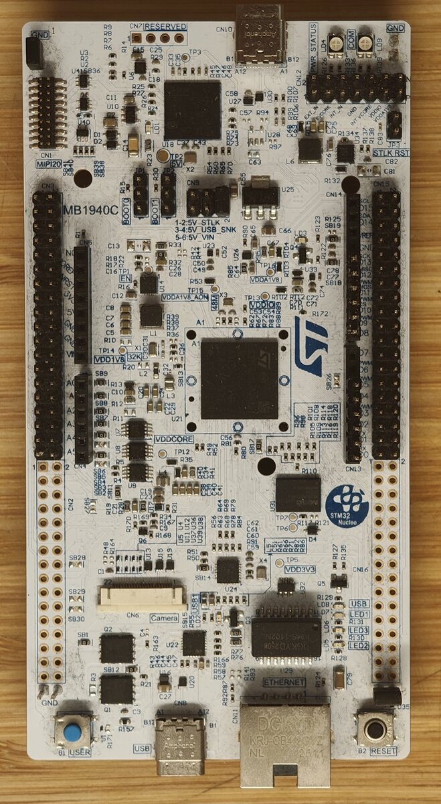

==================
ST Nucleo-N657X0-Q
==================

.. tags:: chip:stm32, chip:stm32n6, chip:stm32n657

   Nucleo-N657X0-Q

The STM Nucleo-N657X0-Q is a development
board for the STM32N657X0H3Q, an Arm Cortex-M55 with 4 MiB of on-chip
AXISRAM, an on-chip Neural-ART NPU, and no internal flash. In
production, code is fetched from external XSPI NOR flash and in
development, the image is loaded directly into AXISRAM by the on-board
ST-LINK-V3EC. Refer to the
https://www.st.com/en/evaluation-tools/nucleo-n657x0-q.html website
for the full product page.

Features
========

* STM32N657X0H3Q MCU (Arm Cortex-M55, up to 800 MHz)
* On-chip Neural-ART NPU accelerator
* 4 MiB on-chip AXISRAM (no internal flash)
* External XSPI NOR flash interface
* On-board ST-LINK-V3EC
* 3 user LEDs (LD5 red, LD6 green, LD7 blue), plus status LEDs
  (LD1 5V_PWR, LD4 PWR, LD9 COM)
* User pushbutton (B1) and reset pushbutton
* 32.768 kHz crystal oscillator
* USB Type-C connectors (ST-LINK and user)
* ST Zio connector
* ST morpho headers

.. warning::

   This is the initial NuttX port for the STM32N6 family. The supported
   peripheral set is intentionally minimal: USART1 (the ST-LINK VCOM
   console), GPIO, RCC, PWR, and the SysTick-based timer. Other on-chip
   peripherals and on-board features (XSPI flash boot, networking,
   user LEDs/buttons, USB, MIPI, NPU, etc) are not yet wired up. The CPU is
   currently clocked at 200 MHz from PLL1. Raising it to the standard
   600 / 800 MHz operating points is deferred to a follow-up change.

Buttons and LEDs
================

The board exposes three user LEDs and a user pushbutton, but the
initial NuttX port does not yet ship ``userleds`` or ``buttons``
drivers. The hardware wiring is summarised here so a follow-up
driver can be written against an authoritative pin map:

===== ======= ======== ======================================
ID    Color   GPIO     Notes
===== ======= ======== ======================================
LD5   Red     PG10     Active low
LD6   Green   PG0      Active low
LD7   Blue    PG8      Active low
B1    Blue    PC13     Active high, external pull-down
===== ======= ======== ======================================

Pin Mapping
===========

The shipped configurations map only the pins required for the serial
console. All other GPIOs retain their reset state and are free for
application use.

===== ============= ======= =================================
Pin   Signal        AF      Notes
===== ============= ======= =================================
PE5   USART1_TX     AF7     Routed to ST-LINK VCOM (host RX)
PE6   USART1_RX     AF7     Routed to ST-LINK VCOM (host TX)
===== ============= ======= =================================

Power Supply
============

The board is powered over either USB Type-C connector (ST-LINK or
user) at 5 V. On-board regulators derive the MCU and I/O rails. See
the ST user manual for the full power tree and jumper selection.

Installation
============

Two host tools are required:

* A bare-metal Arm toolchain, e.g. the GNU Arm Embedded toolchain
  (``arm-none-eabi-gcc``) packaged by most Linux distributions or
  available from Arm.
* `STM32CubeProgrammer
  <https://www.st.com/en/development-tools/stm32cubeprog.html>`_ for
  loading images into AXISRAM over the on-board ST-LINK.

Building NuttX
==============

From the top of the NuttX source tree:

.. code:: console

   $ ./tools/configure.sh nucleo-n657x0-q:<config>
   $ make

At the end of the build, ``nuttx.bin`` is the raw image that the
flashing step below loads into AXISRAM.

The toolchain selection can be changed via ``make menuconfig``.

Flashing
========

The board boots in development mode: the on-board ST-LINK loads the
image directly into AXISRAM at ``0x34000400`` (the first 1 KiB is
reserved for the boot ROM header) and starts execution there. Signed
XSPI flash boot via a first-stage bootloader is not yet supported.

Use STM32CubeProgrammer's CLI to load and run ``nuttx.bin``:

.. code:: console

   $ STM32_Programmer_CLI -c port=SWD mode=UR -halt              \
         -d nuttx.bin 0x34000400                                 \
         -w32 0xE000ED08 0x34000400                              \
         -g 0x34000400

The ``-w32`` write retargets VTOR to the SRAM image before the ``-g``
jump, so the Cortex-M55 starts from the NuttX vector table rather
than the boot ROM's.

Configurations
==============

Each configuration is selected with::

   $ ./tools/configure.sh nucleo-n657x0-q:<config>

Unless otherwise noted, console output is accessed via ST-LINK
(USART1) at 115200 8N1.

nsh
---

Minimal NuttShell configuration. Boots into the NSH prompt via
ST-LINK and exposes the built-in commands plus
:doc:`getprime </applications/testing/getprime/index>`-style apps
selectable via ``make menuconfig``.

ostest
------

Builds the NSH configuration with :doc:`apps/testing/ostest
</applications/testing/ostest/index>` added. Run ``ostest`` from the
NSH prompt to exercise the core RTOS primitives (tasks, mutexes,
semaphores, signals, message queues, POSIX timers, condition
variables, scheduling). Used as the smoke test.

License Exceptions
==================

None.

References
==========

* [RM0486] STM32N647/657xx Arm\ :sup:`®`-based 32-bit MCUs reference manual
* [UM3417] STM32N6 Nucleo-144 board (MB1940) user manual
* [ES0620] STM32N657 errata sheet
