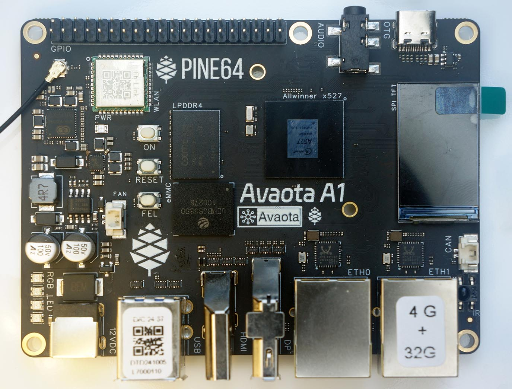

=======================
PINE64 Yuzuki Avaota-A1
=======================

.. tags:: chip:a527

`Avaota-A1 <https://pine64.com/product/yuzuki-avaota-a1-single-board-computer-2gb-16gb/>`_
is an ARM64 Single-Board Computer based on the Allwinner A527 SoC.

Features
========

- **System on Chip:** Allwinner A527
    - **CPU:** Octa-Core ARM Cortex-A55
    - **GPU:** ARM G57 MC1
    - **Interrupt Controller:** ARM GIC-600 (Generic Interrupt Controller v3)
- **RAM:** 2GB or 4GB LPDDR4 SDRAM
- **Internal Storage:** 16GB or 32GB eMMC
- **External Storage:** MicroSD
- **Ethernet:** Dual Gigabit Ports
- **Wireless:** WiFi 6, Bluetooth 5.4
- **I/O:** UART, SPI, I2C, USB 3.0 OTG

Serial Console
==============

A **USB Serial Adapter** (CH340 or CP2102) is required to run NuttX.

Connect the USB Serial Adapter to the Avaota-A1 Serial Console at:

========== =================
USB Serial Avaota-A1 Pin
========== =================
GND        Pin 6 (GND)
RX         Pin 8 (UART0 TX)
TX         Pin 10 (UART0 RX)
========== =================

On the USB Serial Adapter, set the **Voltage Level** to 3V3.

Connect Avaota-A1 to our computer with the USB Serial Adapter.
On our computer, start a Serial Terminal and connect to the USB Serial Port
at **115.2 kbps**:

.. code:: console

   $ screen /dev/ttyUSB0 115200

NuttX will appear in the Serial Console when it boots.

ARM64 Toolchain
===============

Before building NuttX, download the toolchain for
`xPack GNU AArch64 Embedded GCC (aarch64-none-elf) <https://github.com/xpack-dev-tools/aarch64-none-elf-gcc-xpack/releases>`_.

Add the downloaded toolchain ``xpack-aarch64-none-elf-gcc-.../bin``
to the ``PATH`` Environment Variable.

Check the ARM64 Toolchain:

.. code:: console

   $ aarch64-none-elf-gcc -v

Building
========

To build NuttX, :doc:`install the prerequisites </quickstart/install>` and
:doc:`clone the git repositories </quickstart/install>` for ``nuttx`` and ``apps``.

Configure the NuttX project and build the project:

.. code:: console

   $ cd nuttx
   $ tools/configure.sh avaota-a1:nsh
   $ make

This produces the NuttX Kernel ``nuttx.bin``.  Next, build the NuttX Apps Filesystem:

.. code:: console

   $ make export
   $ pushd ../apps
   $ tools/mkimport.sh -z -x ../nuttx/nuttx-export-*.tar.gz
   $ make import
   $ popd
   $ genromfs -f initrd -d ../apps/bin -V "NuttXBootVol"

This generates the Initial RAM Disk ``initrd``.

Package the NuttX Kernel and Initial RAM Disk into a NuttX Image:

.. code:: console

   $ head -c 65536 /dev/zero >/tmp/nuttx.pad
   $ cat nuttx.bin /tmp/nuttx.pad initrd >Image

The NuttX Image ``Image`` will be copied to a microSD Card in the next step.

Booting
=======

NuttX boots on PinePhone via a microSD Card. To prepare the microSD Card, download the
**AvaotaOS Image** ``AvaotaOS-...-noble-gnome-arm64-avaota-a1.img.xz`` from
`github.com/AvaotaSBC/AvaotaOS <https://github.com/AvaotaSBC/AvaotaOS/releases>`_.

Write the downloaded image to a microSD Card with
`Balena Etcher <https://www.balena.io/etcher/>`_.

Copy the file ``Image`` from the previous section
and overwrite the file on the microSD Card.

Check that Avaota-A1 is connected to our computer via a USB Serial Adapter at 115.2 kbps:

.. code:: console

   $ screen /dev/ttyUSB0 115200

Insert the microSD Card into Avaota-A1 and power up.
NuttX boots and NuttShell (nsh) appears in the Serial Console.

To see the available commands in NuttShell:

.. code:: console

   $ help

Configurations
==============

nsh
---

Basic configuration that runs NuttShell (nsh).
This configuration is focused on low level, command-line driver testing.
Built-in applications are supported, but none are enabled.
Serial Console is enabled on UART0 at 115.2 kbps.

Peripheral Support
==================

NuttX for Avaota-A1 supports these peripherals:

======================== ======= =====
Peripheral               Support NOTES
======================== ======= =====
UART                     Yes
======================== ======= =====
