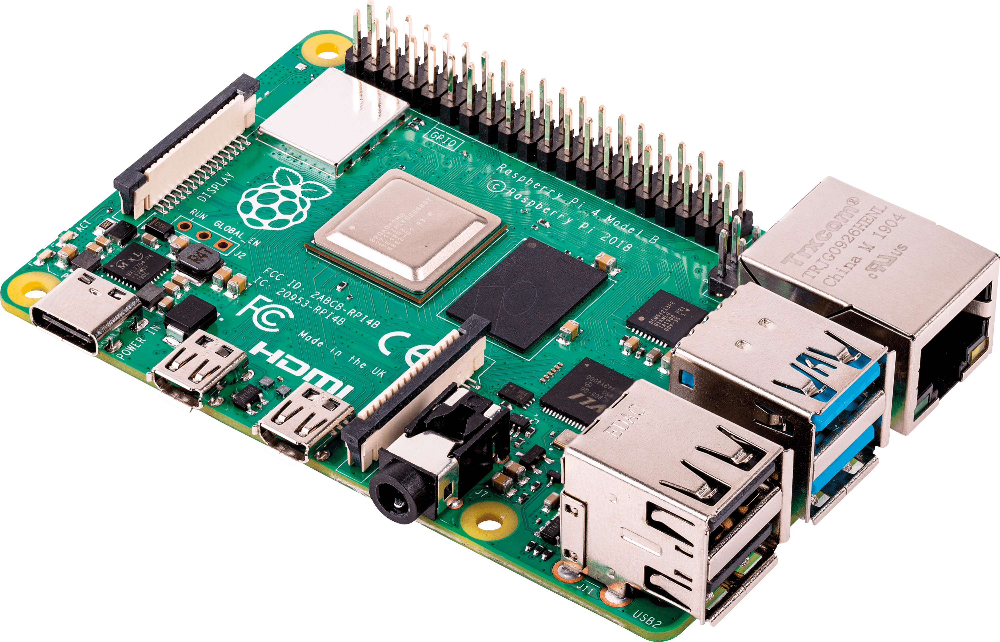

===============
Raspberry Pi 4B
===============

The `Raspberry Pi 4B <https://www.raspberrypi.com/products/raspberry-pi-4-model-b/specifications/>`_ is an ARM64
hobbyist board created by Raspberry Pi.

Features
=========

- Broadcom BCM2711 @1.8GHz
- 1, 2, 4 and 8GB LPDDR4-3200 SDRAM models
- 2.4GHz and 5.0GHz IEEE 802.11ac wireless
- Bluetooth 5.0
- Gigabit Ethernet
- 2 USB 3.0 ports
- 2 USB 2.0 ports
- 2 micro-HDMI ports (4kp60)
- 2-lane MIPI DSI display port
- 2-lane MIPI CSI camera port
- 4-pole stereo audio and composite video port
- Micro SD card slot

ARM64 Toolchain
===============

Before building NuttX for the Raspberry Pi 4B, download the ARM64 Toolchain for
**AArch64 Bare-Metal Target** ``aarch64-none-elf`` from
`Arm GNU Toolchain Downloads <https://developer.arm.com/downloads/-/arm-gnu-toolchain-downloads>`_.
(Skip the section for Beta Releases.)

Add the downloaded toolchain ``gcc-arm-...-aarch64-none-elf/bin`` to the ``PATH`` Environment Variable.

If you are running Arch Linux, you can also get the toolchain by installing from the AUR:

.. code:: console

   $ yay -S aarch64-none-elf-gcc-bin aarch64-none-elf-toolchain

Check the ARM64 Toolchain:

.. code:: console

    $ aarch64-none-elf-gcc -v

Building
========

To build NuttX for the Raspberry Pi 4B, :doc:`install the prerequisites </quickstart/install>` and :doc:`clone the git
repositories </quickstart/install>` for ``nuttx`` and ``apps``.

Configure the NuttX project to use the Raspberry Pi 4B and build it (this example uses the ``nsh`` configuration).

.. code:: console

    $ cd nutxx
    $ tools/configure.sh raspberrypi-4b:nsh
    $ make

Booting
========

In order to boot NuttX on the Raspberry Pi 4B, you will need to have a formatted micro SD card. The SD card should
contain a FAT32 partition that is marked as bootable and which contains the generated ``nuttx.bin`` and ``config.txt``
files from the build process. In addition to those files, you will also need the following files from the Raspberry Pi
repository for loading the image:

- `bcm2711-rpi-4-b.dtb <https://github.com/raspberrypi/firmware/blob/stable/boot/bcm2711-rpi-4-b.dtb>`_
- `fixup4.dat <https://github.com/raspberrypi/firmware/blob/stable/boot/fixup4.dat>`_
- `fixup4cd.dat <https://github.com/raspberrypi/firmware/blob/stable/boot/fixup4cd.dat>`_
- `fixup4db.dat <https://github.com/raspberrypi/firmware/blob/stable/boot/fixup4db.dat>`_
- `fixup4x.dat <https://github.com/raspberrypi/firmware/blob/stable/boot/fixup4x.dat>`_
- `start4.elf <https://github.com/raspberrypi/firmware/blob/stable/boot/start4.elf>`_
- `start4cd.elf <https://github.com/raspberrypi/firmware/blob/stable/boot/start4cd.elf>`_
- `start4db.elf <https://github.com/raspberrypi/firmware/blob/stable/boot/start4db.elf>`_
- `start4x.elf <https://github.com/raspberrypi/firmware/blob/stable/boot/start4x.elf>`_

You can download all of these files with the shell script in ``tools/bcm2711/bootfiles.sh``.

SD Card Formatting
------------------

Here is a list of ``fdisk`` commands for formatting the SD card on Linux. The tutorial assumes the SD card is at
``/dev/sda``, but you can find the location of your SD card with ``lsblk``. **Make very sure you verify that the name is
correct, or you can lose data by formatting a different device.**

.. code:: console

   $ sudo fdisk /dev/sda

Print the partition table on the card with ``p`` to see what's there. If anything appears, continue to use the ``d``
command to remove all partitions.

- ``o`` to create a new, empty DOS partition table
- ``n`` to create a new partition
- ``p`` to make it primary
- Hit enter to select the default partition of "1"
- Hit enter for the default start and end sizes, which will use the full SD card size
- ``t`` to change the type of the partition (hit enter to select default of partition 1)
- ``c`` as the type, which is for Windows FAT32
- ``a`` to mark the partition as bootable
- ``w`` to write all the changes and save

Now when you run ``lsblk``, you should see ``/dev/sda1`` (or an equivalent for your SD card). That is the new partition
just created. Running the following command will then format the SD card to an empty FAT32 file system.

.. code:: console

   $ sudo mkfs.vfat /dev/sda1

Once this completes, you can copy all of the aforementioned boot files, ``nuttx.bin`` and ``config.txt`` to your SD card
in your preferred way (through a file explorer or by using ``mount``).

Once all the files are copied, you can then eject the SD card and insert it onto your Raspberry Pi. The default console
is the Mini UART, which requires an adapter such as `USB to TTL serial converter cable
<https://www.adafruit.com/product/954>`_ to read. You should connect the ground to one of the Pi's ground pins, and then
connect the RX to GPIO 14 and TX to GPIO 15. **Do not connect the red power wire**.

Once the converter is connected and plugged into your host computer, you can open up a serial terminal of your choice. I
use Minicom. Then, power your Raspberry Pi 4B with a USB-C cable and wait for the Pi to boot and the NSH prompt to
appear onscreen:

.. code:: console

    NuttShell (NSH) NuttX-12.6.0-RC0
    nsh> uname -a
    NuttX 12.6.0-RC0 c4f3a42131-dirty Aug  6 2024 21:17:01 arm64 raspberrypi-4b
    nsh> 

Board Peripheral Support
========================

SMP is currently unsupported.

NuttX for the Raspberry Pi 4 supports these on-board peripherals:

======================== =======
Peripheral               Support
======================== =======
I2C                      Partial (able to read, that's it)
UART                     Mini UART yes, PL011 no
GPIO                     Partial
PWM                      No
SPI                      No
PCM                      No
AV port                  No
HDMI                     No
WiFi                     No
Ethernet                 No
USB 3.0                  No
USB 2.0                  No
Bluetooth                No
======================== =======
