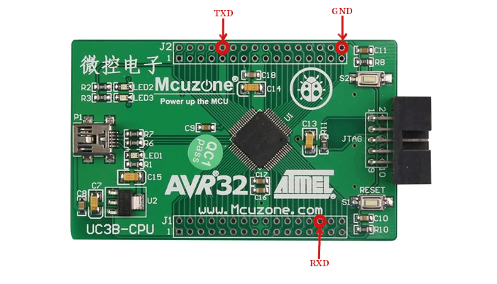

=========
avr32dev1
=========

This is a port of NuttX to the Atmel AVR32DEV1 board and compatible
with MCUZone UC3B-CPU board depicted here:

This board is based on the Atmel AT32UC3B0256 MCU and uses a specially
patched version of the GNU toolchain:  The patches provide support for the
AVR32 family.  That patched GNU toolchain is available only from the
Atmel website.

STATUS: This port is functional but very basic. There
are configurations for NSH and the OS test.

Features
========

  - AVR32 AT32UC3B0256 microcontroller
  - mini-USB Connector
  - Power LED (LED1)
  - MCU controllable LEDs: LED2 and LED3
  - S1/RESET and S2 buttons (S2 accessible to user)
  - 12MHz (main clock) and 32KHz for RTC

Serial Console
==============

The board uses by default the USART1 as serial console.
The pins PB2 (TXD) and PA24 (RXD) are used for USART1.

This way you need to connect a USB/Serial adapter to
get access to the NuttShell. Connect the TXD from your
USB/Serial to the RXD of the board, and the RXD from
USB/Serial to the TXD of the board.

There is another detail about the baudrate, you need to
use 57600 8n1.
