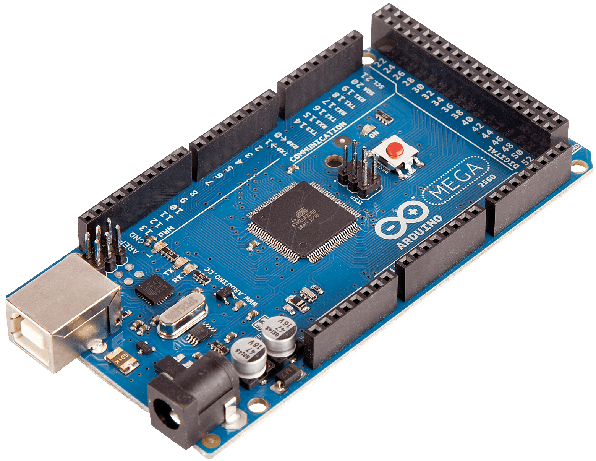

================
Arduino Mega2560
================

.. tags:: chip:atmega2560, chip:atmega, vendor:arduino, arch:avr

This is the documentation for the port of NuttX to the `Arduino Mega 2560 Rev3
<https://www.arduino.cc/en/Main/ArduinoBoardMega2560>`_. The board is based on
the `ATMega2560 chip from Atmel
<http://www.atmel.com/devices/atmega2560.aspx>`_.

   
   The Arduino ATMega2560 micro-controller board.

Toolchain
=========

To learn more about installing the required tool-chain, read the "Toolchain"
section of :doc:`../../index`.

Configurations
==============

Each Arduino MEGA2560 configuration is maintained in a sub-directory
and can be selected as follow:

.. code:: console

   $ tools/configure.sh arduino-mega2560:<subdir>

Where ``<subdir>`` is one of the configuration sub-directories described in the
following sub-headings.

By default, all configurations assume the Atmel Studio AVR8 toolchain under
Cygwin with Windows. This is easily reconfigured:

* ``CONFIG_HOST_WINDOWS=y``
* ``CONFIG_WINDOWS_CYGWIN=y``
* ``CONFIG_AVR_BUILDROOT_TOOLCHAIN=y``

Build with GCC disables ``CONFIG_DEBUG_OPT_UNUSED_SECTIONS`` by default. This is
because the linker script was not checked to determine if it properly prevents
removal of sections which the linker considers unreferenced but which must be
present in the binary.

hello
-----

The simple ``apps/examples/hello`` "Hello, World!" example. The output is
displayed on UART0 at a baud rate of 38400, 8N1.

nsh
---

This is a reduce NuttShell (NSH) configuration using ``apps/example/nsh``. The
serial console is provided on USART0 and can be accessed via a serial terminal
at a baud rate of 38400, 8N1.

.. note::

   As of 2015-01-16, the default static memory usage is:

   .. code:: console

      $ size nuttx.elf
         text    data     bss     dec     hex filename
        34348    2117     944   37409    9221 nuttx.elf

   And dynamic, heap usage:

   .. code:: console

      nsh> free
                   total       used       free    largest
      Mem:          4736       1768       2968       2968

   There is plenty of FLASH space but not a lot of free SRAM. This
   SRAM usage is due primarily to constant strings defined by NSH.

   I investigated the possibility of adding IPTR/IOBJ qualifiers in the NSH
   library and moving the strings to FLASH. This is still a possibility but
   would require some extensive changes to NSH.
