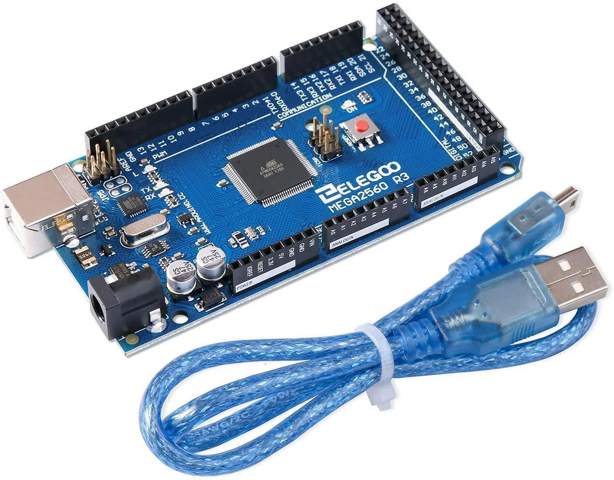

====================
Elegoo Mega2560 Rev3
====================

.. tags:: chip:atmega2560, chip:atmega, arch:avr, vendor:elegoo, experimental

   The Elegoo Mega2560 Rev3 board with its included USB cable

This board is a variant of the `Arduino Mega2560 Rev3 board
<https://docs.arduino.cc/hardware/mega-2560/>`_ designed by Elegoo. The `product
listing can be found here
<https://us.elegoo.com/products/elegoo-mega-2560-r3-board>`_.

Features
========

* Atmel ATMega2560 chip
* 54 digital pins
* 16 analog inputs
* 4 serial ports
* 4KB EEPROM

.. warning::

   The ATMega2560 chip supported is limited, and thus this board does not
   support many peripherals. If you would like to help improve support for this
   board and other ATMega2560-based boards, please see the :doc:`contributing
   guidelines </contributing/index>`.

Buttons and LEDs
================

The board has a large RESET button, which is not user controllable.

There are 4 LEDs on-board the Elegoo Mega2560 Rev3:

* ON: indicates active power, connected directly to the power supply
* TX: indicates transmitting data
* RX: indicates receiving data
* TEST: board controllable LED, near "PWM" label. Turns on to indicate that
  NuttX started, and flashes at 1Hz to indicate panic.

Pin Mapping
===========

The full pin-out of this board is the same as the Arduino Mega2560r3 pinout,
which can be found `here <https://docs.arduino.cc/hardware/mega-2560/>`_.

Power Supply
============

This board uses 5V logic. It has on-board power regulation to provide 5V and
3.3V rails to the user. The 3.3V rail can only supply 50mA.

The board can be powered a few different ways:

* Via the USB connection at 5V
* Via external power supply to the barrel jack (center-positive) at 7V - 12V

Installation
============

You will need the ``avrdude`` utility to flash this board. For instructions on
how to install the AVR toolchain, consult the main documentation for the AVR
architecture.

Building NuttX
==============

In order to build NuttX, you can follow the regular process of using
``./tools/configure.sh`` and ``make``.

.. code:: console

   $ ./tools/configure.sh elegoo-mega2560r3:nsh
   $ make

The build system will generate a ``.hex`` file along with the typical ELF file.
If not, enable the ``CONFIG_INTELHEX_BINARY`` option.

.. warning::

   Beware of the small memory size of this board's chip when choosing what to
   include in your NuttX image.

Flashing
========

Then, to flash the board, connect it via USB to the host computer and run the
following command:

.. code:: console

   $ avrdude -c stk500v2 -p m2560 -P /dev/ttyACM0 -U flash:w:nuttx.hex -v -D

This command assumes that the board USB connection is available on ``ttyACM0``,
but you should verify the file path to its connection. You can use ``lsusb`` on
Linux to look for "Arduino SA Mega 2560 R3".

If you want to reduce the console output of the command, remove the ``-v`` flag.

The board uses the STK500v2 programmer type through the on-board programmer,
hence the argument to ``-c``. The argument to ``-p`` specifies the AVR device to
be the ATMega2560. The ``-U`` argument tells the program to write the
``nuttx.hex`` image to flash.

Configurations
==============

nsh
---

Very basic configuration with the ``nsh`` shell on the UART0 pins at a baud
rate of 38400. You can also access UART0 through the USB connector on your host
machine.
