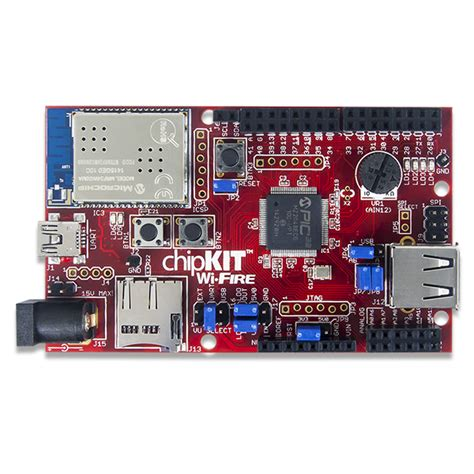

===============
chipKIT Wi-FIRE
===============

.. tags:: arch:mips, chip:pic32mz

   The chipKIT Wi-FIRE development board

This the documentation page for NuttX support of the `chipKIT Wi-FIRE board
<https://chipkit.net/wiki/index.php?title=ChipKIT_Wi-Fire>`_.

Features
========

* Microchip PIC32MZ2048EFG100 MCU @200MHz
* Microchip MRF24WG0MA Wi-Fi module
* USB 2.0
* Full-Speed / Hi-Speed OTG controller,
* Micro SD card connector
* 32-bit MIPS M5150 operation
* 2MB flash memory
* 512KB RAM

Installation
============

The following toolchain options have been tested and confirmed to work:

* ``CONFIG_MIPS32_TOOLCHAIN_PINGUINOL``: Pinquino Toolchain for Linux
* ``CONFIG_MIPS32_TOOLCHAIN_SOURCERY_CODEBENCH_LITE``: Sourcery CodeBench Lite
  Toolchain for Linux

Pinquino Toolchain can be downloaded here:
https://github.com/PinguinoIDE/pinguino-compilers

Sourcery CodeBench Lite Toolchain for Linux can be downloaded and
installed as follows:

.. code:: console

   $ wget https://sourcery.mentor.com/GNUToolchain/package12725/public/mips-sde-elf/mips-2014.05-24-mips-sde-elf-i686-pc-linux-gnu.tar.bz2
   $ sudo tar xvjf mips-2014.05-24-mips-sde-elf-i686-pc-linux-gnu.tar.bz2 \
     -C /usr/local

Flashing
========

.. warning::

   Currently the pre-installed bootloader of the chipKIT Wi-FIRE board is not
   supported in this NuttX configuration. Doing the following steps will erase
   the factory installed bootloader in the Flash memory! If you are going to
   recover the bootloader later on your chipKIT Wi-FIRE board, the original
   chipKIT bootloader can be found here:
   https://reference.digilentinc.com/_media/chipkit_wifire/chipkit-wifire-v01000303.zip

Flash memory can be programmed with a PICkit 2 programmer via the 6-pin ICSP
connector JP1 of chipKIT Wi-FIRE board.

A program is needed to interface to the PICkit 2. One such program is the
pic32prog utility: https://github.com/sergev/pic32prog.git

It is recommended to configure udev rules so that root privileges are not needed
to use pic32prog; root privileges will only be needed for this one-time setup:

1. On most Linux distributions, add the user to the plugdev group:

   .. code:: console

      $ sudo useradd -G plugdev $(whoami)

2. Create the file /etc/udev/rules.d/60-pickit.rules with this content (from
   http://kair.us/projects/pickitminus/):

   .. code:: text

      # PICkit 2
      ATTRS{idVendor}=="04d8", ATTRS{idProduct}=="0033", MODE="0660", GROUP="plugdev"

      # PICkit 3
      ATTRS{idVendor}=="04d8", ATTRS{idProduct}=="900a", MODE="0660", GROUP="plugdev"

3. Restart udev (or restart the computer):

   On Debian:

   .. code:: console

      $ sudo udevadm trigger

   On Arch:

   .. code:: console

      $ sudo udevadm control --reload && sudo udevadm trigger

4. If PICkit was already plugged into USB, unplug and replug it. Now NuttX can
   be flashed to the board as follows:

   .. code:: console

      $ pic32prog nuttx.hex

Configurations
==============

You can use the following command to configure the NuttX build, where
``<config>`` is one of the configurations listed below:

.. code:: console

   $ ./tools/configure.sh -l chipkit-wifire:nsh

nsh
---

Basic serial console access to the NSH shell.

.. note::

   Connect USB cable from your PC to connector J1 (labeled "UART") of
   the chipKIT Wi-FIRE board.
   Then use some serial console client (minicom, picocom, teraterm, etc)
   configured to 115200 8n1 without software or hardware flow control.

   Reset the board and you should see NuttX starting in the serial.
