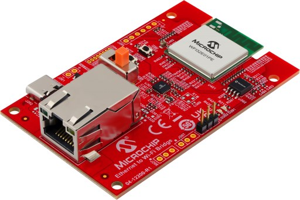

================================================
Microchip EV49N51A (Ethernet to Wi-Fi Bridge)
================================================

.. tags:: arch:mips, chip:pic32mz, vendor:microchip

   The Microchip EV49N51A Ethernet to Wi-Fi Bridge board

This page documents the NuttX port to the Microchip EV49N51A, the
"Ethernet to Wi-Fi Bridge" reference design built around the WFI32E01PE
Wi-Fi module. The module contains a PIC32MZ1025W104132 (PIC32MZ-W1
family) microcontroller.

Features
========

* WFI32E01PE module (PCB antenna) with a PIC32MZ1025W104132:

  * MIPS32 M-Class core at 200 MHz
  * 1 MB program flash, 256 KB data RAM
  * 40 MHz crystal inside the module
  * 2.4 GHz IEEE 802.11 b/g/n Wi-Fi (not supported by NuttX)

* SST26VF032B 32 Mbit (4 MB) SPI serial flash (U202)
* LAN8720A 10/100 Ethernet PHY (U301, RMII) with RJ45 connector J301
* USB Type-C connector J202 (5 V power input only; the data lines are
  not connected) and MCP1727 3.3 V regulator
* Debug UART header J203
* Two user LEDs and one user button
* ICSP header J204 (not fitted on the kit)

Supported hardware
==================

========================= ======= ====================================
Peripheral                Status  Notes
========================= ======= ====================================
UART1                     Yes     NSH console on J203
Timers                    Yes     System tick
GPIO                      Yes
SPI1                      Yes     SST26VF032B; reads tested only
I2C1/I2C2                 Build   Not tested; no I2C device on board
Ethernet                  Yes     LAN8720A, RMII, 10/100 Mbps
Wi-Fi                     No
========================= ======= ====================================

Pin mapping
===========

Module pads and chip pins as wired on the EV49N51A (schematic 02-01134
Rev 2):

============== ================ =============================================
Pin            Signal           Notes
============== ================ =============================================
RA8            U1RX             Debug UART, dedicated pin (not PPS)
RA9            U1TX             Debug UART, dedicated pin (not PPS)
RK1            LED D201 (red)   Active high
RK3            LED D202 (green) Active high
RA10           SW202            User button, low when pressed
RA1            SST26 CS         GPIO, active low
RPC6           SPI1 SCK         Dedicated SPI1 pin (``DEVCFG1.HSSPIEN``)
RPC7           SPI1 SDI         Dedicated SPI1 pin
RPC8           SPI1 SDO         Dedicated SPI1 pin
RB4 / RB5      PGC2 / PGD2      ICSP (J204), debug channel 2
RA4 / RA5      I2C1             GPIO header footprint (not fitted)
RC12           ETH_CLK_OUT      50 MHz RMII reference clock to MAC and PHY
RC13           ETXEN            Dedicated Ethernet pin
RC15 / RC14    ETXD0 / ETXD1    Dedicated Ethernet pins
RC11 / RC10    ERXD0 / ERXD1    Dedicated Ethernet pins
RK12           ECRSDV           Dedicated Ethernet pin
RC9            ERXERR           Dedicated Ethernet pin
RK14 / RK13    EMDC / EMDIO     PHY management interface, PHY address 0
RA14           PHY nRST         GPIO, active low
============== ================ =============================================

Buttons and LEDs
================

The board has two user LEDs, both active high:

* D201 (red): RK1
* D202 (green): RK3

D203 (red) is the power LED and cannot be controlled by software.

When ``CONFIG_ARCH_LEDS`` is selected (the default), the LEDs are used by
the OS as follows:

================ ======================= ======= =======
SYMBOL           MEANING                 GREEN   RED
================ ======================= ======= =======
LED_STARTED      NuttX has been started  OFF     OFF
LED_HEAPALLOCATE Heap has been allocated OFF     OFF
LED_IRQSENABLED  Interrupts enabled      OFF     OFF
LED_STACKCREATED Idle stack created      ON      OFF
LED_INIRQ        In an interrupt         N/C     GLOW
LED_SIGNAL       In a signal handler     N/C     GLOW
LED_ASSERTION    An assertion failed     N/C     GLOW
LED_PANIC        The system has crashed  N/C     FLASH
================ ======================= ======= =======

The user button SW202 (RA10) and the reset button SW203 (MCLR) are
present on the board, but there is no button driver yet.

Clocking
========

Unlike the PIC32MZ EC/EF families, the PIC32MZ-W1 does not configure its
PLLs from the configuration words. At boot, ``pic32mz_wfi32_pwrclk.c``:

#. On B0 silicon, after a power-on or brown-out reset, switches the
   power management unit (PMU) from its power-on MLDO mode to buck mode,
   using the factory trim values stored in the device.
   ``CONFIG_PIC32MZ_W1_PMU_MLDO=y`` skips this step and keeps the PMU in
   MLDO mode.
#. Starts the 40 MHz primary oscillator inside the module.
#. Programs the system PLL (40 MHz / 5 * 150 / 6 = 200 MHz) and the
   Ethernet/Wi-Fi PLL, and switches SYSCLK to the system PLL. When the
   Ethernet MAC is enabled, the Ethernet/Wi-Fi PLL also drives the 50 MHz
   RMII reference clock on ETH_CLK_OUT.

The peripheral bus clocks are set in ``include/board.h``:

======= ======= ========= =====================================
Clock   Divider Frequency Used by
======= ======= ========= =====================================
PBCLK1  5       40 MHz    Timers, UART3
PBCLK2  2       100 MHz   I/O ports, I2C1, ADC, CAN
PBCLK3  4       50 MHz    UART1/2, SPI1/2, I2C2
PBCLK4  10      20 MHz    RTCC, DSCON
PBCLK5  2       100 MHz   Flash, crypto, SQI
======= ======= ========= =====================================

PBCLK6 clocks the CPU on PIC32MZ-W1 and is not changed.

The program flash uses ``CONFIG_PIC32MZ_W1_FLASH_WAITSTATES`` wait states
(5 by default at 200 MHz).

Configuration words
-------------------

The build places the configuration words (DEVCFG0/1/2/4, FBCFG0, FCPN0 and
FSIGN0) in ``nuttx.hex``, so no separate configuration step is needed when
flashing. They are set through Kconfig (``PIC32MZ_*`` options in
``arch/mips/src/pic32mz/Kconfig``). The ``nsh`` configuration selects ICSP
channel 2 (``CONFIG_PIC32MZ_ICESEL_CH2``) and keeps the secondary
oscillator disabled: the 32.768 kHz crystal X401 is not fitted on the kit.

Toolchains
==========

The port builds with two toolchains:

* ``CONFIG_MIPS32_TOOLCHAIN_PINGUINOL``: the Pinguino p32-gcc toolchain,
  also used by the NuttX CI for all MIPS boards. It can be downloaded from
  https://github.com/PinguinoIDE/pinguino-compilers:

  .. code:: console

     $ curl -sSL -O https://github.com/PinguinoIDE/pinguino-compilers/releases/download/v20.10/pinguino-linux64-p32.zip
     $ unzip pinguino-linux64-p32.zip
     $ export PATH=$PWD/p32/bin:$PATH

* ``CONFIG_MIPS32_TOOLCHAIN_MICROCHIPL_XC32``: Microchip MPLAB XC32 for
  Linux (tested with v6.00), selected by the ``nsh`` defconfig.

XC32 v6 and later no longer include device support and need the
`PIC32MZ-W Device Family Pack
<https://packs.download.microchip.com/>`_ (DFP). Extract the
``Microchip.PIC32MZ-W_DFP`` ``.atpack`` file (a zip archive) to
``~/microchip/WFI32-W_DFP``, or point ``WFI32E01_DFP_DIR`` at another
location:

.. code:: console

   $ make WFI32E01_DFP_DIR=/path/to/PIC32MZ-W_DFP

Flashing
========

The EV49N51A has no on-board programmer. The flash is programmed through
the ICSP header J204 (MCLR, PGC2/RB4, PGD2/RB5, 3.3 V, GND), which is not
fitted on the kit, using a Microchip programmer and MPLAB IPE. The port was
tested with a PICkit 3:

.. code:: console

   $ cd /opt/microchip/mplabx/v6.20/mplab_platform/mplab_ipe
   $ ./ipecmd.sh -P32MZ1025W104132 -TPPK3 -M -F/path/to/nuttx/nuttx.hex -Y -OL

``-M`` programs the whole device, ``-Y`` verifies it and ``-OL`` releases
the device from reset. For other programmers, change ``-TPPK3`` (for
example ``-TPPK4`` for a PICkit 4).

.. warning::

   Programming erases the factory firmware. Read it back first with
   MPLAB IPE if you want to restore it later.

.. note::

   Debugging through a PICkit 3 does not work with this device
   (MPLAB X marks PICkit 3 support for it as beta). Programming works.
   For early boot problems, use ``CONFIG_PIC32MZ_W1_BOOTTRACE`` (see
   below).

Configurations
==============

Each configuration is built with:

.. code:: console

   $ ./tools/configure.sh -l ev49n51a:<config>
   $ make

To build with the Pinguino toolchain instead of XC32:

.. code:: console

   $ ./tools/configure.sh -l ev49n51a:nsh
   $ kconfig-tweak --disable MIPS32_TOOLCHAIN_MICROCHIPL_XC32 \
       --enable MIPS32_TOOLCHAIN_PINGUINOL
   $ make olddefconfig
   $ make

nsh
---

Basic NuttShell configuration with the console on UART1. Connect a 3.3 V
USB-to-serial adapter to J203:

========== ============ =====================
J203 pin   Signal       Adapter
========== ============ =====================
1          U1RX (RA8)   TX
2          U1TX (RA9)   RX
3          GND          GND
========== ============ =====================

and open it at 115200 8N1, without flow control.

The SST26VF032B serial flash is registered as ``/dev/mtdblock0``.

.. code:: console

   nsh> uname -a
   NuttX 13.0.1-RC1 ec7277eeba Oct  3 2026 17:10:38 mips ev49n51a
   nsh> ls -l /dev
   /dev:
    crw-rw-rw-           0 console
    brw-rw-rw-     4194304 mtdblock0
    crw-rw-rw-           0 null
    crw-rw-rw-           0 ttyS0
    crw-rw-rw-           0 zero

netnsh
------

The ``nsh`` configuration with networking: Ethernet, IPv4, TCP, UDP and
ICMP, the ``ping`` command and a Telnet server on port 23. The interface is
brought up at boot with the default static address of the network
initialization (``CONFIG_NETINIT_IPADDR``, 10.0.0.2/24 with 10.0.0.1 as
the default router) and the MAC address 02:e0:de:ad:be:ef
(``CONFIG_NETINIT_MACADDR_1/2``). Change these to match your network.
The example below was taken with ``CONFIG_NETINIT_IPADDR`` set to
192.168.100.2 and ``CONFIG_NETINIT_DRIPADDR`` to 192.168.100.1:

.. code:: console

   nsh> ifconfig
   eth0    Link encap:Ethernet HWaddr 02:e0:de:ad:be:ef at RUNNING mtu 1500
           inet addr:192.168.100.2 DRaddr:192.168.100.1 Mask:255.255.255.0
   nsh> ping -c 3 192.168.100.1
   PING 192.168.100.1 56 bytes of data
   56 bytes from 192.168.100.1: icmp_seq=0 time=0.0 ms
   56 bytes from 192.168.100.1: icmp_seq=1 time=0.0 ms
   56 bytes from 192.168.100.1: icmp_seq=2 time=0.0 ms
   3 packets transmitted, 3 received, 0% packet loss, time 3030 ms
   rtt min/avg/max/mdev = 0.000/0.000/0.000/0.000 ms

Ethernet
========

The LAN8720A PHY is connected to the MAC through RMII and is managed
through MDIO at PHY address 0. The board code pulses the PHY reset (RA14)
at boot, after the reference clock is running.

The PHY interrupt output (nINT) reaches RK6 only through R309, which is not
fitted. If you fit R309, select ``CONFIG_EV49N51A_PHY_INTERRUPT`` to use it
as a link up/down interrupt. With ``CONFIG_NETINIT_MONITOR`` the network
initialization thread then takes the interface down when the cable is
removed and brings it up again when it is reconnected, including when the
board boots without a cable.

The 50 MHz RMII reference clock comes from ETH_CLK_OUT (RC12) through R313.
The board also has a footprint for a 50 MHz oscillator (X1, not fitted)
that can clock the PHY through R314 (not fitted). If you fit X1 and R314,
select ``CONFIG_PIC32MZ_W1_ETH_EXTREFCLK`` so that ETH_CLK_OUT is left
disabled and the MAC uses the oscillator clock on the same pin.

The PIC32MZ-W1 has no factory-programmed Ethernet MAC address. Assign one
with ``CONFIG_NETINIT_NOMAC`` or with the ``SIOCSIFHWADDR`` ioctl before the
interface is brought up.

L1 cache
========

Both configurations enable the 16 KB instruction and 16 KB data caches
(``CONFIG_MIPS32_ICACHE``, which also selects ``CONFIG_MIPS32_DCACHE``).
The linker script places the data memory in KSEG0, so that it goes through
the D-Cache; KSEG0 is uncached when the caches are disabled. The Ethernet
driver performs the D-Cache maintenance around its DMA transfers.

``CONFIG_BOARD_LOOPSPERMSEC`` (22224) is calibrated with the caches
enabled. If you disable them, set it to 7245, or the busy-wait delays will
be about three times too long.

Boot trace
==========

``CONFIG_PIC32MZ_W1_BOOTTRACE=y`` prints one character on UART1 for each
PMU and clock bring-up step, before the PLLs are running. UART1 is clocked
from the internal FRC during this phase, so the baud rate is about
117647 instead of 115200; most terminals still read it. The normal console
takes over once the clocks are up.

Silicon tested: WFI32E01PE, revision B0 (DEVID 0x0A400000).

Limitations
===========

* No Wi-Fi driver.
* I2C1/I2C2 build but are not tested.
* SPI flash: only reads were tested (JEDEC ID and data), not writes or
  erases.
* UART3 is not wired up.
* No button driver.

References
==========

* `PIC32MZ W1 and WFI32E01 Family Data Sheet (DS70005425)
  <https://www.microchip.com/en-us/product/WFI32E01PE>`_
* `EV49N51A Ethernet to Wi-Fi Bridge
  <https://www.microchip.com/en-us/development-tool/EV49N51A>`_
