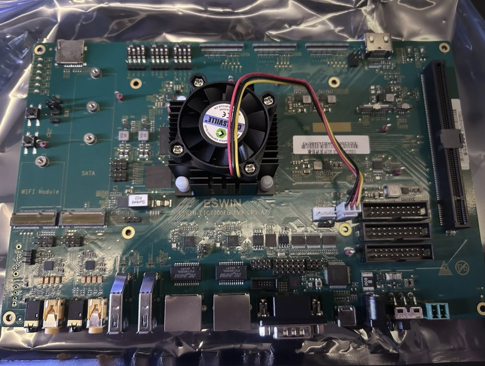

=================
ESWIN EIC7700 EVB
=================

.. tags:: chip:eic7700x, arch:risc-v, vendor:eswin, experimental

   ESWIN EIC7700 EVB

The `EIC7700 EVB <https://www.eswincomputing.com/en/products/index/36.html>`_
is ESWIN's own evaluation board for the
:doc:`EIC7700X <../../index>` SoC.  Where the
:doc:`PINE64 StarPro64 <../starpro64/index>` is a single board computer built
around the chip, the EVB brings out most of the SoC's interfaces, so it is the
board to develop drivers on.

Features
========

* ESWIN EIC7700X, 4 x RV64GC 1.4 GHz RISC-V cores
* 16 GB LPDDR5
* eMMC, microSD and SPI NOR flash, the last holding the boot firmware
* 2 x Ethernet (GMAC, RGMII)
* 2 x USB 3.0, host and device capable
* HDMI output, with CEC
* PCIe 3.0 slot, and two M.2 slots, for SATA and for a WiFi and Bluetooth
  module
* USB serial console, RS232 on a DB9, and further UARTs on the headers
* Expansion headers carrying GPIO, I2C, SPI and PWM
* PWM fan header

.. warning::

   This port is under development and drives a subset of the board.
   `Peripheral Support`_ below records what it drives.

Serial Console
==============

The console is UART0 at **115200 8N1**.  It is wired to the on-board FT4232
USB bridge, so a single USB cable carries it and no separate USB serial
adapter is needed.  The bridge presents four ports, of which UART0 is the
third; on Linux that is usually ``/dev/ttyUSB2``, the first of the four
being the JTAG interface:

.. code:: console

   $ screen /dev/ttyUSB2 115200

Buttons and LEDs
================

The board has four LEDs on GPIO lines 107 to 110 and one push button, ``OK``,
on GPIO line 6.  NuttX does not drive any of them yet.

Power Supply
============

The board is powered through its barrel jack.  The core rails, including the
NPU rail, are set by regulators on I2C bus 1, which NuttX leaves alone: the
firmware has already configured them by the time NuttX starts, and writing to
them changes a core voltage.

RISC-V Toolchain
================

Install `xPack GNU RISC-V Embedded GCC (riscv-none-elf)
<https://github.com/xpack-dev-tools/riscv-none-elf-gcc-xpack/releases>`_ and
add its ``bin`` directory to ``PATH``, as described for the
:doc:`PINE64 StarPro64 <../starpro64/index>`.

Building NuttX
==============

Configure and build:

.. code:: console

   $ cd nuttx
   $ tools/configure.sh eic7700-evb:nsh
   $ make

Then build the applications filesystem and package it with the kernel:

.. code:: console

   $ make export
   $ pushd ../apps
   $ tools/mkimport.sh -z -x ../nuttx/nuttx-export-*.tar.gz
   $ make import
   $ popd
   $ boards/risc-v/eic7700x/common/tools/mkimage.sh

The image is the kernel, then padding, then a RAM disk holding the
applications.  Use the script rather than padding by hand: the RAM disk is
found at run time by searching memory for its header, and that search runs
after BSS has been cleared, so the disk has to start above ``_ebss`` or it is
zeroed before anything looks for it.  The script reads ``_ebss`` from the
kernel and pads to suit.

The result is ``Image-eic7700-evb``.

Booting NuttX
=============

The board boots over TFTP from U-Boot, as the
:doc:`PINE64 StarPro64 <../starpro64/index>` does.  Copy
``Image-eic7700-evb`` and the device tree to the TFTP server:

.. code:: console

   $ wget https://github.com/lupyuen/nuttx-starpro64/raw/refs/heads/main/eic7700-evb.dtb
   $ scp Image-eic7700-evb eic7700-evb.dtb tftpserver:/tftpfolder/

Interrupt U-Boot with Ctrl-C at power on and boot the image:

.. code:: console

   # Change to your TFTP Server
   $ setenv tftp_server 192.168.x.x
   $ saveenv
   $ dhcp ${kernel_addr_r} ${tftp_server}:Image-eic7700-evb
   $ tftpboot ${fdt_addr_r} ${tftp_server}:eic7700-evb.dtb
   $ fdt addr ${fdt_addr_r}
   $ booti ${kernel_addr_r} - ${fdt_addr_r}

NuttShell appears on the console.

Configurations
==============

.. code:: console

   $ tools/configure.sh eic7700-evb:<config-name>

nsh
---

NuttShell on UART0 at 115200 8N1, with the RAM disk mounted and ``/proc``
available.  Built-in applications are supported; none are enabled.

Peripheral Support
==================

NuttX for the EIC7700 EVB supports these peripherals:

======================== ======= =====
Peripheral               Support NOTES
======================== ======= =====
UART                     Yes
======================== ======= =====
