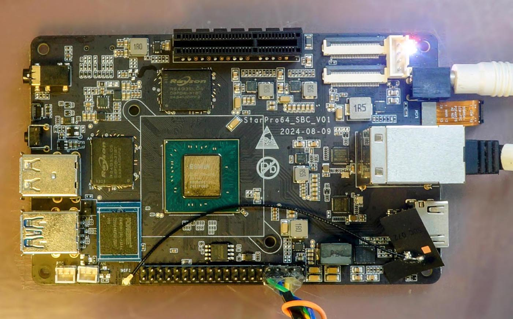

================
PINE64 StarPro64
================

.. tags:: chip:eic7700x, arch:risc-v, vendor:pine64, experimental

`PINE64 StarPro64 <https://lupyuen.github.io/articles/starpro64>`_
is a RISC-V Single-Board Computer based on the ESWIN EIC7700X RISC-V SoC
with Quad-Core 64-bit RISC-V CPU, 32 GB LPDDR5 RAM and 100 Mbps Ethernet.

Features
========

- **System on Chip:** ESWIN EIC7700X
- **Processors:** 4 x RV64GC 1.4 GHz 64-bit RISC-V Cores
- **NPU:** 19.95 TOPS INT8
- **Memory:** 32 GB 64-bit LPDDR5
- **Storage:** 1 x microSD Connector, 1 x eMMC Pad
- **Network:** 2 x GMAC, RGMII supported
- **PCI Express:** 4-lane PCIe 3.0 (RC + EP)
- **Wireless:** WiFi, Bluetooth
- **USB:** USB 2.0 and 3.0
- **GPIO:** Full GPIO Header

Serial Console
==============

A **USB Serial Adapter** (CH340 or CP2102) is required to run NuttX
on StarPro64.

Connect the USB Serial Adapter to StarPro64 Serial Console at:

========== =================
USB Serial StarPro64 Pin
========== =================
GND        Pin 6 (GND)
RX         Pin 8 (UART0 TX)
TX         Pin 10 (UART0 RX)
========== =================

On the USB Serial Adapter, set the **Voltage Level** to 3V3.

Connect StarPro64 to our computer with the USB Serial Adapter.
On our computer, start a Serial Terminal and connect to the USB Serial Port
at **115.2 kbps**:

.. code:: console

   $ screen /dev/ttyUSB0 115200

NuttX will appear in the Serial Console when it boots on StarPro64.

RISC-V Toolchain
================

Before building NuttX for StarPro64, download the toolchain for
`xPack GNU RISC-V Embedded GCC (riscv-none-elf) <https://github.com/xpack-dev-tools/riscv-none-elf-gcc-xpack/releases>`_.

Add the downloaded toolchain ``xpack-riscv-none-elf-gcc-.../bin``
to the ``PATH`` Environment Variable.

Check the RISC-V Toolchain:

.. code:: console

   $ riscv-none-elf-gcc -v

Building
========

To build NuttX for StarPro64, :doc:`install the prerequisites </quickstart/install>` and
:doc:`clone the git repositories </quickstart/install>` for ``nuttx`` and ``apps``.

Configure the NuttX project and build the project:

.. code:: console

   $ cd nuttx
   $ tools/configure.sh starpro64:nsh
   $ make

This produces the NuttX Kernel ``nuttx.bin``.  Next, build the NuttX Apps Filesystem:

.. code:: console

   $ make export
   $ pushd ../apps
   $ tools/mkimport.sh -z -x ../nuttx/nuttx-export-*.tar.gz
   $ make import
   $ popd

Package the NuttX Kernel and the applications into a NuttX Image:

.. code:: console

   $ boards/risc-v/eic7700x/common/tools/mkimage.sh

The image is the kernel, then padding, then a RAM disk holding the
applications.  Use the script rather than padding by hand.  The RAM disk is
found at run time by searching memory for its header, and that search runs
after BSS has been cleared, so the disk has to start above ``_ebss`` or it
is zeroed before anything looks for it.  The script reads ``_ebss`` from the
kernel and pads to suit; a fixed pad works only until BSS grows past it, and
when it does the board hangs during start up with nothing on the console at
all, because the failure happens before there is a console to report it.

The NuttX Image ``Image-starpro64`` will be copied to the TFTP Server in the next step.

Booting
=======

To boot NuttX on StarPro64, `install a TFTP Server <https://lupyuen.github.io/articles/starpro64#boot-nuttx-over-tftp>`_
on our computer.

Copy the file ``Image-starpro64`` from the previous section to the TFTP Server,
together with the Device Tree:

.. code:: console

   $ wget https://github.com/lupyuen/nuttx-starpro64/raw/refs/heads/main/eic7700-evb.dtb
   $ scp Image-starpro64 \
      tftpserver:/tftpfolder/Image-starpro64
   $ scp eic7700-evb.dtb \
      tftpserver:/tftpfolder/eic7700-evb.dtb

Check that StarPro64 is connected to our computer via a USB Serial Adapter at 115.2 kbps:

.. code:: console

   $ screen /dev/ttyUSB0 115200

When StarPro64 boots, press Ctrl-C until U-Boot stops.
At the U-Boot Prompt, run these commands to
`boot NuttX over TFTP <https://lupyuen.github.io/articles/starpro64#boot-nuttx-over-tftp>`_:

.. code:: console

   # Change to your TFTP Server
   $ setenv tftp_server 192.168.x.x
   $ saveenv
   $ dhcp ${kernel_addr_r} ${tftp_server}:Image-starpro64
   $ tftpboot ${fdt_addr_r} ${tftp_server}:eic7700-evb.dtb
   $ fdt addr ${fdt_addr_r}
   $ booti ${kernel_addr_r} - ${fdt_addr_r}

Or configure U-Boot to `boot NuttX automatically <https://lupyuen.github.io/articles/starpro64#boot-nuttx-over-tftp>`_.

NuttX boots on StarPro64 and NuttShell (nsh) appears in the Serial Console.
To see the available commands in NuttShell:

.. code:: console

   $ help

Configurations
==============

nsh
---

Basic configuration that runs NuttShell (nsh).
This configuration is focused on low level, command-line driver testing.
Built-in applications are supported, but none are enabled.
Serial Console is enabled on UART0 at 115.2 kbps.

Peripheral Support
==================

NuttX for StarPro64 supports these peripherals:

======================== ======= =====
Peripheral               Support NOTES
======================== ======= =====
UART                     Yes
CPU clock control        Yes     400 MHz to 1.4 GHz, measured not assumed
Watchdog                 Yes     Four, timeout resets the chip
======================== ======= =====

Watchdog
========

Four Synopsys watchdogs whose timeout genuinely resets the chip, registered
as ``/dev/watchdog0`` to ``3``.  With the auto-monitor configured, both
boards ship it on, the kernel arms every one at boot and feeds them from
a kernel timer, so a hang anywhere becomes a reboot in about eleven
seconds.  An application may take one over at any time with ``WDIOC_START``
(the kernel stops feeding that one permanently), poke one with
``WDIOC_KEEPALIVE``, or disarm one by writing ``V`` before closing.

Timeouts are powers of two of the 200 MHz peripheral clock: a third of a
millisecond up to 10.74 seconds, always rounded up, and requests beyond
the ceiling are refused with an error rather than quietly shortened.
The auto-monitor plans its feeding schedule around the number it asked
for, and a shorter dog under a longer schedule dies on time, every time.
The configured 8 second timeout is therefore granted as 10.74 seconds,
fed every 4.

Why the board last reset is printed at every boot and served through
``BOARDIOC_RESET_CAUSE``::

   wdt: last reset: WATCHDOG (08)

**Panic policy is a configuration choice.**  Without
``CONFIG_WATCHDOG_PANIC_NOTIFIER``, the shipped default, a kernel
panic starves the dogs and the board reboots itself, cause recorded.
With it, the kernel stops all four at the moment of panic and the crash
scene keeps forever for a debugger; the stop path is deliberately free
of locks and allocation so it works from a dying kernel.

**For JTAG sessions** two rescues exist, both one line.  Freeze every
dog from the debugger (a halted hart cannot feed them, and a halt longer
than the timeout otherwise reboots the board under the session)::

   mww 0x51828444 0x0

and release them again by writing ``0xf``.  The same register is how the
driver itself stops a dog, since the enable bit is unclearable by
design: held in block reset is the off state.

Two hardware notes learned on silicon rather than from the manual.  The
timeout-range register must be written and read back: the manual's own
advice to clear the protection-level register first makes the block
silently drop timeout writes while still accepting the enable, arming a
third-of-a-millisecond watchdog nothing can outrun.  And all four
instances' reset outputs genuinely reach the chip reset: starving any
one of them reboots the machine.
