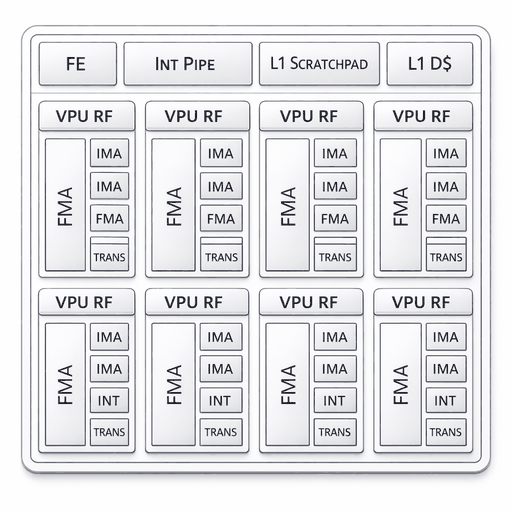

=============
Erbium Minion
=============

.. tags:: chip:erbium, arch:risc-v, vendor:aifoundry

   ET-Minion core (source: `aifoundry-org/erbium
   <https://github.com/aifoundry-org/erbium>`__, Apache-2.0).

The Erbium CPU subsystem is one ET-Neighborhood of eight dual-threaded
RV64IMFC ET-Minion cores (16 harts), derived from the Esperanto ET-SoC-1,
together with a PLIC, a CLINT-style machine timer and a shared instruction
cache. Erbium silicon is not yet available, so this board targets the
``erbium_emu`` system emulator. NuttX runs on hart 0.

Memory and interrupts
=====================

The ELF loader reserves the first 512 bytes of the 16 MiB MRAM window.
NuttX therefore starts at ``0x40000200``. Initialized data is loaded at its
execution address. Startup clears BSS and places the heap after the idle
stack. The linker checks that the image and idle stack fit in MRAM.

The PLIC at ``0xa0000000`` provides sources 1 through 6; UART0 uses source
3. Receive and transmit use interrupts, without periodic polling.
The machine timer uses ``mtime`` at ``0x80f40200`` and ``mtimecmp`` at
``0x80f40208``. ``CONFIG_ERBIUM_MTIMER_FREQ`` defaults to 2 MHz, the
emulator's timer rate. The Erbium documentation specifies a 10 MHz
``mtime`` (one tick every 100 ns) on silicon, so set this option to match
the target.

Toolchain
=========

Use a GNU RISC-V bare-metal toolchain with RV64 single-precision ABI
support, such as ``riscv64-unknown-elf-gcc``. The normal RISC-V toolchain
logic derives ``rv64imfc_zicsr_zifencei`` and ``lp64f`` from Kconfig.

Erbium handles floating-point divide and square root through microcode.
This standalone image does not supply that microcode, so the port uses
``-mno-fdiv`` to generate software helper calls for those operations.
Other single-precision instructions and FPU context switching remain
enabled, including the FPU portion of ``ostest``. Double-precision
arithmetic uses software. The atomic instruction extension is not enabled.
NuttX provides atomic operations through interrupt masking on hart 0.
Startup also avoids the microcode-dependent ``FENCE.I`` instruction; this
port expects the emulator's ELF loader to install the executable image.
NuttX's dynamic ELF module loader is disabled in both configurations because
its instruction-cache synchronization also uses ``FENCE.I``. This does not
affect the ``nuttx`` ELF output file loaded by the emulator.

Configurations
==============

``nsh`` provides the NuttShell console and procfs. ``ostest`` starts the
NuttX OS test application automatically. Both configurations run on hart 0.

With sibling ``nuttx`` and ``apps`` checkouts, build using Make::

  cd nuttx
  ./tools/configure.sh -l minion:nsh
  make -j8

To select the OS tests, start from a clean configuration::

  make distclean
  ./tools/configure.sh -l minion:ostest
  make -j8

From the directory containing the sibling ``nuttx`` and ``apps`` checkouts,
CMake is also supported::

  # Run make distclean first if nuttx was configured with Make.
  cmake -S nuttx -B build -GNinja -DBOARD_CONFIG=minion:nsh
  cmake --build build

Build the emulator
==================

The public ET-platform revision
``836a4ab600e93c3059bb58c898edbc37744cd8d0`` has been tested with this port.
No local emulator patches are required. Build only the header-only Erbium
HAL package and the native emulator; the accelerator firmware and ET
cross-toolchain are not needed. The host requires CMake 3.21 or later,
Ninja, a C++17 compiler, and the glog and LZ4 development packages::

  git clone https://github.com/aifoundry-org/et-platform.git
  git -C et-platform checkout 836a4ab600e93c3059bb58c898edbc37744cd8d0
  cmake -S et-platform/erbium-hal -B hal-build \
    -DCMAKE_INSTALL_PREFIX="$PWD/emu-prefix"
  cmake --install hal-build
  cmake -S et-platform/sw-sysemu -B emu-build -GNinja \
    -DCMAKE_BUILD_TYPE=Release -DCMAKE_PREFIX_PATH="$PWD/emu-prefix" \
    -DCMAKE_CXX_FLAGS=-Wno-error=unused-result
  cmake --build emu-build --target erbium_emu

The last compiler option keeps an existing ignored ``write()`` return value
in the emulator UART implementation from becoming a build error with GCC
13. It does not modify the emulator source. The executable is
``emu-build/erbium_emu``.

Run in the emulator
===================

Use an emulator with Erbium PLIC PMA access, clocked UART FIFO/interrupts,
and timer advancement while the core is in WFI. Older emulator builds
without those features are not supported.

Start an interactive console with::

  erbium_emu -elf_load nuttx -reset_pc 0x40000200 -single_thread \
    -max_cycles 100000000000

The same command runs the ``ostest`` image without console input. Allow
enough simulated cycles for the tests' sleeps and timeouts; reaching the
emulator cycle limit is not a successful test result. A complete run prints
``Final memory usage:`` followed by ``user_main: Exiting`` and
``ostest_main: Exiting with status 0``. Inspect the entire log for failures
and assertions as well.

The board includes an automated runner that accepts prebuilt ELF files::

  python3 boards/risc-v/erbium/minion/tools/test_emu.py \
    --emu /path/to/erbium_emu --elf nuttx --mode ostest --output logs/ostest

For an ``nsh`` image, select ``--mode nsh``. This checks console commands,
procfs, uptime advancement during sleep and receive interrupts after idle.
Add ``--extra-harts``
to start four harts and exercise secondary-hart parking. The runner fills
uninitialized emulator memory with a nonzero pattern and records the UART
log, emulator log, binary checksums and result JSON. It stops the emulator
after the required completion markers; a timeout or cycle-limit exit before
completion fails the test. A Release build of the emulator is recommended
for the complete OS tests, which contain many simulated sleeps.

UART settings
=============

UART0 supports 8-bit characters, no parity and one stop bit (8N1), using
``CONFIG_UART0_BAUD`` and the standard serial buffer size options. Other
line formats are rejected at build time. ``CONFIG_ERBIUM_UART_CLOCK``
describes the peripheral clock
after the system divider. The emulator defaults correspond to a 200 MHz
system clock divided by 30. Runtime termios reconfiguration and hardware
flow control are not implemented. ``CONFIG_SUPPRESS_UART_CONFIG`` preserves
a bootloader's UART configuration; it must remain disabled for direct ELF
loading into a reset emulator. ``CONFIG_SUPPRESS_SERIAL_INTS`` is honored
for low-level console debugging.

The emulator reads host input into its finite RX FIFO immediately. Feeding
a long command through a pipe can overrun that FIFO. Automated console
tests should pace input, for example by waiting for each echoed character.

References
==========

* `Erbium documentation <https://erbium.readthedocs.io/en/latest/>`_
* `ET-Minion core <https://erbium.readthedocs.io/en/latest/minion/>`_
* `Interrupts and PLIC source IDs <https://erbium.readthedocs.io/en/latest/interrupts/>`_
* `CPU memory map <https://erbium.readthedocs.io/en/latest/cpu_mm/>`_
* `UART <https://erbium.readthedocs.io/en/latest/uart/>`_
* `ET-platform, including erbium_emu <https://github.com/aifoundry-org/et-platform>`_
