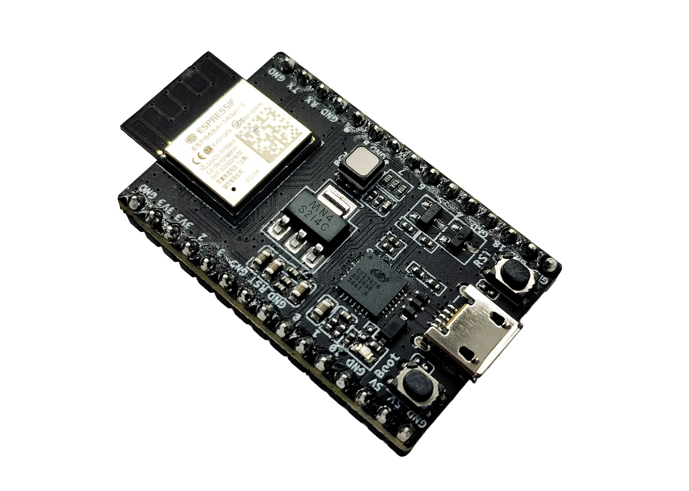
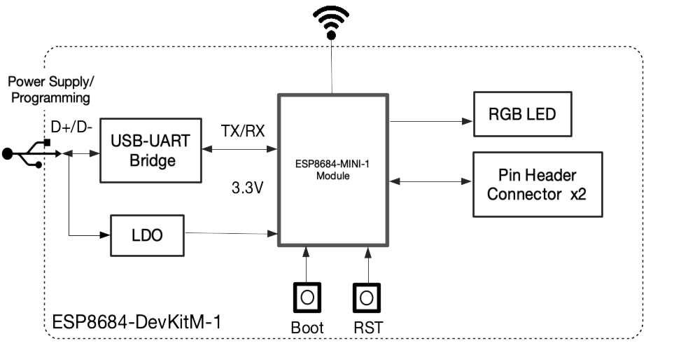
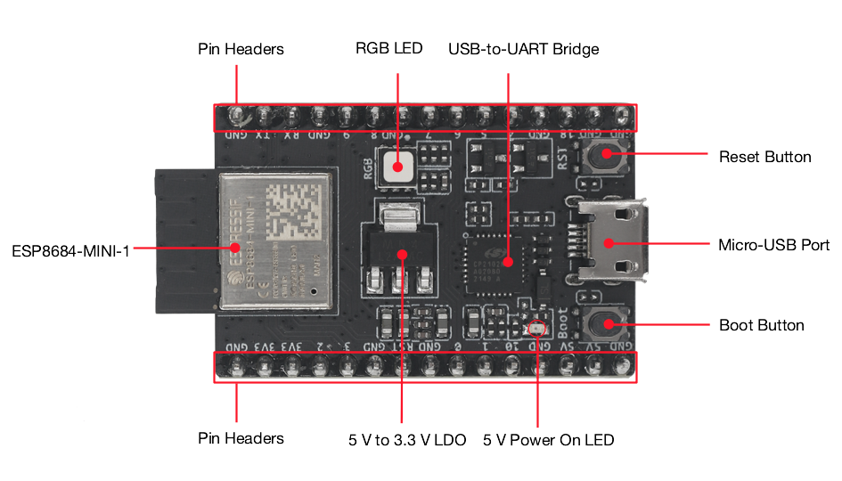
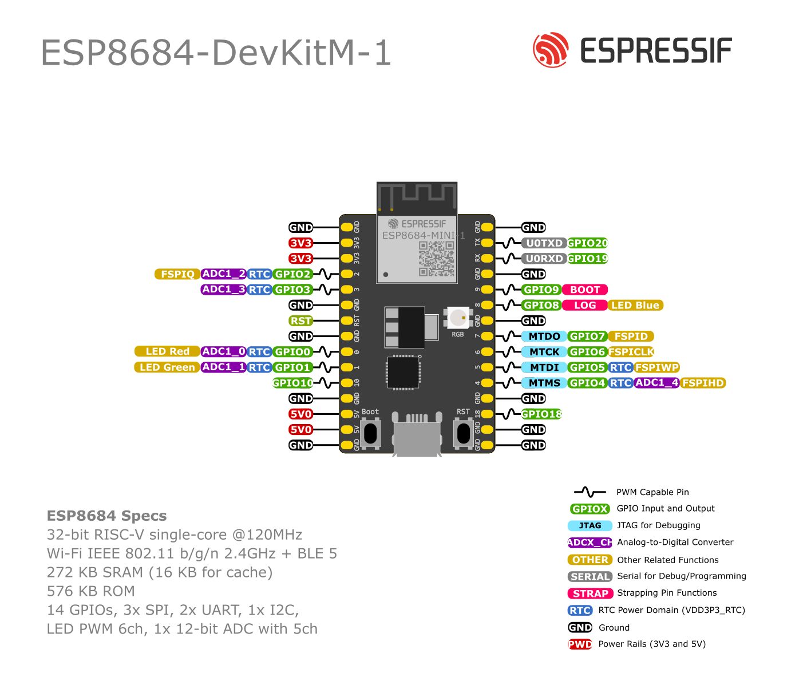

=================
ESP8684-DevKitM-1
=================

.. tags:: chip:esp32c2, chip:esp8684, arch:risc-v, vendor:espressif

ESP8684-DevKitM-1 is an entry-level development board based on ESP8684-MINI-1,
a general-purpose module with 1 MB/2 MB/4 MB SPI flash. The module uses the
ESP32-C2 SoC and integrates Wi-Fi and Bluetooth LE. You can find the board
schematic
`here <https://dl.espressif.com/dl/schematics/esp8684-devkitm-1-schematics_V1.1.pdf>`_
and the vendor user guide
`here <https://docs.espressif.com/projects/esp-dev-kits/en/latest/esp32c2/esp8684-devkitm-1/user_guide.html>`_.

Most of the I/O pins are broken out to the pin headers on both sides for easy
interfacing. Developers can either connect peripherals with jumper wires or
mount ESP8684-DevKitM-1 on a breadboard.

Toolchain, flashing and the serial console are described in the
:doc:`ESP32-C2 chip documentation <../../index>`.

    ESP8684-DevKitM-1 with ESP8684-MINI-1 module

The block diagram below presents the main components of the ESP8684-DevKitM-1.

    ESP8684-DevKitM-1 Electrical Block Diagram

Hardware Components
-------------------

    ESP8684-DevKitM-1 Hardware Components

===================== ========================================================
Key Component         Description
===================== ========================================================
ESP8684-MINI-1        Wi-Fi and Bluetooth LE module with PCB antenna and
                      on-board SPI flash (1 MB/2 MB/4 MB). Typical XTAL is
                      26 MHz.
5 V to 3.3 V LDO      Converts USB or 5 V header power to 3.3 V.
5 V Power On LED      Turns on when USB power is connected.
Pin Headers           All available GPIO pins broken out on J1 and J3.
Boot Button           Download button. Hold **Boot** and press **Reset** to
                      enter Firmware Download mode.
Micro-USB Port        Power supply and USB-to-UART communication.
Reset Button          Restarts the system (connected to CHIP_EN).
USB-to-UART Bridge    Single USB-to-UART bridge, up to 3 Mbps.
RGB LED               On v1.1: discrete RGB LED on GPIO0 (R), GPIO1 (G) and
                      GPIO8 (B). On v1.0: addressable RGB LED on GPIO8 only.
===================== ========================================================

This board has no USB-Serial-JTAG port on the SoC. Console and flashing use
the on-board USB-to-UART bridge.

Buttons and LEDs
================

Board Buttons
-------------

There are two buttons labeled Boot and RST. The RST button is not available
to software. It pulls the chip enable line that doubles as a reset line.

The BOOT button is connected to GPIO9. On reset it is used as a strapping
pin to determine whether the chip boots normally or into the serial
bootloader. After reset, however, the BOOT button can be used for software
input.

Board LEDs
----------

There is one on-board LED that indicates the presence of USB power.

The RGB LED mapping depends on the hardware revision:

* **v1.1 (current):** discrete RGB LED driven by GPIO0 (red), GPIO1 (green)
  and GPIO8 (blue). This is the mapping used by NuttX
  (``LED_RED``, ``LED_GREEN`` and ``LED_BLUE`` in ``board.h``).
* **v1.0:** addressable RGB LED driven only by GPIO8.

Both revisions are available on the market. See
`Hardware Revision Details <https://docs.espressif.com/projects/esp-dev-kits/en/latest/esp32c2/esp8684-devkitm-1/user_guide.html#hardware-revision-details>`_.
GPIO8 and GPIO9 are also strapping pins of the ESP8684 chip.

Power Supply
============

There are three mutually exclusive ways to provide power to the board:

* Micro-USB port (default, recommended)
* 5V and G (GND) pins
* 3V3 and G (GND) pins

Use a USB 2.0 cable (Standard-A to Micro-B) that carries data lines.
Charge-only cables will not enumerate the USB-to-UART bridge and cannot be
used to flash the board.

Pin Mapping
===========

    ESP8684-DevKitM-1 Pin Layout

Default NuttX pin assignments for this board:

============= ========== =========================================
ESP8684 Pin   Signal     Notes
============= ========== =========================================
GPIO20        U0TXD      UART0 TX (serial console)
GPIO19        U0RXD      UART0 RX (serial console)
GPIO9         BOOT       Strapping pin; user button after reset
GPIO0         LED Red    RGB LED (v1.1); ADC1_CH0
GPIO1         LED Green  RGB LED (v1.1); ADC1_CH1
GPIO8         LED Blue   RGB LED (v1.1) / WS2812 (v1.0); strapping
GPIO6         I2C0 SCL   Default I2C clock
GPIO5         I2C0 SDA   Default I2C data; ADC2_CH0
GPIO7         SPI2 MOSI  Default SPI2 MOSI (FSPID)
GPIO2         SPI2 MISO  Default SPI2 MISO (FSPIQ); LEDC PWM ch0
GPIO10        SPI2 CS    Default SPI2 chip select
GPIO6         SPI2 CLK   Default SPI2 clock (shared with I2C SCL)
============= ========== =========================================

**J1**

===== ========== =========================================
Pin   Signal     Notes
===== ========== =========================================
1     G          Ground
2     3V3        3.3 V power supply
3     3V3        3.3 V power supply
4     GPIO2      ADC1_CH2, FSPIQ
5     GPIO3      ADC1_CH3
6     G          Ground
7     RST        CHIP_EN; High: enable; Low: power off
8     G          Ground
9     GPIO0      ADC1_CH0, LED Red (v1.1)
10    GPIO1      ADC1_CH1, LED Green (v1.1)
11    GPIO10     FSPICS0
12    G          Ground
13    5V         5 V power supply
14    5V         5 V power supply
15    G          Ground
===== ========== =========================================

**J3**

===== ========== =========================================
Pin   Signal     Notes
===== ========== =========================================
1     G          Ground
2     TX         GPIO20, U0TXD
3     RX         GPIO19, U0RXD
4     G          Ground
5     GPIO9      Strapping pin, BOOT button
6     GPIO8      Strapping pin, LED Blue (v1.1)
7     G          Ground
8     GPIO7      FSPID, MTDO
9     GPIO6      FSPICLK, MTCK
10    GPIO5      ADC2_CH0, FSPIWP, MTDI
11    GPIO4      ADC1_CH4, FSPIHD, MTMS
12    G          Ground
13    GPIO18
14    G          Ground
15    G          Ground
===== ========== =========================================

GPIO8 and GPIO9 are strapping pins. Their level at reset selects boot and
download mode. See the
`ESP8684 Datasheet <https://www.espressif.com/sites/default/files/documentation/esp8684_datasheet_en.pdf>`_
section *Strapping Pins*.

Configurations
==============

All of the configurations presented below can be tested by running the following commands::

    $ ./tools/configure.sh esp8684-devkitm:<config_name>
    $ make flash ESPTOOL_PORT=/dev/ttyUSB0 -j

Where ``<config_name>`` is the name of board configuration you want to use,
i.e.: nsh, buttons, wifi...
Then use a serial console terminal like ``picocom`` configured to 115200 8N1.

adc
---

The ``adc`` configuration enables the ADC driver and the ADC example application.
ADC Unit 1 is registered to ``/dev/adc0`` with channels 0, 1, 2 and 3 enabled by default.
Currently, the ADC operates in oneshot mode.

More ADC channels can be enabled or disabled in ``ADC Configuration`` menu.

This example shows channels 0 and 1 connected to 3.3 V and channels 2 and 3 to GND (all readings
show in units of mV)::

    nsh> adc -n 1
    adc_main: g_adcstate.count: 1
    adc_main: Hardware initialized. Opening the ADC device: /dev/adc0
    Sample:
    1: channel: 0 value: 2900
    2: channel: 1 value: 2900
    3: channel: 2 value: 0
    4: channel: 3 value: 0

autopm
------

This configuration makes the device automatically enter the low power consumption mode
when in the idle state, powering off the cpu and other peripherals.

In minimum power save mode, the station wakes up every DTIM to receive a beacon. The broadcast
data will not be lost because it is transmitted after DTIM. However, it can not save much more
power if DTIM is short as the DTIM is determined by the access point.

ble
---

This configuration is used to enable the Bluetooth Low Energy (BLE) of
the ESP32-C2 chip.

To test it, just run the following commands below.

Confirm that bnep interface exist::

    nsh> ifconfig
    bnep0   Link encap:UNSPEC at DOWN
        inet addr:0.0.0.0 DRaddr:0.0.0.0 Mask:0.0.0.0

Get basic information from it::

    nsh> bt bnep0 info
    Device: bnep0
    BDAddr: 86:f7:03:09:41:4d
    Flags:  0000
    Free:   20
      ACL:  20
      SCO:  0
    Max:
      ACL:  24
      SCO:  0
    MTU:
      ACL:  70
      SCO:  0
    Policy: 0
    Type:   0

Start the scanning process::

    nsh> bt bnep0 scan start

Wait a little bit before stopping it.

Then after some minutes stop it::

    nsh> bt bnep0 scan stop

Get the list of BLE devices found around you::

    nsh> bt bnep0 scan get
    Scan result:
    1.     addr:           d7:c4:e6:xx:xx:xx type: 0
           rssi:            -62
           response type:   4
           advertiser data: 10 09 4d 69 20 XX XX XX XX XX XX XX XX XX XX 20                      e
    nsh>

bmp180
------

This configuration enables the use of the BMP180 pressure sensor over I2C.
You can check that the sensor is working by using the ``bmp180`` application::

    nsh> bmp180
    Pressure value = 91531
    Pressure value = 91526
    Pressure value = 91525

buttons
-------

This configuration shows the use of the buttons subsystem. It can be used by executing
the ``buttons`` application and pressing the ``BOOT`` button on the board::

    nsh> buttons
    buttons_main: Starting the button_daemon
    buttons_main: button_daemon started
    button_daemon: Running
    button_daemon: Opening /dev/buttons
    button_daemon: Supported BUTTONs 0x01
    nsh> Sample = 1
    Sample = 0

crypto
------

This configuration enables support for the cryptographic hardware and
the ``/dev/crypto`` device file. Currently, we are supporting SHA-1,
SHA-224 and SHA-256 algorithms using hardware.
To test hardware acceleration, you can use `hmac` example and following output
should look like this::

    nsh> hmac
    ...
    hmac sha1 success
    hmac sha1 success
    hmac sha1 success
    hmac sha256 success
    hmac sha256 success
    hmac sha256 success

efuse
-----

This configuration demonstrates the use of the eFuse driver. It can be accessed
through the ``/dev/efuse`` device file.
Virtual eFuse mode can be used by enabling `CONFIG_ESPRESSIF_EFUSE_VIRTUAL`
option to prevent possible damages on chip.

The following snippet demonstrates how to read MAC address:

.. code-block:: C

   int fd;
   int ret;
   uint8_t mac[6];
   struct efuse_param_s param;
   struct efuse_desc_s mac_addr =
   {
     .bit_offset = 1,
     .bit_count = 48
   };

   const efuse_desc_t* desc[] =
   {
       &mac_addr,
       NULL
   };
   param.field = desc;
   param.size = 48;
   param.data = mac;

   fd = open("/dev/efuse", O_RDONLY);
   ret = ioctl(fd, EFUSEIOC_READ_FIELD, &param);

To find offset and count variables for related eFuse,
please refer to Espressif's Technical Reference Manuals.

gpio
----

This is a test for the GPIO driver. It uses GPIO1 and GPIO2 as outputs and
GPIO9 as an interrupt pin.

At the nsh, we can turn the outputs on and off with the following::

    nsh> gpio -o 1 /dev/gpio0
    nsh> gpio -o 1 /dev/gpio1

    nsh> gpio -o 0 /dev/gpio0
    nsh> gpio -o 0 /dev/gpio1

We can use the interrupt pin to send a signal when the interrupt fires::

    nsh> gpio -w 14 /dev/gpio2

The pin is configured as a rising edge interrupt, so after issuing the
above command, connect it to 3.3V.

To use dedicated gpio for controlling multiple gpio pin at the same time
or having better response time, you need to enable
`CONFIG_ESPRESSIF_DEDICATED_GPIO` option. Dedicated GPIO is suitable
for faster response times required applications like simulate serial/parallel
interfaces in a bit-banging way.
After this option enabled GPIO4 and GPIO5 pins are ready to used as dedicated GPIO pins
as input/output mode. These pins are for example, you can use any pin up to 8 pins for
input and 8 pins for output for dedicated gpio.
To write and read data from dedicated gpio, you need to use
`write` and `read` calls.

The following snippet demonstrates how to read/write to dedicated GPIO pins:

.. code-block:: C

    int fd = open("/dev/dedic_gpio0", O_RDWR);
    int rd_val = 0;
    int wr_mask = 0xffff;
    int wr_val = 3;

    while(1)
      {
        write(fd, &wr_val, wr_mask);
        if (wr_val == 0)
          {
            wr_val = 3;
          }
        else
          {
            wr_val = 0;
          }
        read(fd, &rd_val, sizeof(uint32_t));
        printf("rd_val: %d", rd_val);
      }

i2c
---

This configuration can be used to scan and manipulate I2C devices.
You can scan for all I2C devices using the following command::

    nsh> i2c dev 0x00 0x7f

Default pins are GPIO6 (SCL) and GPIO5 (SDA).

To use slave mode, you can enable `ESPRESSIF_I2C0_SLAVE_MODE` option.
To use slave mode driver following snippet demonstrates how write to i2c bus
using slave driver:

.. code-block:: C

   #define ESP_I2C_SLAVE_PATH  "/dev/i2cslv0"
   int main(int argc, char *argv[])
     {
       int i2c_slave_fd;
       int ret;
       uint8_t buffer[5] = {0xAA};
       i2c_slave_fd = open(ESP_I2C_SLAVE_PATH, O_RDWR);
       ret = write(i2c_slave_fd, buffer, 5);
       close(i2c_slave_fd);
    }

mcuboot_nsh
-----------

This configuration is the same as the ``nsh`` configuration, but it generates the application
image in a format that can be used by MCUboot. It also makes the ``make bootloader`` command to
build the MCUboot bootloader image using the Espressif HAL.

See :ref:`MCUBoot C2` for flash-layout limits on 2 MB modules. NuttX MCUBoot
support for ESP32-C2 is still in progress; there is no ``mcuboot_update_agent``
configuration for this board.

nsh
---

Basic configuration to run the NuttShell (nsh).

ostest
------

This is the NuttX test at ``apps/testing/ostest`` that is run against all new
architecture ports to assure a correct implementation of the OS.

pm
--

This config demonstrate the use of power management.
You can use the ``pmconfig`` command to check current power state and time spent in other power states.
Also you can define time will spend in standby and sleep modes::

    $ make menuconfig
    -> Board Selection
        -> (15) PM_STANDBY delay (seconds)
           (0)  PM_STANDBY delay (nanoseconds)
           (20) PM_SLEEP delay (seconds)
           (0)  PM_SLEEP delay (nanoseconds)

Before switching PM status, you need to query the current PM status to call correct number of relax command to correct modes::

    nsh> pmconfig
    Last state 0, Next state 0

    /proc/pm/state0:
    DOMAIN0           WAKE         SLEEP         TOTAL
    normal          0s 00%        0s 00%        0s 00%
    idle            0s 00%        0s 00%        0s 00%
    standby         0s 00%        0s 00%        0s 00%
    sleep           0s 00%        0s 00%        0s 00%

    /proc/pm/wakelock0:
    DOMAIN0      STATE     COUNT      TIME
    system       normal        2        1s
    system       idle          1        1s
    system       standby       1        1s
    system       sleep         1        1s

In this case, needed commands to switch the system into PM idle mode::

    nsh> pmconfig relax normal
    nsh> pmconfig relax normal

pwm
---

This configuration demonstrates the use of PWM through LEDC channel 0,
which defaults to GPIO2. To test it, just execute the ``pwm`` application::

    nsh> pwm
    pwm_main: starting output with frequency: 10000 duty: 00008000
    pwm_main: stopping output

random
------

This configuration shows the use of the ESP32-C2's True Random Number Generator.
To test it, just run ``rand`` to get 32 randomly generated bytes::

    nsh> rand
    Reading 8 random numbers
    Random values (0x3ffe0b00):
    0000  98 b9 66 a2 a2 c0 a2 ae 09 70 93 d1 b5 91 86 c8  ..f......p......
    0010  8f 0e 0b 04 29 64 21 72 01 92 7c a2 27 60 6f 90  ....)d!r..|.'`o.

romfs
-----

This configuration demonstrates the use of ROMFS (Read-Only Memory File System) to provide
automated system initialization and startup scripts. ROMFS allows embedding a read-only
filesystem directly into the NuttX binary, which is mounted at ``/etc`` during system startup.

**What ROMFS provides:**

* **System initialization script** (``/etc/init.d/rc.sysinit``): Executed after board bring-up
* **Startup script** (``/etc/init.d/rcS``): Executed after system init, typically used to start applications

**Default behavior:**

When this configuration is used, NuttX will:

1. Create a read-only RAM disk containing the ROMFS filesystem
2. Mount the ROMFS at ``/etc``
3. Execute ``/etc/init.d/rc.sysinit`` during system initialization
4. Execute ``/etc/init.d/rcS`` for application startup

**Customizing startup scripts:**

The startup scripts are located in:
``boards/risc-v/esp32c2/common/src/etc/init.d/``

* ``rc.sysinit`` - System initialization script
* ``rcS`` - Application startup script

To customize these scripts:

1. **Edit the script files** in ``boards/risc-v/esp32c2/common/src/etc/init.d/``
2. **Add your initialization commands** using any NSH-compatible commands

**Example customizations:**

* **rc.sysinit** - Set up system services, mount additional filesystems, configure network.
* **rcS** - Start your application, launch daemons, configure peripherals. This is executed after the rc.sysinit script.

Example output::

    *** Booting NuttX ***
    [...]
    rc.sysinit is called!
    rcS file is called!
    NuttShell (NSH) NuttX-12.8.0
    nsh> ls /etc/init.d
    /etc/init.d:
    .
    ..
    rc.sysinit
    rcS

rtc
---

This configuration demonstrates the use of the RTC driver through alarms.
You can set an alarm, check its progress and receive a notification after it expires::

    nsh> alarm 10
    alarm_daemon started
    alarm_daemon: Running
    Opening /dev/rtc0
    Alarm 0 set in 10 seconds
    nsh> alarm -r
    Opening /dev/rtc0
    Alarm 0 is active with 10 seconds to expiration
    nsh> alarm_daemon: alarm 0 received

The ESP32-C2 has no RTC retention memory, so the saved time does not
survive deep sleep.

sdmmc_spi
---------

This configuration is used to mount a FAT/FAT32 SD Card into the OS' filesystem.
It uses SPI to communicate with the SD Card, defaulting to SPI2.

The SD slot number, SPI port number and minor number can be modified in ``Application Configuration → NSH Library``.

To access the card's files, make sure ``/dev/mmcsd0`` exists and then execute the following commands::

    nsh> ls /dev
    /dev:
    console
    mmcsd0
    null
    ttyS0
    zero
    nsh> mount -t vfat /dev/mmcsd0 /mnt

This will mount the SD Card to ``/mnt``. Now, you can use the SD Card as a normal filesystem.
For example, you can read a file and write to it::

    nsh> ls /mnt
    /mnt:
    hello.txt
    nsh> cat /mnt/hello.txt
    Hello World
    nsh> echo 'NuttX RTOS' >> /mnt/hello.txt
    nsh> cat /mnt/hello.txt
    Hello World!
    NuttX RTOS
    nsh>

spi
---

This configuration enables the support for the SPI driver.
You can test it by connecting MOSI and MISO pins which are GPIO7 and GPIO2
by default to each other and running the ``spi`` example::

    nsh> spi exch -b 2 "AB"
    Sending:	AB
    Received:	AB

If SPI peripherals are already in use you can also use bitbang driver which is a
software implemented SPI peripheral by enabling `CONFIG_ESPRESSIF_SPI_BITBANG`
option.

spiflash
--------

This config tests the external SPI that comes with the ESP8684-MINI-1 module
connected through SPI1.

By default a SmartFS file system is selected.
Once booted you can use the following commands to mount the file system::

    nsh> mksmartfs /dev/smart0
    nsh> mount -t smartfs /dev/smart0 /mnt

The storage partition defaults to offset ``0x110000`` and size ``0xf0000``
on 2 MB flash so that it fits after the application image.

temperature_sensor
------------------

This configuration enables the on-chip temperature sensor driver. The sensor is
exposed through the uORB interface and can be read with the ``sensortest``
utility::

    nsh> sensortest temp

tickless
--------

This configuration enables the support for tickless scheduler mode.

timers
------

This configuration tests the general purpose timer. The ESP32-C2 has a
single timer group. It adds driver support, registers the timer as a device
and includes the timer example.

To test it, just run the following::

  nsh> timer -d /dev/timer0

watchdog
--------

This configuration tests the watchdog timers. It includes the MWDT of the
single timer group, adds driver support, registers the WDT as a device and
includes the watchdog example application.

To test it, just run the following command::

    nsh> wdog -i /dev/watchdog0

wifi
----

Enables Wi-Fi support. You can define your credentials this way::

    $ make menuconfig
    -> Application Configuration
        -> Network Utilities
            -> Network initialization (NETUTILS_NETINIT [=y])
                -> WAPI Configuration

Or if you don't want to keep it saved in the firmware you can do it
at runtime::

    nsh> wapi psk wlan0 mypasswd 3
    nsh> wapi essid wlan0 myssid 1
    nsh> renew wlan0

.. tip:: Please refer to :ref:`ESP32 Wi-Fi Station Mode <esp32_wi-fi_sta>`
  for more information.
