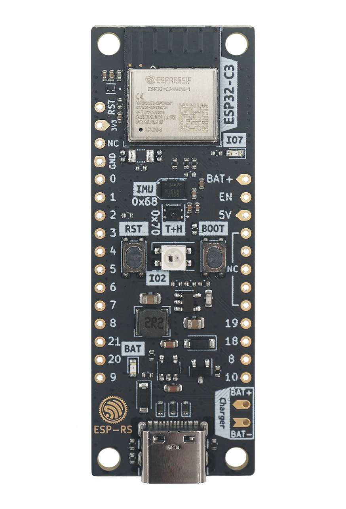

==============================
ESP32C3 DevKit RUST-1 (Legacy)
==============================

.. tags:: arch:riscv, vendor:espressif

   ESP32-C3 DevKit-RUST-1 development board.

To learn more about this board, you can visit the vendor documentation page
`here <https://www.espressif.com/en/dev-board/esp32-c3-devkit-rust-1-en>`_.
There is also an `informational GitHub page here
<https://github.com/esp-rs/esp-rust-board>`_.

Features
========

* IEEE 802.11 b/g/n-compliant
* Bluetooth 5, Bluetooth mesh
* 32-bit RISC-V single-core processor, up to 160MHz
* 384KB ROM
* 400KB SRAM (16 KB for cache)
* 8KB SRAM in RTC
* 22x programmable GPIOs
* 3x SPI
* 2x UART
* 1x I2C
* 1x I2S
* 2x 54-bit general-purpose timers
* 3x watchdog timers
* 1x 52-bit system timer
* Remote Control Peripheral (RMT)
* LED PWM controller (LEDC)
* Full-speed USB Serial/JTAG controller
* General DMA controller (GDMA)
* 1x TWAI
* 2x 12-bit SAR ADCs, up to 6 channels
* 1x SHTC3 temperature sensor
* 1x ICM-42670-P IMU

Power Supply
============

The board can be powered via USB-C. There is also a battery charging unit
that will power a connected Li-Ion or LiPo up to 4V2.

Flashing
========

To flash NuttX to the board, you can run:

.. code:: console

   $ make -j flash ESPTOOL_PORT=/dev/ttyACM0

Where you can replace `/dev/ttyACM0` with the name of the port that the device
is connected to.

Configurations
==============

To configure NuttX for this board, you can use the following command:

.. code:: console

   $ ./tools/configure.sh esp32c3-legacy-devkit-rust-1:<config>

Where ``<config>`` is one of the configurations listed below.

nsh
---

This is a simple configuration with the NSH shell on the serial console. The
baud rate settings to connect to the serial console are 9600bps, 8N1.
