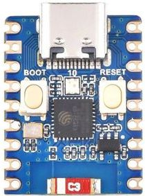

===============================
Waveshare ESP32-C3-Zero
===============================

.. tags:: chip:ESP32-C3

The `Waveshare ESP32-C3-Zero <https://www.waveshare.com/wiki/ESP32-C3-Zero>`_ is a compact development board supplied by Waveshare.

Features
========

* Low-power RISC-V 32-bit Single-core processor, up to 160MHz main frequency.
* Supports 2.4GHz Wi-Fi (802.11 b/g/n) and Bluetooth® 5 (LE).
* 400KB SRAM, 384KB ROM and built-in 4MB flash memory.
* 15 multi-function GPIO pins.
* 3× SPI, 1× I2C, 2× UART, 1× I2S, 2× ADC.
* Onboard WS2812 RGB led.
* Compact SMD ceramic antenna.
* Ultra-compact size: 23.5 × 18 mm

Buttons and LEDs
================

There are two buttons labeled BOOT and RESET.
The BOOT button is connected to GPIO9. On reset it is used as a strapping pin to determine whether the chip boots normally or into the serial bootloader. After reset, however, the BOOT button can be used for software input.

WS2812 LED is connected to GPIO10 and is available for software.

Pin Mapping
===========

Pads numbered anticlockwise from USB connector.

===== ========== ==========
Pad   Signal     Notes
===== ========== ==========
1     5V         +5V Supply to board
2     GND        Ground
3     3V3        Power output to peripherals
4     GPIO0
5     GPIO1
6     GPIO2
7     GPIO3
8     GPIO4      SCK (bit-banging)
9     GPIO5      MISO (bit-banging)
10    GPIO6      MOSI (bit-banging)
11    GPIO7      CSn (bit-banging)
12    GPIO8      SCL (bit-banging)
13    GPIO9      SDA (bit-banging)
14    GPIO10     To connect with WS2812 RGB LED
15    GPIO18     USB_D+
16    GPIO19     USB_D-
17    GPIO20     Default RX for UART0 serial console
18    GPIO21     Default TX for UART0 serial console
===== ========== ==========

.. note:: The Waveshare ESP32-C3-Zero does not have dedicated I2C and SPI pins.
   However, you can implement software-based I2C or SPI (bit-banging) using any available GPIO pins.

Power Supply
============

There are two mutually exclusive ways to provide power to the board:

* USB Type-C Port

* supplying via VIN (5V) pin (3.3–6 V) and GND pin headers

Installation & Build
====================

For instructions on how to to install the build dependencies and create a NuttX
image for this board, consult the main :doc:`ESP32-C3 documentation
<../../index>`.

Serial Console
==============

A **USB Serial Adapter** is required to run NuttX on ESP32-C3-Zero with UART0 serial console.

Connect the USB Serial Adapter to ESP32-C3-Zero Serial Console at:

.. list-table:: USB Serial connections
   :widths: auto
   :header-rows: 1

   * - USB Serial
     - ESP32-C3-Zero Pin
   * - GND
     - GND (Pin 2)
   * - RX
     - GPIO21 (UART0 TX) (Pin 18)
   * - TX
     - GPIO20 (UART0 RX) (Pin 17)

A USB serial adapter with **+3.3V TTL level** UART signals is required.

Connect ESP32-C3-Zero to our computer with the USB Serial Adapter.
On our computer, start a Serial Terminal and connect to the USB Serial Port
at **115200 bps**.

NuttX will appear in the Serial Console when it boots on ESP32-C3-Zero.

Configurations
==============

All configurations listed below can be configured using the following command in
the ``nuttx`` directory (again, consult the main :doc:`ESP32-C3 documentation
<../../index>`):

.. code:: console

   $ ./tools/configure.sh esp32-c3-zero:<config_name>

where <config_name> is the name of board configuration you want to use, i.e.: nsh, usbnsh, wifi...

.. list-table:: Build System
   :widths: auto
   :header-rows: 1

   * - Build System
     - Support
   * - Make
     - Yes
   * - CMake
     - No

.. code:: console

   $ make flash ESPTOOL_PORT=/dev/ttyUSB0 -j

Then use a serial console terminal like ``picocom`` configured to **115200 8N1**.

jumbo
----------

This configuration enables many Apache NuttX features (console enabled in UART0, at **115200** bps).
This is mostly to help provide additional code coverage in CI, but also allows for a users
to see a wide range of features that are supported by the OS.

**I2C**

The I2C Tool can be used to scan and manipulate I2C devices.
You can scan for all I2C devices using the following command::

    nsh> i2c dev -b 3 00 77
    NOTE: Some devices may not appear with this scan.
    You may also try a scan with the -z flag to discover more devices using a zero-byte write request.
         0  1  2  3  4  5  6  7  8  9  a  b  c  d  e  f
    00: -- -- -- -- -- -- -- -- -- -- -- -- -- -- -- --
    10: -- -- -- -- -- -- -- -- -- -- -- -- -- -- -- --
    20: -- -- -- -- -- -- -- -- -- -- -- -- -- -- -- --
    30: -- -- -- -- -- -- -- -- -- -- -- -- -- -- -- --
    40: -- -- -- -- -- -- -- -- -- -- -- -- -- -- -- --
    50: -- -- -- -- -- -- -- -- -- -- -- -- -- -- -- --
    60: -- -- -- -- -- -- -- -- -- -- -- -- -- -- -- --
    70: -- -- -- -- -- -- 76 --
    nsh>

.. tip:: Please refer to :doc:`I2C Tool </applications/system/i2c/index>`
  for more information.

**SPI**

The SPI Tool provides a way to debug SPI related problems.
You can test it by connecting MOSI and MISO pins which are GPIO6 and GPIO5
by default to each other and running the ``spi`` example::

    nsh> spi exch -b 3 "AB"
    Sending:	AB
    Received:	AB

.. tip:: Please refer to :doc:`SPI Tool </applications/system/spi/index>`
  for more information.

**bmp280**

You can check that the Bosch BMP280 sensor over I2C is working by using the :doc:`bmp280 </applications/examples/bmp280/index>` application:

.. list-table:: BMP280 connections
   :widths: auto
   :header-rows: 1

   * - BMP280
     - ESP32-C3-Zero Pin
   * - VCC
     - 3V3 OUT (Pin 3)
   * - GND
     - GND (Pin 2)
   * - SCL
     - GPIO8 (SCL) (Pin 12)
   * - SDA
     - GPIO9 (SDA) (Pin 13)

.. code-block:: console

   nsh> bmp280
   Absolute pressure [hPa] = 1003.359985
   Temperature [C] = 18.969999

**sensortest**

You can check that the Bosch BMP280 sensor over I2C is working by using the ``sensortest`` application:

.. code-block:: console

    nsh> sensortest -n 10 baro0
    SensorTest: Test /dev/uorb/sensor_baro0 with interval(1000000us), latency(0us)
    baro0: timestamp:3449690000 value1:1023.23 value2:19.75
    baro0: timestamp:3449690000 value1:1023.23 value2:19.75
    baro0: timestamp:3449690000 value1:1023.23 value2:19.75
    baro0: timestamp:3449690000 value1:1023.23 value2:19.75
    baro0: timestamp:3449690000 value1:1023.23 value2:19.75
    baro0: timestamp:3449700000 value1:1023.23 value2:19.75
    baro0: timestamp:3449700000 value1:1023.23 value2:19.75
    baro0: timestamp:3449710000 value1:1022.82 value2:19.86
    baro0: timestamp:3449710000 value1:1022.82 value2:19.86
    baro0: timestamp:3449720000 value1:1022.82 value2:19.86
    SensorTest: Received message: baro0, number:10/10
    nsh>

nsh
---

Basic configuration that runs NuttShell (console enabled in UART0, at **115200 bps**).
This configuration is focused on low level, command-line driver testing.
Built-in applications are supported, but none are enabled.

.. tip:: Please refer to :doc:`NuttShell (NSH) </applications/nsh/index>`
  for more information.

sta_softap
----------

With this configuration you can run these commands to be able
to connect your smartphone or laptop to your board::

  nsh> ifup wlan1
  nsh> dhcpd_start wlan1
  nsh> wapi psk wlan1 mypasswd 3
  nsh> wapi essid wlan1 nuttxap 1

In this case, you are creating the access point ``nuttxapp`` in your board and to
connect to it on your smartphone you will be required to type the password ``mypasswd``
using WPA2.

.. tip:: Please refer to :ref:`ESP32 Wi-Fi SoftAP Mode <esp32_wi-fi_softap>`
  for more information.

The ``dhcpd_start`` is necessary to let your board to associate an IP to your smartphone.

usbnsh
------

Basic NuttShell configuration using CDC/ACM serial (console enabled in USB Port, at **115200 bps**).
This is another NSH example. If differs from other ‘nsh’ configurations in that this configurations
uses a USB serial device for console I/O.

wifi
----

Enables Wi-Fi support. You can define your credentials this way::

    $ make menuconfig
    -> Application Configuration
        -> Network Utilities
            -> Network initialization (NETUTILS_NETINIT [=y])
                -> WAPI Configuration

Or if you don't want to keep it saved in the firmware you can do it
at runtime::

    nsh> wapi psk wlan0 mypasswd 3
    nsh> wapi essid wlan0 myssid 1
    nsh> renew wlan0

.. tip:: Please refer to :ref:`ESP32 Wi-Fi Station Mode <esp32_wi-fi_sta>`
  for more information.
